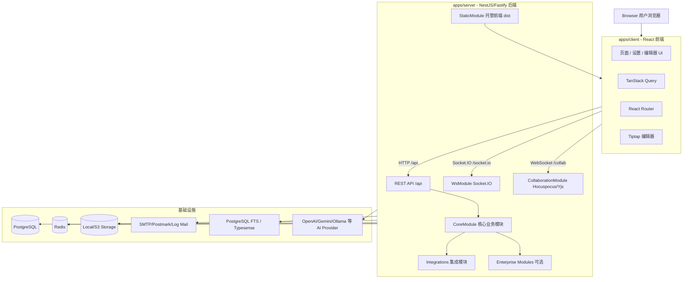
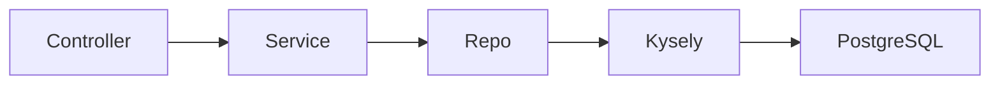
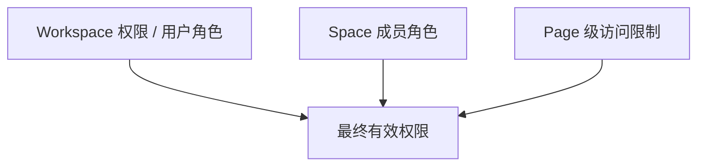
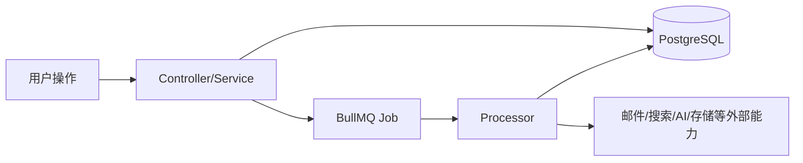
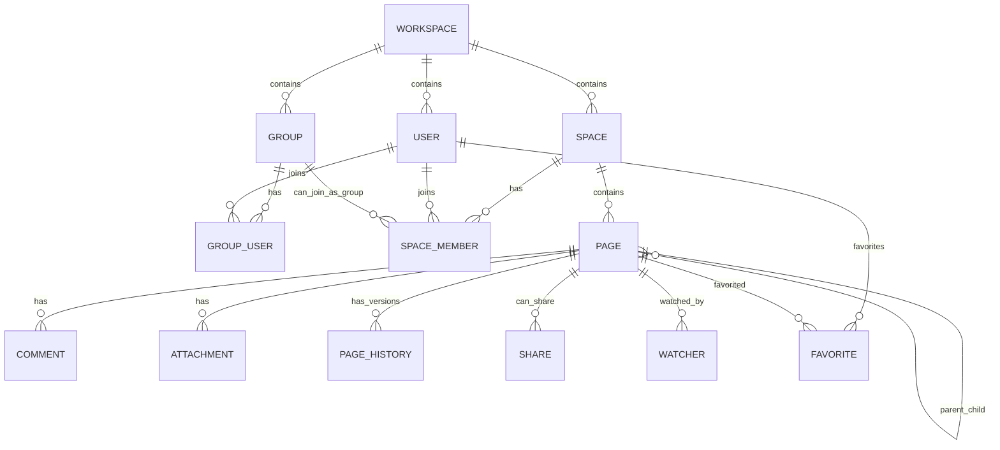

# Docmost 系统架构说明

> 本文档基于源码反向分析生成，用于帮助架构师、系统工程师和研发人员快速理解 Docmost 的系统边界、模块分层、运行组件与核心业务域。
>
> 分析基线：`main` 分支，参考提交 `c9fa6e20b32689c3639d691840834b15df171f5f`。

## 1. 系统定位

Docmost 是一个开源协作文档 / Wiki / 知识库系统，产品形态接近 Confluence、Notion、飞书文档的团队知识空间。源码体现出的核心能力包括：

- 多工作区：Workspace
- 空间管理：Space
- 层级页面：Page tree
- 富文本协作编辑：Tiptap / ProseMirror / Yjs
- 实时协作：WebSocket + Hocuspocus
- 评论、历史版本、收藏、关注、分享
- 附件上传与文件存储
- 全文搜索
- 组、成员、权限管理
- 邮件、导入导出、审计、AI、计费、SSO/MFA 等扩展能力

从工程形态看，Docmost 是一个 **TypeScript Monorepo**，前端、后端、编辑器扩展包与企业版扩展共仓管理。

## 2. 总体架构视图



## 3. 工程结构

### 3.1 Monorepo 组织

根目录 `package.json` 定义了 `pnpm workspace`，工作空间包括：

```text
apps/*
packages/*
```

主要工程单元如下：

| 路径 | 类型 | 职责 |
|---|---|---|
| `apps/server` | 后端应用 | NestJS/Fastify API、WebSocket、协作服务、队列、数据库访问、集成能力 |
| `apps/client` | 前端应用 | React/Vite 单页应用，承载文档 UI、设置页、编辑器等 |
| `packages/editor-ext` | 编辑器扩展包 | Docmost 自定义编辑器扩展，供前后端或编辑器相关逻辑复用 |
| `packages/ee` | 企业版扩展包 | 企业版授权目录，按源码说明属于企业版 license 范围 |
| `patches` | 依赖补丁 | 对第三方包的 pnpm patch |
| `docs` | 源码理解文档 | 本文档集所在目录 |

### 3.2 构建与启动脚本

根脚本体现了系统的主要运行形态：

| 命令 | 作用 |
|---|---|
| `pnpm build` | 通过 Nx 构建多个项目 |
| `pnpm dev` | 并发启动前端开发服务和后端开发服务 |
| `pnpm client:dev` | 启动 Vite 前端开发服务 |
| `pnpm server:dev` | 启动 NestJS 后端开发服务 |
| `pnpm start` | 启动生产后端服务，即 `apps/server/dist/main` |
| `pnpm collab` | 启动独立协作服务，即 `collaboration/server/collab-main` |
| `pnpm server:build` | 构建后端 |
| `pnpm client:build` | 构建前端 |
| `pnpm editor-ext:build` | 构建编辑器扩展包 |

Nx 配置中 `build` 任务启用缓存，并依赖上游项目构建，说明仓库采用 Monorepo 依赖图驱动的增量构建方式。

## 4. 后端系统架构

### 4.1 后端入口

后端主入口：

```text
apps/server/src/main.ts
```

主入口负责：

- 创建 NestJS 应用
- 使用 `FastifyAdapter`
- 设置全局 API 前缀 `/api`
- 注册 WebSocket Redis Adapter
- 注册 multipart、cookie、IP 等 Fastify 插件
- 设置 Workspace 前置校验 hook
- 启用全局 `ValidationPipe`
- 启用 CORS
- 注册统一响应拦截器
- 设置异常兜底日志
- 监听 `PORT`，默认 3000

### 4.2 后端模块总装

后端总装模块：

```text
apps/server/src/app.module.ts
```

`AppModule` 组合了以下类型模块：

| 模块类别 | 代表模块 | 职责 |
|---|---|---|
| 上下文与日志 | `ClsModule`, `LoggerModule` | 请求上下文、结构化日志 |
| 数据库 | `DatabaseModule` | PostgreSQL/Kysely 连接、Migration、Repo 注册 |
| 核心业务 | `CoreModule` | Workspace、User、Auth、Space、Page 等核心域 |
| 实时能力 | `CollaborationModule`, `WsModule` | 协作编辑 WebSocket、普通业务 WebSocket |
| 基础设施集成 | `StorageModule`, `MailModule`, `QueueModule`, `StaticModule`, `HealthModule` | 文件、邮件、队列、静态资源、健康检查 |
| 业务扩展 | `ImportModule`, `ExportModule`, `SecurityModule`, `TelemetryModule`, `ThrottleModule` | 导入导出、安全、遥测、限流 |
| 事件机制 | `EventEmitterModule` | 领域事件 / 异步事件桥接 |
| 企业版 | `EeModule` 可选加载 | 企业能力按运行环境动态加载 |

企业版模块采用动态 `require('./ee/ee.module')` 加载。若云端模式 `CLOUD=true` 下企业模块加载失败，进程会退出；自托管场景则允许没有企业模块。

### 4.3 CoreModule 核心业务域

核心业务入口：

```text
apps/server/src/core/core.module.ts
```

`CoreModule` 组织了产品主域：

| 模块 | 业务职责 |
|---|---|
| `AuthModule` | 登录、初始化管理员、改密、找回密码、协作 token、登出 |
| `UserModule` | 用户信息、用户管理 |
| `WorkspaceModule` | 工作区创建、设置、邀请、成员入口 |
| `SpaceModule` | 空间管理、空间成员 |
| `PageModule` | 页面创建、读取、更新、删除、移动、复制、历史、面包屑、侧边栏树 |
| `PageAccessModule` | Page 级权限限制与访问控制 |
| `AttachmentModule` | 附件上传、下载、索引、清理 |
| `CommentModule` | 页面评论、回复、解决状态 |
| `SearchModule` | 页面 / 用户 / 组搜索与建议 |
| `GroupModule` | 用户组管理 |
| `CaslModule` | Workspace / Space 权限能力构建 |
| `ShareModule` | 对外分享页面 |
| `NotificationModule` | 通知管理 |
| `WatcherModule` | 页面 / 空间关注 |
| `FavoriteModule` | 收藏 |
| `SessionModule` | 用户会话 |

`CoreModule` 同时注册两个关键中间件：

| 中间件 | 职责 |
|---|---|
| `DomainMiddleware` | 根据部署模式识别当前 Workspace；自托管取第一个 Workspace，云端按 host/subdomain 查 Workspace |
| `AuditContextMiddleware` | 建立审计上下文，供审计服务记录 actor、resource、request metadata |

## 5. 前端系统架构

### 5.1 前端入口

前端入口：

```text
apps/client/src/main.tsx
```

入口完成：

- 引入 Mantine 样式
- 初始化 React Root
- 注册 `BrowserRouter`
- 注册 `MantineProvider`
- 注册 `ModalsProvider` 与 `Notifications`
- 注册 `TanStack Query` 的 `QueryClientProvider`
- 注册 `HelmetProvider`
- 云端模式下初始化 PostHog
- 渲染 `App`

### 5.2 前端路由结构

前端路由入口：

```text
apps/client/src/App.tsx
```

主要路由域如下：

| 路由域 | 示例路径 | 职责 |
|---|---|---|
| 认证 | `/login`, `/forgot-password`, `/password-reset`, `/login/mfa` | 登录、找回密码、MFA |
| 初始化 | `/setup/register` | 自托管首次初始化 Workspace |
| 云端工作区 | `/create`, `/select`, `/verify-email` | 云端模式工作区创建 / 选择 |
| 分享访问 | `/share/:shareId/p/:pageSlug`, `/share/p/:pageSlug` | 对外分享页面 |
| PDF 渲染 | `/pdf-render/:pageId` | PDF 导出渲染页 |
| 主布局 | `/home`, `/spaces`, `/favorites`, `/templates`, `/s/:spaceSlug` | 登录后主应用 |
| 页面编辑 | `/s/:spaceSlug/p/:pageSlug` | 文档页面编辑与查看 |
| 设置中心 | `/settings/*` | 账号、成员、空间、分组、安全、AI、审计、计费等设置 |
| AI | `/ai`, `/ai/chat/:chatId` | AI Chat |

### 5.3 前端与后端交互

开发环境下，Vite 配置代理：

| 前端路径 | 代理目标 | 用途 |
|---|---|---|
| `/api` | `APP_URL` | 后端 REST API |
| `/socket.io` | `APP_URL` | Socket.IO 业务 WebSocket |
| `/collab` | `APP_URL` | 协作编辑 WebSocket |

生产环境下，`StaticModule` 会在存在 `apps/client/dist` 时由后端 Fastify 托管前端静态资源，并将运行时配置注入到 `window.CONFIG`。

## 6. 实时通信架构

Docmost 中存在两类 WebSocket：

| 类型 | 技术 | 入口 | 主要用途 |
|---|---|---|---|
| 业务 WebSocket | Socket.IO | `WsModule` / `WsGateway` | 用户房间、Workspace 房间、Space 房间、树事件、通知类实时更新 |
| 协作 WebSocket | Hocuspocus + Yjs + ws | `CollaborationModule` / `/collab` | 富文本多人协同编辑、Yjs 文档同步与持久化 |

### 6.1 业务 WebSocket

`WsGateway` 在连接时：

1. 从 Cookie 中解析 `authToken`。
2. 使用 `TokenService` 校验 Access JWT。
3. 提取 `userId` 与 `workspaceId`。
4. 查询用户所属 Space。
5. 加入以下房间：
   - `user-{userId}`
   - `workspace-{workspaceId}`
   - 每个 Space 对应 room

这类通道适合推送页面树变化、通知、空间范围内变更等普通业务事件。

### 6.2 协作 WebSocket

协作入口由 `CollaborationModule` 在模块初始化时挂载到：

```text
/collab
```

协作服务核心组件：

| 组件 | 职责 |
|---|---|
| `CollaborationGateway` | 创建 Hocuspocus 实例，处理 WebSocket 连接 |
| `AuthenticationExtension` | 校验协作 JWT、用户状态、Space 权限、Page 级权限，必要时设置 readonly |
| `PersistenceExtension` | 加载 / 保存 Yjs 文档，将 Ydoc 与 Tiptap JSON 写回页面表 |
| `LoggerExtension` | 协作日志 |
| `RedisSyncExtension` | 多实例协作同步、事件广播、文档锁 |
| `CollabHistoryService` | 协作历史相关支持 |
| `HistoryProcessor` | 页面历史任务处理 |

协作服务有两种运行方式：

| 模式 | 入口 | 说明 |
|---|---|---|
| 内嵌模式 | 主后端 `main.ts` + `CollaborationModule` | 默认后端进程同时承载 API 与协作 |
| 独立模式 | `collaboration/server/collab-main.ts` | 通过 `pnpm collab` 启动独立协作服务，监听 `COLLAB_PORT`，默认 3001 |

## 7. 数据访问架构

### 7.1 数据库技术选型

Docmost 使用：

- PostgreSQL 作为主数据库
- Kysely 作为 TypeScript SQL Query Builder
- `nestjs-kysely` 集成 NestJS DI
- `kysely-codegen` 生成数据库类型定义
- `kysely-migration-cli` 执行 migration

数据库模块：

```text
apps/server/src/database/database.module.ts
```

`DatabaseModule` 是全局模块，负责：

- 创建 Kysely 连接
- 注册 PostgreSQL dialect
- 配置连接池
- 注册 CamelCasePlugin
- 开发环境下支持 SQL debug log
- 注册各类 Repo
- 生产环境启动时自动执行 migration 到最新版本

### 7.2 Repo 分层

后端并没有让业务服务直接散落 SQL，而是通过 Repo 封装主要数据访问。典型 Repo 包括：

| Repo | 领域 |
|---|---|
| `WorkspaceRepo` | 工作区 |
| `UserRepo` | 用户 |
| `GroupRepo`, `GroupUserRepo` | 用户组 |
| `SpaceRepo`, `SpaceMemberRepo` | 空间与空间成员 |
| `PageRepo`, `PagePermissionRepo`, `PageHistoryRepo` | 页面、页面权限、页面历史 |
| `CommentRepo` | 评论 |
| `AttachmentRepo` | 附件 |
| `ShareRepo` | 分享 |
| `NotificationRepo` | 通知 |
| `WatcherRepo` | 关注 |
| `FavoriteRepo` | 收藏 |
| `TemplateRepo` | 模板 |
| `UserSessionRepo`, `UserTokenRepo` | 会话与用户 token |

整体模式是：



## 8. 权限架构

Docmost 的权限不是单层模型，而是多层叠加：



### 8.1 Space 权限

`SpaceAbilityFactory` 基于用户在 Space 中的最高角色构建 CASL Ability：

| Space 角色 | 权限含义 |
|---|---|
| `ADMIN` | 管理设置、成员、页面、分享 |
| `WRITER` | 读取设置与成员，管理页面与分享 |
| `READER` | 读取设置、成员、页面、分享 |

### 8.2 Page 级权限

`PageAccessService` 在 Space 权限基础上叠加 Page 级限制：

| 方法 | 作用 |
|---|---|
| `validateCanView` | 校验用户是否可查看页面 |
| `validateCanViewWithPermissions` | 校验可查看，并返回是否可编辑、是否存在限制 |
| `validateCanEdit` | 校验用户是否可编辑页面 |
| `validateCanComment` | 校验评论权限；可编辑用户可评论，读者评论取决于 Space 设置 |

协作编辑认证也复用了同一思路：先校验协作 JWT，再校验用户、页面、Space 角色、Page 级权限；若只能阅读则将协作连接设置为 readonly。

## 9. 异步任务架构

异步任务基于：

- Redis
- BullMQ
- `@nestjs/bullmq`

队列模块：

```text
apps/server/src/integrations/queue/queue.module.ts
```

主要队列：

| 队列 | 典型职责 |
|---|---|
| `EMAIL_QUEUE` | 邮件发送 |
| `ATTACHMENT_QUEUE` | 附件索引、附件清理 |
| `GENERAL_QUEUE` | 通用任务，例如页面 backlink、watcher |
| `BILLING_QUEUE` | Stripe 席位同步、试用结束、付款邮件 |
| `FILE_TASK_QUEUE` | 导入 / 导出等文件任务 |
| `SEARCH_QUEUE` | 页面、评论、附件搜索索引维护 |
| `AI_QUEUE` | 页面内容变更、Embedding 生成 / 删除 |
| `HISTORY_QUEUE` | 页面历史版本生成 |
| `NOTIFICATION_QUEUE` | 评论、提及、权限、审核等通知 |
| `AUDIT_QUEUE` | 审计日志与清理 |

典型链路：



## 10. 存储与附件架构

存储模块：

```text
apps/server/src/integrations/storage/storage.module.ts
```

通过 `StorageService` 屏蔽具体驱动。当前驱动选择由环境变量 `STORAGE_DRIVER` 控制：

| Driver | 说明 |
|---|---|
| `local` | 本地文件系统，默认使用 `/app/data/storage` 一类路径 |
| `s3` | S3 兼容对象存储，支持 region、endpoint、bucket、baseUrl、forcePathStyle、credentials 等配置 |

这种设计使附件、头像、导入导出文件等上层业务不直接依赖具体存储实现。

## 11. 搜索架构

Docmost 有两类搜索思路：

1. 数据库全文检索：页面表中存在 `textContent` 与 `tsv` 字段，`SearchService` 使用 PostgreSQL `to_tsquery`、`ts_rank`、`ts_headline` 查询页面。
2. 外部搜索引擎：环境配置中存在 `SEARCH_DRIVER`、`TYPESENSE_URL`、`TYPESENSE_API_KEY`、`TYPESENSE_LOCALE`，队列中也存在 Typesense flush 与索引任务，说明系统支持切换或扩展到 Typesense。

搜索结果会结合用户 Space 成员关系与 Page 级权限过滤，避免返回无权访问页面。

## 12. 静态资源与部署架构

### 12.1 单容器生产形态

`Dockerfile` 采用多阶段构建：

1. `builder` 阶段安装依赖并执行 `pnpm build`。
2. `installer` 阶段复制：
   - `apps/server/dist`
   - `apps/client/dist`
   - `packages/editor-ext/dist`
   - root package files
   - patches
3. 安装生产依赖。
4. 暴露 3000。
5. 默认执行 `pnpm start`。

这说明默认生产镜像是 **后端进程托管前端静态资源 + 提供 API + WebSocket** 的单容器应用形态。

### 12.2 docker-compose 形态

`docker-compose.yml` 中包括：

| 服务 | 镜像 / 作用 |
|---|---|
| `docmost` | 应用服务，暴露 3000，依赖 db 和 redis |
| `db` | PostgreSQL |
| `redis` | Redis，启用 AOF，maxmemory-policy 为 noeviction |

最小自托管依赖是：

```text
Docmost App + PostgreSQL + Redis + Storage Volume
```

## 13. 企业版扩展架构

源码中存在企业版目录：

```text
apps/server/src/ee
apps/client/src/ee
packages/ee
```

README 中声明这些目录受 Docmost Enterprise license 约束。系统架构上，企业能力采用两类扩展方式：

| 层面 | 扩展方式 |
|---|---|
| 后端 | `AppModule` 动态加载 `EeModule` |
| 前端 | `App.tsx` 直接引用 `@/ee/*` 页面、hook 和组件 |

从前端路由看，企业能力包括但不限于：

- Billing
- Cloud login / workspace create
- Security
- License
- MFA
- API Keys
- AI settings / AI Chat
- Audit logs
- Page verification
- Template
- PDF export

## 14. 核心业务域关系



该图是面向源码理解的简化模型，完整字段、索引、软删除策略、AI、审计、通知、模板、会话等表将在 `02-data-architecture.md` 中展开。

## 15. 分层职责总结

| 层级 | 目录 / 模块 | 职责边界 |
|---|---|---|
| UI 层 | `apps/client/src/pages`, `apps/client/src/features` | 页面展示、用户交互、编辑器集成 |
| 前端基础层 | `main.tsx`, `App.tsx`, hooks/lib | 路由、Query、主题、通知、配置 |
| API 层 | `apps/server/src/core/**/**.controller.ts` | 请求入口、参数 DTO、权限前置调用、响应组织 |
| 业务服务层 | `apps/server/src/core/**/**.service.ts` | 业务规则、事务编排、队列投递、审计触发 |
| 数据访问层 | `apps/server/src/database/repos/*` | SQL 查询、实体持久化、聚合查询 |
| 协作层 | `apps/server/src/collaboration/*` | Yjs 文档同步、协作认证、内容持久化 |
| 集成层 | `apps/server/src/integrations/*` | 存储、邮件、队列、导入导出、健康检查、遥测、安全 |
| 基础设施层 | PostgreSQL / Redis / Storage / Mail / Search / AI | 持久化、缓存、队列、外部能力 |

## 16. 架构判断与二次开发建议

### 16.1 架构优点

- Monorepo 便于统一构建、共享类型与编辑器扩展。
- NestJS 模块边界清晰，核心业务域较容易定位。
- 数据访问通过 Repo 集中封装，利于控制 SQL 分散度。
- 协作编辑独立模块化，支持内嵌和独立服务两种运行形态。
- Redis 同时支撑缓存、队列、WebSocket 横向扩展与协作同步，部署依赖明确。
- 存储、邮件、搜索、AI 等能力已抽象为 integration，具备替换空间。
- 企业版能力采用独立目录和动态加载，商业功能与核心开源功能有清晰边界。

### 16.2 主要复杂点

| 复杂点 | 原因 | 阅读建议 |
|---|---|---|
| 实时协作 | Hocuspocus/Yjs/Tiptap/Redis Sync 多组件组合 | 从 `CollaborationGateway`、`AuthenticationExtension`、`PersistenceExtension` 读起 |
| 权限判断 | Space 角色和 Page 级限制叠加 | 从 `SpaceAbilityFactory`、`PageAccessService`、`PagePermissionRepo` 读起 |
| 页面内容模型 | 同时维护 Tiptap JSON、纯文本、tsv、Ydoc | 数据架构文档重点展开 |
| 异步副作用 | 页面变更会触发历史、搜索、AI、通知等任务 | 从 Queue constants 和各 Processor 读起 |
| 企业版耦合点 | 前端路由直接引用 `@/ee/*`，后端动态加载 EE 模块 | 区分开源核心与企业扩展能力 |

### 16.3 二次开发推荐切入点

| 需求类型 | 优先修改位置 |
|---|---|
| 新增业务 API | `apps/server/src/core/<domain>` 下新增 controller/service/dto/repo |
| 新增页面或设置项 | `apps/client/src/pages` 或 `apps/client/src/features` |
| 新增编辑器能力 | `apps/client/src/features/editor` 与 `packages/editor-ext` |
| 新增异步任务 | `integrations/queue/constants` + 对应 Processor |
| 替换文件存储 | `integrations/storage` 新增 driver |
| 替换搜索引擎 | `core/search` + `SEARCH_QUEUE` 相关 Processor |
| 调整权限 | `core/casl`、`page-access`、`PagePermissionRepo` |
| 扩展协作能力 | `collaboration/*`，尤其 extension 和 handler |

## 17. 后续文档衔接

本文只回答“系统由哪些部分组成、边界在哪里、运行组件如何协作”。后续文档建议继续拆解：

1. `02-data-architecture.md`：展开表结构、实体关系、内容模型、权限数据模型。
2. `03-technology-architecture.md`：展开技术栈、构建、配置、部署、基础设施。
3. `04-runtime-flows.md`：展开登录、页面编辑、协作保存、搜索、附件、通知等链路。
4. `05-source-reading-guide.md`：给出源码阅读路线与修改点地图。
