# Docmost 数据架构说明

> 本文档基于源码反向分析生成，用于帮助后端研发、数据工程、架构设计人员快速理解 Docmost 的数据库表域、核心实体关系、页面内容模型、权限模型、协作持久化与数据访问模式。
>
> 分析基线：`main` 分支，参考提交 `c9fa6e20b32689c3639d691840834b15df171f5f`。

## 1. 数据架构总览

Docmost 的主数据存储是 PostgreSQL。后端通过 Kysely 访问数据库，并使用 `kysely-codegen` 生成 TypeScript 类型。

整体数据访问链路：

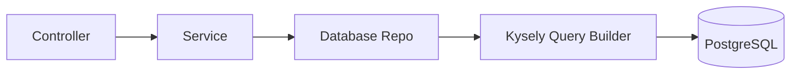

核心数据模型围绕以下主轴展开：

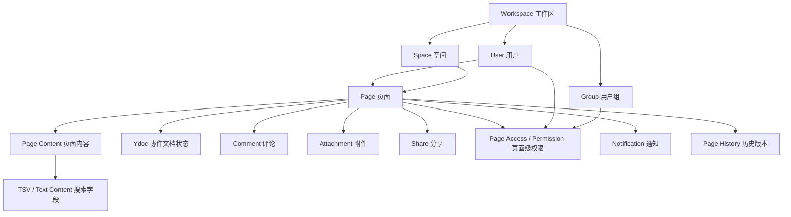

## 2. 数据库技术选型

| 项目 | 技术 / 机制 | 说明 |
|---|---|---|
| 主数据库 | PostgreSQL | 系统主事务数据库 |
| Query Builder | Kysely | TypeScript 类型安全 SQL 构造 |
| Nest 集成 | `nestjs-kysely` | 将 Kysely 注册为 Nest Provider |
| 类型生成 | `kysely-codegen` | 从数据库 schema 生成 `db.d.ts` |
| Migration | `kysely-migration-cli` | 数据库迁移管理 |
| 命名转换 | `CamelCasePlugin` | 数据库 snake_case 与 TypeScript camelCase 映射 |
| 全文搜索 | PostgreSQL tsvector / tsquery | 页面、附件、AI Chat 等文本搜索字段 |
| 向量扩展 | pgvector 相关依赖 | AI Embedding 能力相关 |

## 3. 数据访问模块

数据库模块位于：

```text
apps/server/src/database/database.module.ts
```

`DatabaseModule` 是全局模块，核心职责：

1. 创建 PostgreSQL 连接。
2. 注册 Kysely dialect。
3. 配置连接池与 bigint 类型处理。
4. 注册 `CamelCasePlugin`。
5. 开发环境按 `DEBUG_DB=true` 输出 SQL 与耗时。
6. 注册所有 Repo。
7. 生产环境启动时自动执行 migration 到最新版本。

### 3.1 Repo 注册清单

| Repo | 领域 | 主要职责 |
|---|---|---|
| `WorkspaceRepo` | 工作区 | 工作区创建、查询、hostname 识别 |
| `UserRepo` | 用户 | 用户资料、认证状态、禁用/删除状态 |
| `GroupRepo` | 用户组 | 组信息、成员数等聚合查询 |
| `GroupUserRepo` | 组成员 | 用户与组关系 |
| `SpaceRepo` | 空间 | 空间资料、成员数、删除状态 |
| `SpaceMemberRepo` | 空间成员 | 用户/组在 Space 中的角色与访问范围 |
| `PageRepo` | 页面 | 页面树、内容查询、移动、删除、恢复、递归查询 |
| `PagePermissionRepo` | 页面权限 | Page 级访问限制、继承权限、批量过滤 |
| `PageHistoryRepo` | 页面历史 | 历史版本记录 |
| `CommentRepo` | 评论 | 页面评论、回复、解决状态 |
| `FavoriteRepo` | 收藏 | 用户收藏页面、空间、模板 |
| `AttachmentRepo` | 附件 | 文件元数据、内容索引、页面/AI Chat 绑定 |
| `UserTokenRepo` | 用户 token | 找回密码、邀请、认证 token 等 |
| `UserSessionRepo` | 会话 | 用户设备会话、失效与撤销 |
| `BacklinkRepo` | 反向链接 | 页面间引用关系 |
| `ShareRepo` | 分享 | 页面分享、分享 key、子页面分享范围 |
| `NotificationRepo` | 通知 | 评论、提及、权限、审核等通知 |
| `WatcherRepo` | 关注 | 页面/空间关注关系 |
| `TemplateRepo` | 模板 | 页面模板 |

## 4. 表域划分

根据生成类型 `db.d.ts`，当前数据库表可按领域分组如下。

### 4.1 租户与身份域

| 表 | 说明 | 关键字段 |
|---|---|---|
| `workspaces` | 工作区 / 租户 | `id`, `hostname`, `customDomain`, `defaultRole`, `defaultSpaceId`, `plan`, `status`, `settings` |
| `users` | 用户 | `id`, `email`, `name`, `role`, `workspaceId`, `password`, `lastLoginAt`, `deactivatedAt`, `deletedAt`, `settings` |
| `workspaceInvitations` | 工作区邀请 | `email`, `token`, `role`, `groupIds`, `invitedById`, `workspaceId` |
| `userTokens` | 用户 token | `token`, `type`, `expiresAt`, `usedAt`, `userId`, `workspaceId` |
| `userSessions` | 用户会话 | `deviceName`, `userAgent`, `ipAddress`, `lastActiveAt`, `expiresAt`, `revokedAt` |
| `userMfa` | 用户 MFA | `method`, `secret`, `backupCodes`, `isEnabled` |
| `authProviders` | SSO/LDAP/SAML/OIDC 等认证源 | `type`, `name`, `settings`, `ldap*`, `oidc*`, `saml*`, `groupSync` |
| `authAccounts` | 第三方认证账号绑定 | `providerUserId`, `authProviderId`, `userId`, `workspaceId` |
| `apiKeys` | API Key | `name`, `creatorId`, `workspaceId`, `expiresAt`, `lastUsedAt` |
| `scimTokens` | SCIM Token | `tokenHash`, `tokenLastFour`, `isEnabled`, `workspaceId` |

### 4.2 组织与权限域

| 表 | 说明 | 关键字段 |
|---|---|---|
| `groups` | 用户组 | `name`, `description`, `isDefault`, `isExternal`, `scimExternalId`, `workspaceId` |
| `groupUsers` | 用户组成员 | `groupId`, `userId` |
| `spaces` | 空间 | `name`, `slug`, `visibility`, `defaultRole`, `settings`, `workspaceId` |
| `spaceMembers` | 空间成员 | `spaceId`, `userId`, `groupId`, `role`, `addedById` |
| `pageAccess` | 页面访问限制主表 | `pageId`, `spaceId`, `workspaceId`, `accessLevel`, `creatorId` |
| `pagePermissions` | 页面权限成员表 | `pageAccessId`, `userId`, `groupId`, `role`, `addedById` |

### 4.3 文档内容域

| 表 | 说明 | 关键字段 |
|---|---|---|
| `pages` | 页面主表 | `title`, `content`, `textContent`, `tsv`, `ydoc`, `parentPageId`, `position`, `slugId`, `spaceId`, `workspaceId` |
| `pageHistory` | 页面历史版本 | `pageId`, `version`, `content`, `title`, `ydoc`, `contributorIds`, `lastUpdatedById` |
| `comments` | 评论 | `pageId`, `parentCommentId`, `content`, `selection`, `resolvedAt`, `resolvedById` |
| `attachments` | 附件 | `fileName`, `filePath`, `fileSize`, `mimeType`, `type`, `textContent`, `tsv`, `pageId`, `aiChatId` |
| `shares` | 页面分享 | `key`, `pageId`, `includeSubPages`, `searchIndexing`, `spaceId`, `workspaceId` |
| `backlinks` | 反向链接 | `sourcePageId`, `targetPageId`, `workspaceId` |
| `favorites` | 收藏 | `userId`, `pageId`, `spaceId`, `templateId`, `type` |
| `watchers` | 关注 | `userId`, `pageId`, `spaceId`, `type`, `mutedAt` |
| `templates` | 模板 | `title`, `description`, `content`, `ydoc`, `spaceId`, `workspaceId`, `creatorId` |

### 4.4 通知、审计与任务域

| 表 | 说明 | 关键字段 |
|---|---|---|
| `notifications` | 通知 | `type`, `actorId`, `pageId`, `spaceId`, `commentId`, `data`, `readAt`, `emailedAt` |
| `audit` | 审计日志 | `event`, `actorId`, `actorType`, `resourceType`, `resourceId`, `changes`, `metadata`, `ipAddress` |
| `fileTasks` | 文件任务 | `type`, `source`, `status`, `filePath`, `metadata`, `errorMessage` |
| `billing` | 计费订阅 | `stripeCustomerId`, `stripeSubscriptionId`, `status`, `planName`, `periodStartAt`, `periodEndAt` |

### 4.5 AI 域

| 表 | 说明 | 关键字段 |
|---|---|---|
| `aiChats` | AI 会话 | `title`, `creatorId`, `workspaceId` |
| `aiChatMessages` | AI 消息 | `chatId`, `role`, `content`, `toolCalls`, `metadata`, `tsv` |
| `pageEmbeddings` | 页面 Embedding | 实体类型由 `embeddings.types.ts` 提供，通常与 AI 检索/向量搜索相关 |

### 4.6 审核 / 验证域

| 表 | 说明 | 关键字段 |
|---|---|---|
| `pageVerifications` | 页面验证 / 审核 | `pageId`, `type`, `status`, `mode`, `verifiedAt`, `expiresAt`, `requestedAt`, `data` |
| `pageVerifiers` | 页面验证人 | `pageVerificationId`, `userId`, `isPrimary`, `addedById` |

## 5. 核心实体关系

### 5.1 租户与组织关系

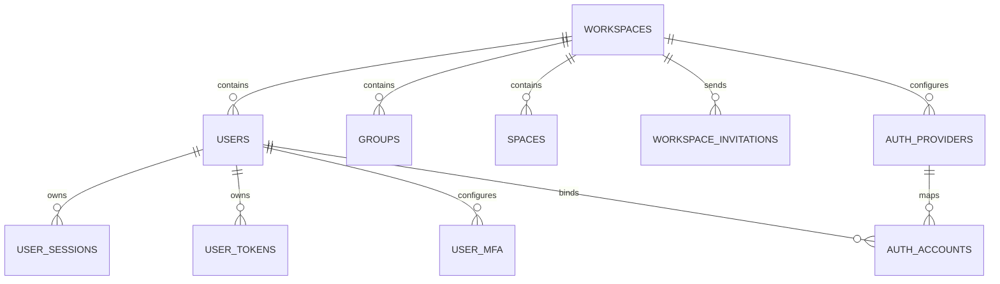

说明：

- `workspaces` 是多租户根实体。
- 自托管模式通常只使用一个 Workspace；云端模式按 hostname / subdomain 识别 Workspace。
- `users.workspaceId` 可以为空，说明系统需要兼容某些跨工作区、初始化或云端选择场景。
- SSO / LDAP / OIDC / SAML 配置放在 `authProviders`，账号映射放在 `authAccounts`。

### 5.2 组、空间、成员关系

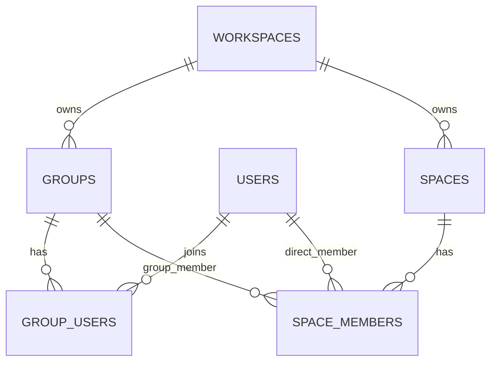

说明：

- `spaceMembers` 支持两种成员类型：用户成员和组成员。
- 用户的 Space 权限来自：
  - 用户直接加入 Space 的角色。
  - 用户所属 Group 加入 Space 的角色。
- 同一个用户可能通过多个组获得多个 Space 角色，业务侧会取最高角色。

### 5.3 文档树关系

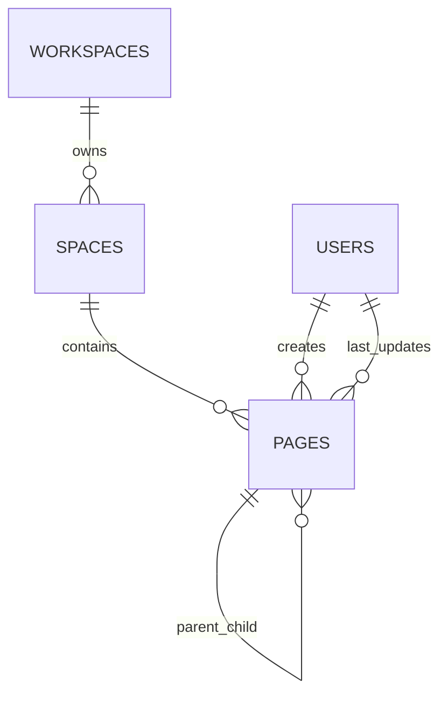

说明：

- `pages.parentPageId` 建立页面树。
- 根页面的 `parentPageId` 为空。
- `position` 用于同级页面排序。
- `slugId` 支持 URL 访问和非 UUID 查找。
- 软删除通过 `deletedAt` 和 `deletedById` 实现。
- 页面删除和恢复会递归处理子页面。

## 6. Page 页面数据模型

`pages` 是 Docmost 最核心的业务表。

### 6.1 字段分组

| 字段组 | 字段 | 说明 |
|---|---|---|
| 标识 | `id`, `slugId` | UUID 主键与 URL 友好标识 |
| 展示 | `title`, `icon`, `coverPhoto` | 页面标题、图标、封面 |
| 树结构 | `parentPageId`, `position`, `spaceId` | 页面父子关系与排序 |
| 内容 | `content`, `textContent`, `ydoc`, `tsv` | Tiptap JSON、纯文本、Yjs 状态、全文搜索向量 |
| 协作者 | `creatorId`, `lastUpdatedById`, `contributorIds` | 创建者、最后更新者、贡献者列表 |
| 状态 | `isLocked`, `deletedAt`, `deletedById` | 锁定、软删除状态 |
| 租户 | `workspaceId` | 所属工作区 |
| 时间 | `createdAt`, `updatedAt` | 创建与更新时间 |

### 6.2 内容字段设计

Docmost 页面内容不是只存一份数据，而是多表示并存：

| 字段 | 类型语义 | 来源 / 用途 |
|---|---|---|
| `content` | Tiptap / ProseMirror JSON | 页面渲染、导入导出、历史版本、HTML/Markdown 转换 |
| `ydoc` | Yjs document binary state | 实时协作的 CRDT 状态持久化 |
| `textContent` | 纯文本 | 搜索摘要、全文检索、AI 处理 |
| `tsv` | PostgreSQL tsvector | PostgreSQL 全文搜索索引 |

内容写入链路通常是：

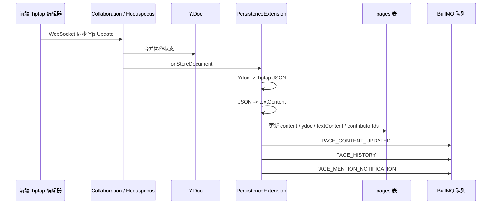

### 6.3 页面树递归查询

`PageRepo` 使用 PostgreSQL recursive CTE 处理页面树：

| 方法 | 说明 |
|---|---|
| `getPageAndDescendants` | 查询页面及全部子孙页面 |
| `getPageAndDescendantsExcludingRestricted` | 查询页面及子孙，但遇到受限页面停止递归并排除受限分支 |
| `removePage` | 递归软删除页面及子孙页面 |
| `restorePage` | 递归恢复页面及子孙页面 |

这意味着任何涉及页面树的功能，都需要特别注意：

- 权限继承。
- 删除状态。
- 子页面是否可见。
- 移动/复制是否跨 Space。
- 分享时是否包含子页面。

## 7. Page History 历史版本模型

`pageHistory` 用于记录页面历史版本。

| 字段 | 说明 |
|---|---|
| `pageId` | 对应页面 |
| `version` | 版本号 |
| `content` | 当时的 Tiptap JSON 内容 |
| `ydoc` | 当时的 Yjs 状态 |
| `title`, `icon`, `coverPhoto`, `slug`, `slugId` | 历史展示信息 |
| `contributorIds` | 贡献者 |
| `lastUpdatedById` | 最后更新者 |
| `spaceId`, `workspaceId` | 所属空间与工作区 |

历史版本不是每次字符变化都立即生成，而是在协作持久化后投递 `PAGE_HISTORY` 队列任务，由后台处理器按策略生成。

## 8. 权限数据模型

Docmost 权限模型分为两层：

1. Space 级基础权限。
2. Page 级限制权限。

### 8.1 Space 权限

Space 权限由 `spaceMembers` 表表达。

| 字段 | 说明 |
|---|---|
| `spaceId` | 空间 |
| `userId` | 用户成员，可为空 |
| `groupId` | 组成员，可为空 |
| `role` | `admin` / `writer` / `reader` |
| `addedById` | 添加者 |
| `deletedAt` | 软删除或移除标记 |

用户的 Space 角色来自两类来源：

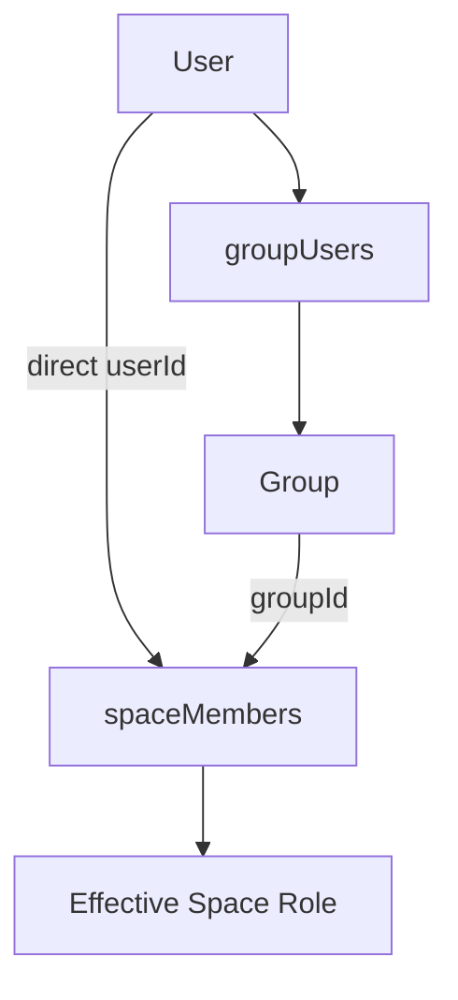

当用户有多个角色来源时，业务侧取最高角色。角色优先级通常是：

```text
admin > writer > reader
```

### 8.2 Page 级限制

Page 级限制由两张表组成：

| 表 | 职责 |
|---|---|
| `pageAccess` | 标记某个 Page 启用了访问限制 |
| `pagePermissions` | 定义哪些用户/组在该限制点拥有 reader/writer 权限 |

关系如下：

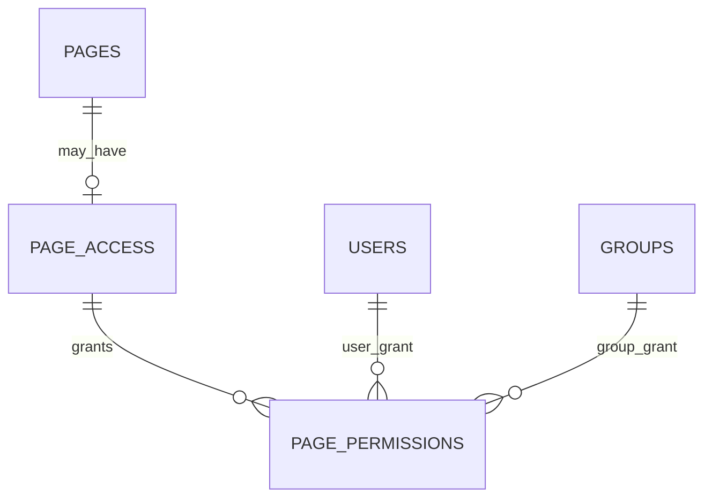

`pageAccess` 关键字段：

| 字段 | 说明 |
|---|---|
| `pageId` | 被限制的页面 |
| `workspaceId` | 工作区 |
| `spaceId` | 空间 |
| `accessLevel` | 限制级别 |
| `creatorId` | 创建限制的人 |

`pagePermissions` 关键字段：

| 字段 | 说明 |
|---|---|
| `pageAccessId` | 所属访问限制 |
| `userId` | 授权用户 |
| `groupId` | 授权用户组 |
| `role` | `reader` / `writer` |
| `addedById` | 添加者 |

### 8.3 Page 权限继承规则

Page 级限制会沿页面祖先链生效。访问某页面时，需要检查从当前页面到根页面的所有祖先限制。

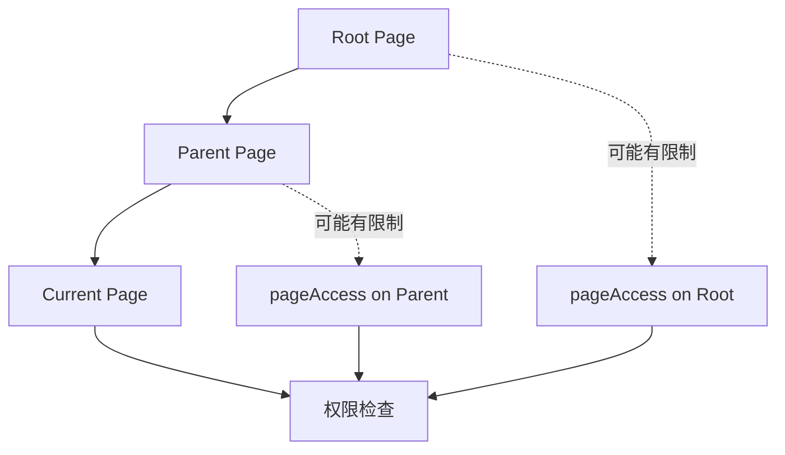

核心判断：

| 判断 | 规则 |
|---|---|
| 可查看 | 用户必须对所有受限祖先至少有权限 |
| 可编辑 | 用户必须能通过所有受限祖先，且最近的受限祖先上具备 `writer` |
| 无 Page 限制 | 回退到 Space 级权限判断 |
| 受限祖先缺权限 | 直接不可访问 |

这就是为什么 `PagePermissionRepo` 中大量使用 recursive CTE 查询祖先链，并批量过滤可访问 Page ID。

## 9. 评论模型

`comments` 表表达页面评论与回复。

| 字段 | 说明 |
|---|---|
| `pageId` | 所属页面 |
| `parentCommentId` | 父评论，支持回复 |
| `content` | 评论内容 JSON |
| `selection` | 评论关联的页面选区 |
| `creatorId` | 评论创建者 |
| `lastEditedById` | 最后编辑者 |
| `resolvedAt`, `resolvedById` | 解决状态 |
| `type` | 评论类型 |
| `spaceId`, `workspaceId` | 所属空间与工作区 |
| `deletedAt` | 删除状态 |

评论读取时通常会聚合：

- 创建者信息。
- 解决人信息。
- 子评论状态。

评论权限不是评论表自身完成，而是由 Page 权限与 Space 设置共同决定。

## 10. 附件模型

`attachments` 表存储文件元数据，不直接承载二进制文件本体。文件本体由 Storage 模块管理，可使用 local 或 S3 driver。

| 字段 | 说明 |
|---|---|
| `fileName` | 原始文件名 |
| `filePath` | 存储路径 |
| `fileSize` | 文件大小 |
| `fileExt` | 扩展名 |
| `mimeType` | MIME 类型 |
| `type` | 附件类型，例如页面附件、聊天附件等 |
| `creatorId` | 上传者 |
| `pageId` | 绑定页面，可为空 |
| `spaceId` | 所属空间，可为空 |
| `aiChatId` | 绑定 AI Chat，可为空 |
| `textContent` | 提取后的文本内容 |
| `tsv` | 全文搜索向量 |
| `workspaceId` | 工作区 |
| `deletedAt` | 删除状态 |

附件设计要点：

- 文件元数据和文件内容分离。
- 附件可绑定 Page，也可绑定 AI Chat。
- 文本类附件可提取 `textContent` 并进入搜索 / AI 流程。
- 删除页面或空间时，通常通过队列清理附件和存储文件。

## 11. 分享模型

`shares` 表表达页面对外分享。

| 字段 | 说明 |
|---|---|
| `key` | 分享 key，可作为非 UUID 分享入口 |
| `pageId` | 被分享页面 |
| `includeSubPages` | 是否包含子页面 |
| `searchIndexing` | 是否允许搜索索引 |
| `creatorId` | 创建分享的人 |
| `spaceId`, `workspaceId` | 所属空间与工作区 |
| `deletedAt` | 删除状态 |

分享访问需要处理：

1. 分享 key / id 查询。
2. 分享页面是否存在。
3. 是否包含子页面。
4. 是否有受限祖先或受限子树。
5. 分享搜索范围。

当页面被软删除时，`PageRepo.removePage` 会同步删除相关 `shares`，避免已删除页面继续被分享访问。

## 12. Backlink 模型

`backlinks` 表记录页面之间的引用关系。

| 字段 | 说明 |
|---|---|
| `sourcePageId` | 发起引用的页面 |
| `targetPageId` | 被引用页面 |
| `workspaceId` | 所属工作区 |

插入 backlink 时对 `(sourcePageId, targetPageId)` 做冲突忽略，说明系统希望保持页面对页面引用关系唯一。

## 13. 收藏与关注模型

### 13.1 Favorite

`favorites` 支持收藏多类对象。

| 字段 | 说明 |
|---|---|
| `userId` | 收藏用户 |
| `pageId` | 收藏页面，可为空 |
| `spaceId` | 收藏空间，可为空 |
| `templateId` | 收藏模板，可为空 |
| `type` | 收藏类型 |
| `workspaceId` | 工作区 |

### 13.2 Watcher

`watchers` 支持页面或空间关注。

| 字段 | 说明 |
|---|---|
| `userId` | 关注者 |
| `pageId` | 页面，可为空 |
| `spaceId` | 空间 |
| `workspaceId` | 工作区 |
| `type` | 关注类型 |
| `addedById` | 添加者 |
| `mutedAt` | 静音时间 |

关注关系通常用于页面更新通知、提及通知、空间更新等场景。

## 14. 搜索数据模型

搜索主要依赖以下字段：

| 表 | 字段 | 作用 |
|---|---|---|
| `pages` | `title` | 标题匹配 |
| `pages` | `textContent` | 正文高亮与摘要 |
| `pages` | `tsv` | PostgreSQL 全文检索 |
| `attachments` | `textContent` | 附件文本搜索 |
| `attachments` | `tsv` | 附件全文检索 |
| `aiChatMessages` | `content` | AI Chat 消息搜索 |
| `aiChatMessages` | `tsv` | AI Chat 消息全文检索 |

页面搜索链路中会做三类过滤：

1. 文本匹配：`to_tsquery` / `ts_rank` / `ts_headline`。
2. Space 范围过滤：只能查用户所属 Space。
3. Page 权限过滤：过滤掉受限且无权访问的页面。

## 15. AI 数据模型

AI 能力相关表包括：

| 表 | 说明 |
|---|---|
| `aiChats` | AI 会话主表 |
| `aiChatMessages` | AI 会话消息表 |
| `attachments` | AI Chat 附件复用附件表，以 `aiChatId` 绑定 |
| `pageEmbeddings` | 页面 Embedding / 向量检索相关表 |

页面内容更新后会投递 `PAGE_CONTENT_UPDATED`，AI 队列可以据此重新生成 Embedding 或更新 AI 检索数据。

## 16. 通知数据模型

`notifications` 表是多业务事件通知的统一承载。

| 字段 | 说明 |
|---|---|
| `userId` | 通知接收人 |
| `workspaceId` | 工作区 |
| `type` | 通知类型 |
| `actorId` | 触发人 |
| `pageId` | 相关页面 |
| `spaceId` | 相关空间 |
| `commentId` | 相关评论 |
| `pageVerificationId` | 相关页面验证 |
| `data` | 扩展 JSON |
| `readAt` | 已读时间 |
| `emailedAt` | 邮件发送时间 |
| `archivedAt` | 归档时间 |

典型通知来源：

- 评论。
- 评论解决。
- 页面提及。
- 页面权限授予。
- 页面更新摘要。
- 页面验证 / 审批。

## 17. 审计数据模型

`audit` 表记录系统审计事件。

| 字段 | 说明 |
|---|---|
| `event` | 审计事件名称 |
| `actorId` | 操作人 |
| `actorType` | 操作人类型 |
| `resourceType` | 资源类型 |
| `resourceId` | 资源 ID |
| `spaceId` | 相关空间 |
| `workspaceId` | 工作区 |
| `changes` | 前后变化 JSON |
| `metadata` | 扩展信息 |
| `ipAddress` | 请求 IP |

Controller / Service 中通过审计服务记录关键事件，例如页面创建、删除、恢复、移动、用户登出等。

## 18. 软删除策略

多个核心表都有 `deletedAt` 字段：

- `workspaces`
- `users`
- `groups`
- `spaces`
- `pages`
- `comments`
- `attachments`
- `shares`
- `templates`
- `fileTasks`
- `aiChats`
- `aiChatMessages`

软删除带来的开发注意事项：

| 场景 | 注意点 |
|---|---|
| 页面列表 | 必须过滤 `deletedAt is null` |
| 页面树递归 | 删除父页面时要处理子页面可见性 |
| 恢复页面 | 若父页面仍删除，需要将恢复页面脱离父级 |
| 搜索 | 不能返回软删除页面 |
| 分享 | 页面删除时需要清理分享 |
| 权限 | 删除对象的权限记录是否清理取决于业务场景 |

## 19. 数据一致性与事件副作用

页面、附件、通知、历史、搜索、AI 等并不完全在一个同步事务里完成。常见模式是：

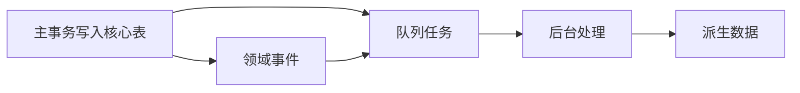

典型派生数据包括：

| 派生数据 / 副作用 | 来源 |
|---|---|
| Page History | 页面内容变更后投递历史队列 |
| Search Index | 页面、评论、附件变更后投递搜索队列 |
| AI Embedding | 页面内容更新后投递 AI 队列 |
| Notification | 评论、提及、权限等操作投递通知队列 |
| Attachment Cleanup | 页面/空间删除后投递附件清理队列 |
| Audit Log | 操作事件进入审计服务或队列 |

因此，二次开发时需要区分：

- **强一致数据**：核心业务写表，例如 `pages`, `spaceMembers`, `pagePermissions`。
- **最终一致数据**：搜索索引、历史版本、AI Embedding、通知、附件清理等。

## 20. 关键数据访问模式

### 20.1 Base Fields 模式

多个 Repo 定义 `baseFields`，默认只查轻量字段。大字段如 `content`, `ydoc`, `textContent` 需要显式 include。

示例：`PageRepo.findById` 支持：

| 选项 | 加载字段 / 聚合 |
|---|---|
| `includeContent` | 加载 `content` |
| `includeTextContent` | 加载 `textContent` |
| `includeYdoc` | 加载 `ydoc` |
| `includeSpace` | 聚合 Space 简要信息 |
| `includeCreator` | 聚合创建者 |
| `includeLastUpdatedBy` | 聚合最后更新者 |
| `includeContributors` | 聚合贡献者列表 |
| `includeHasChildren` | 判断是否有子页面 |
| `withLock` | 事务内 `for update` 加锁 |

这种模式可以降低页面列表、侧边栏、搜索等场景的数据传输与查询成本。

### 20.2 JSON 聚合模式

Repo 中大量使用 PostgreSQL JSON 聚合：

- `jsonObjectFrom`
- `jsonArrayFrom`

典型用途：

| 聚合对象 | 说明 |
|---|---|
| `page.space` | 页面所属空间简要信息 |
| `page.creator` | 页面创建者 |
| `page.lastUpdatedBy` | 最后更新者 |
| `page.contributors` | 页面贡献者列表 |
| `comment.creator` | 评论创建者 |
| `comment.resolvedBy` | 评论解决人 |
| `share.page` | 分享对应页面 |
| `share.space` | 分享对应空间 |

### 20.3 Cursor Pagination 模式

分页统一使用 cursor pagination，而不是简单 offset pagination。

常见排序字段：

| 场景 | 排序字段 |
|---|---|
| 最近页面 | `updatedAt desc`, `id desc` |
| 删除页面 | `deletedAt desc`, `id desc` |
| Space 成员 | `roleOrder asc`, `isGroup desc`, `memberName asc`, `id asc` |
| Page 权限成员 | `isGroup desc`, `id asc` |
| 分享列表 | `updatedAt desc`, `id desc` |

## 21. 推荐 ER 总图

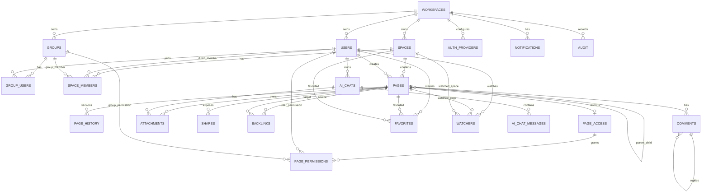

## 22. 二次开发注意事项

### 22.1 修改 Page 相关逻辑时

必须检查：

- 是否需要处理页面树递归。
- 是否需要过滤软删除页面。
- 是否需要校验 Page 级限制。
- 是否需要更新 `textContent` / `tsv` / `ydoc`。
- 是否需要投递搜索、历史、AI、通知队列。
- 是否需要触发 WebSocket 事件。

### 22.2 修改权限逻辑时

必须检查：

- Space 直接成员权限。
- Space 组成员权限。
- Page 本页限制。
- Page 祖先限制。
- 最近受限祖先对编辑权限的影响。
- 搜索、分享、侧边栏树是否同步过滤。

### 22.3 修改内容模型时

必须检查：

- 前端 Tiptap schema。
- 后端 `collaboration.util` 中 JSON/HTML/Markdown/Text 转换。
- `PersistenceExtension` 的保存逻辑。
- `PageHistory` 的版本记录。
- 搜索文本提取。
- AI Embedding 内容来源。
- 导入导出逻辑。

### 22.4 修改附件逻辑时

必须检查：

- `attachments` 元数据。
- Storage driver 文件路径。
- 文件清理队列。
- 文本提取与索引。
- 页面权限或 AI Chat 权限。

## 23. 建议后续深入分析点

后续如果继续补充更细的开发文档，建议新增以下专题：

| 专题 | 建议文档 |
|---|---|
| Page 权限算法详解 | `docs/topic-page-permission-algorithm.md` |
| 协作内容持久化详解 | `docs/topic-collaboration-persistence.md` |
| 页面树移动/复制/删除规则 | `docs/topic-page-tree-operations.md` |
| 搜索索引与 Typesense 切换 | `docs/topic-search-indexing.md` |
| AI Embedding 数据流 | `docs/topic-ai-data-flow.md` |

## 24. 小结

Docmost 的数据架构可以概括为：

1. `workspaces` 是租户根。
2. `spaces` 是知识空间与权限边界。
3. `pages` 是核心内容实体，采用树结构。
4. 页面内容同时保存 Tiptap JSON、Yjs binary、纯文本和 tsvector。
5. Space 权限由 `spaceMembers` 表表达，支持用户和组。
6. Page 级限制由 `pageAccess + pagePermissions` 表达，并沿页面祖先链继承。
7. 评论、附件、分享、历史、收藏、关注、通知围绕 Page 展开。
8. 搜索、AI、历史、通知等派生能力通过队列实现最终一致。
