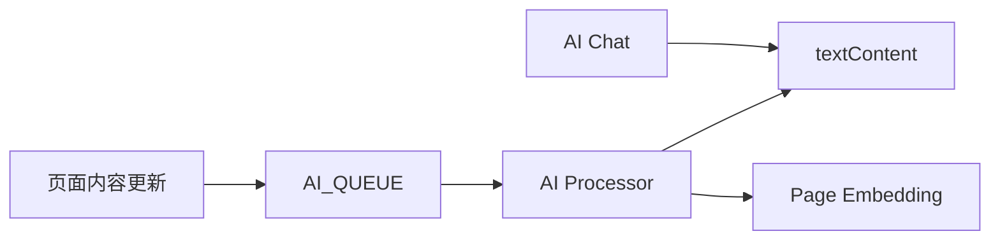
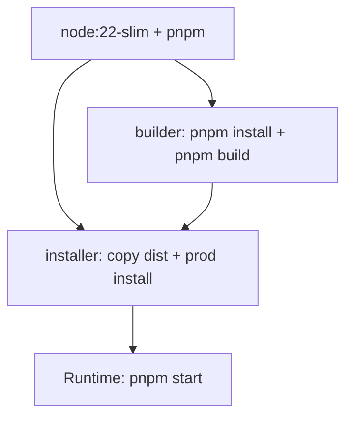
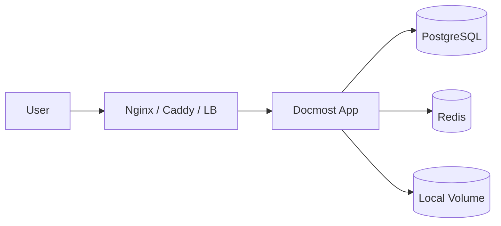
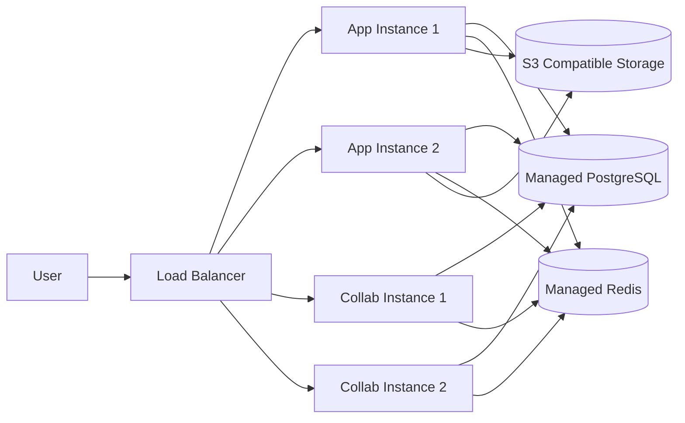
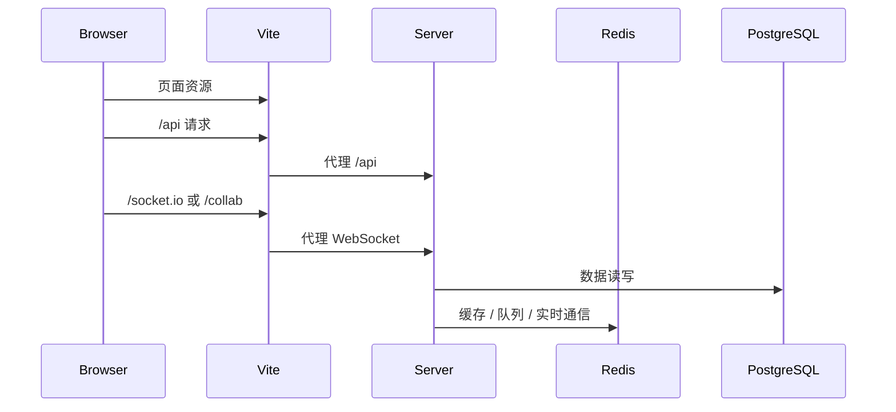

# Docmost 技术架构说明

> 本文档基于源码反向分析生成，用于帮助系统工程师、DevOps、架构师和研发人员快速理解 Docmost 的技术栈、工程组织、构建体系、运行配置、基础设施依赖与部署形态。
>
> 分析基线：`main` 分支，参考提交 `c9fa6e20b32689c3639d691840834b15df171f5f`。

## 1. 技术架构总览

Docmost 是一个 TypeScript Monorepo 项目，使用 `pnpm workspace + Nx` 管理多个应用和包。运行时主要由以下组件组成：

```mermaid
flowchart TD
  Browser[Browser]

  subgraph Frontend[apps/client]
    React[React 18]
    Vite[Vite]
    Mantine[Mantine UI]
    Query[TanStack Query]
    Tiptap[Tiptap / ProseMirror]
  end

  subgraph Backend[apps/server]
    Nest[NestJS 11]
    Fastify[Fastify Adapter]
    Kysely[Kysely]
    BullMQ[BullMQ]
    SocketIO[Socket.IO]
    Hocuspocus[Hocuspocus / Yjs]
  end

  subgraph Packages[packages]
    EditorExt[@docmost/editor-ext]
    EE[Enterprise Extension]
  end

  subgraph Infra[Infrastructure]
    PG[(PostgreSQL)]
    Redis[(Redis)]
    Storage[(Local / S3)]
    Mail[SMTP / Postmark / Log]
    Search[PostgreSQL FTS / Typesense]
    AI[OpenAI / Gemini / Ollama / Compatible API]
  end

  Browser --> Frontend
  Frontend -->|HTTP /api| Nest
  Frontend -->|/socket.io| SocketIO
  Frontend -->|/collab| Hocuspocus
  Nest --> Kysely --> PG
  Nest --> BullMQ --> Redis
  SocketIO --> Redis
  Hocuspocus --> Redis
  Nest --> Storage
  Nest --> Mail
  Nest --> Search
  Nest --> AI
  Frontend --> EditorExt
  Backend --> EditorExt
  Backend --> EE
  Frontend --> EE
```

## 2. 工程与包管理

### 2.1 Monorepo 工程形态

根目录采用：

| 技术 | 作用 |
|---|---|
| `pnpm@10.4.0` | 包管理器 |
| `pnpm workspace` | 管理 `apps/*`、`packages/*` |
| `Nx 22.6.1` | 构建编排、任务缓存、依赖构建 |
| TypeScript | 全栈主要开发语言 |

工作空间：

```text
apps/*
packages/*
```

主要项目：

| 项目 | 说明 |
|---|---|
| `apps/server` | NestJS/Fastify 后端服务 |
| `apps/client` | React/Vite 前端应用 |
| `packages/editor-ext` | 编辑器扩展包 |
| `packages/ee` | 企业版扩展包 |

### 2.2 根脚本

| 命令 | 说明 |
|---|---|
| `pnpm build` | `nx run-many -t build`，构建多个项目 |
| `pnpm dev` | 并发启动前端开发服务和后端开发服务 |
| `pnpm start` | 启动生产后端主服务 |
| `pnpm collab` | 启动生产协作服务 |
| `pnpm collab:dev` | 启动开发协作服务 |
| `pnpm server:build` | 构建后端 |
| `pnpm client:build` | 构建前端 |
| `pnpm editor-ext:build` | 构建编辑器扩展包 |
| `pnpm clean` | 清理构建产物和 Vite 缓存 |

### 2.3 Nx 构建策略

`nx.json` 中配置：

| 配置 | 说明 |
|---|---|
| `build.dependsOn: ['^build']` | 构建项目前先构建依赖项目 |
| `build.cache: true` | 构建结果可缓存 |
| `lint.cache: true` | Lint 结果可缓存 |
| `affected.defaultBase: main` | affected 分析默认基线为 main |
| `analytics: false` | 禁用 Nx analytics |

这说明项目适合使用 Nx 的依赖图、增量构建和 CI 缓存能力。

## 3. 后端技术栈

### 3.1 核心框架

| 技术 | 版本 / 形态 | 用途 |
|---|---|---|
| Node.js | Docker 使用 `node:22-slim` | 服务端运行时 |
| NestJS | 11.x | 后端模块化框架 |
| Fastify | Nest Fastify Adapter | HTTP Server |
| TypeScript | 5.9.x | 服务端开发语言 |
| RxJS | 7.x | Nest 生态依赖 |
| Pino / nestjs-pino | 结构化日志 | 请求日志、应用日志 |
| class-validator / class-transformer | DTO 校验转换 | 请求参数校验 |
| nestjs-cls | 请求上下文 | 审计、上下文传递 |

后端入口：

```text
apps/server/src/main.ts
```

后端总装模块：

```text
apps/server/src/app.module.ts
```

### 3.2 后端编译配置

后端 `tsconfig.json` 关键配置：

| 配置 | 值 / 说明 |
|---|---|
| `module` | `commonjs` |
| `target` | `ES2021` |
| `outDir` | `./dist` |
| `emitDecoratorMetadata` | `true`，NestJS 装饰器需要 |
| `experimentalDecorators` | `true` |
| `incremental` | `true` |
| `strict` | `true`，但多个严格子项关闭 |
| `jsx` | `react`，用于服务端 React Email 等场景 |
| path alias | `@docmost/db/*`, `@docmost/transactional/*`, `@docmost/ee/*` |

Nest CLI 配置：

| 配置 | 说明 |
|---|---|
| `sourceRoot` | `src` |
| `deleteOutDir` | 构建前删除输出目录 |

### 3.3 HTTP 层

后端使用 `NestFastifyApplication`，并配置：

| 能力 | 说明 |
|---|---|
| 全局前缀 | `/api` |
| excluded routes | `robots.txt`, `share/:shareId/p/:pageSlug`, `mcp` 等不走 `/api` 前缀 |
| CORS | 启用 |
| Cookie | `@fastify/cookie` |
| Multipart | `@fastify/multipart` |
| IP | `fastify-ip` |
| SCIM JSON | 自定义 `application/scim+json` parser |
| 响应格式 | `TransformHttpResponseInterceptor` 统一响应转换 |
| ValidationPipe | `whitelist`, `stopAtFirstError`, `transform` |
| Shutdown hooks | 启用 |

### 3.4 中间件与 Hook

关键运行逻辑：

| 组件 | 说明 |
|---|---|
| `DomainMiddleware` | 自托管取首个 Workspace；云端按 host/subdomain 识别 Workspace |
| `AuditContextMiddleware` | 建立审计上下文 |
| Fastify `preHandler` hook | 对大部分 `/api` 请求要求已识别 `workspaceId` |
| `InternalLogFilter` | 捕获 Nest 内部错误日志 |

## 4. 前端技术栈

### 4.1 核心框架

| 技术 | 用途 |
|---|---|
| React 18 | UI 框架 |
| Vite 8 | 前端开发与构建 |
| TypeScript | 前端开发语言 |
| React Router 7 | 前端路由 |
| TanStack Query 5 | 服务端状态和请求缓存 |
| Mantine 8 | UI 组件库 |
| Jotai | 局部/全局状态管理 |
| i18next / react-i18next | 国际化 |
| PostHog | 云端模式产品分析 |
| Tiptap / ProseMirror | 富文本编辑器 |
| Yjs / y-prosemirror | 协作编辑状态同步 |
| Socket.IO Client | 业务实时消息 |
| Hocuspocus Provider | 协作 WebSocket provider |

### 4.2 前端编译配置

客户端 `tsconfig.json` 关键配置：

| 配置 | 值 / 说明 |
|---|---|
| `target` | `ES2020` |
| `lib` | `ES2020`, `DOM`, `DOM.Iterable` |
| `module` | `ESNext` |
| `moduleResolution` | `bundler` |
| `jsx` | `react-jsx` |
| `noEmit` | `true`，由 Vite 负责打包 |
| `strict` | `false` |
| path alias | `@/* -> ./src/*` |

### 4.3 Vite 配置

`apps/client/vite.config.ts` 关键点：

| 配置项 | 说明 |
|---|---|
| `loadEnv` | 从仓库根目录加载环境变量 |
| `define.process.env` | 注入 APP_URL、CLOUD、COLLAB_URL、DRAWIO_URL、POSTHOG 等配置 |
| `APP_VERSION` | 注入 npm package version |
| `@vitejs/plugin-react` | React 插件 |
| `resolve.alias` | `@ -> /src` |
| `server.proxy./api` | 代理 REST API 到 `APP_URL` |
| `server.proxy./socket.io` | 代理 Socket.IO WebSocket |
| `server.proxy./collab` | 代理协作 WebSocket |
| build code splitting | 对 Mantine、Mermaid、Excalidraw、KaTeX 做 vendor 分组 |

## 5. 编辑器技术架构

Docmost 的编辑器技术组合：

| 技术 | 作用 |
|---|---|
| Tiptap | 富文本编辑器框架 |
| ProseMirror | 文档模型与编辑能力底座 |
| Yjs | CRDT 协作数据结构 |
| y-prosemirror | ProseMirror 与 Yjs 绑定 |
| Hocuspocus | Yjs WebSocket 协作服务 |
| `@docmost/editor-ext` | 自定义编辑器扩展包 |
| Mermaid | 图表 |
| Excalidraw | 绘图 |
| Draw.io | 图形编辑集成 |
| KaTeX | 数学公式 |
| highlight.js / lowlight | 代码高亮 |

编辑器内容在后端同时落成多种形态：

| 形态 | 说明 |
|---|---|
| Tiptap JSON | 页面结构化内容 |
| Ydoc binary | 协作 CRDT 状态 |
| Text content | 搜索 / AI 使用 |
| PostgreSQL tsvector | 数据库全文检索 |

## 6. 数据库与持久化技术

### 6.1 PostgreSQL + Kysely

后端使用：

| 技术 | 用途 |
|---|---|
| PostgreSQL | 主数据库 |
| `postgres` | PostgreSQL JS client |
| `kysely` | 类型安全 SQL Query Builder |
| `kysely-postgres-js` | Kysely PostgreSQL dialect |
| `nestjs-kysely` | NestJS 依赖注入集成 |
| `kysely-codegen` | 类型生成 |
| `kysely-migration-cli` | Migration CLI |

连接配置来自 `EnvironmentService`：

| 环境变量 | 说明 |
|---|---|
| `DATABASE_URL` | PostgreSQL 连接串 |
| `DATABASE_MAX_POOL` | 最大连接池，默认 10 |
| `DEBUG_DB` | 开发环境输出 SQL 与耗时 |

### 6.2 Migration 策略

后端 package scripts：

| 命令 | 说明 |
|---|---|
| `migration:create` | 创建 migration |
| `migration:up` | 执行 up |
| `migration:down` | 回滚一个 migration |
| `migration:latest` | 迁移到最新 |
| `migration:redo` | 重做 migration |
| `migration:reset` | 回滚到 `NO_MIGRATIONS` |
| `migration:codegen` | 生成 Kysely 类型定义 |

生产环境中 `DatabaseModule.onApplicationBootstrap()` 会自动执行 `migrateToLatest()`。

## 7. Redis 技术使用

Redis 是 Docmost 的关键基础设施，不只是缓存。

| 使用场景 | 技术 / 模块 | 说明 |
|---|---|---|
| 缓存 | Nest Cache + KeyvRedis | 全局 CacheModule，TTL 默认 5 秒 |
| 队列 | BullMQ | 邮件、搜索、AI、历史、通知、审计等任务 |
| 业务 WebSocket 横向扩展 | Socket.IO Redis Adapter | 多实例房间与事件广播 |
| 协作同步 | RedisSyncExtension | 多协作实例同步 Yjs 事件、文档锁 |
| 限流存储 | Redis throttler storage | 分布式限流 |

部署上 Redis 需要稳定可靠。`docker-compose.yml` 中 Redis 使用：

```text
redis-server --appendonly yes --maxmemory-policy noeviction
```

这表明项目希望 Redis 不因内存淘汰破坏队列或协作状态。

## 8. 异步队列技术架构

队列模块：

```text
apps/server/src/integrations/queue/queue.module.ts
```

核心技术：

| 技术 | 说明 |
|---|---|
| BullMQ | Redis-backed queue |
| `@nestjs/bullmq` | NestJS 集成 |
| Redis retry strategy | 统一 Redis 重试策略 |
| default job options | 默认 3 次重试、指数退避、保留成功/失败任务数量 |

队列清单：

| 队列 | 典型任务 |
|---|---|
| `EMAIL_QUEUE` | 邮件发送 |
| `ATTACHMENT_QUEUE` | 附件索引、附件删除 |
| `GENERAL_QUEUE` | backlink、watcher 等通用任务 |
| `BILLING_QUEUE` | Stripe seats sync、试用结束、付款邮件 |
| `FILE_TASK_QUEUE` | 导入导出任务 |
| `SEARCH_QUEUE` | 页面、评论、附件索引维护 |
| `AI_QUEUE` | 页面内容更新、Embedding 生成/删除 |
| `HISTORY_QUEUE` | 页面历史版本 |
| `NOTIFICATION_QUEUE` | 评论、提及、权限、审核等通知 |
| `AUDIT_QUEUE` | 审计日志、审计清理 |

## 9. 实时通信技术架构

Docmost 存在两条实时通信链路。

### 9.1 业务 WebSocket：Socket.IO

| 项目 | 说明 |
|---|---|
| 模块 | `WsModule` |
| Gateway | `WsGateway` |
| 技术 | `@nestjs/websockets` + Socket.IO |
| 认证 | 从 Cookie 读取 `authToken`，用 `TokenService` 校验 JWT |
| 房间 | User room、Workspace room、Space room |
| 用途 | 页面树事件、通知、普通业务实时更新 |

### 9.2 协作 WebSocket：Hocuspocus/Yjs

| 项目 | 说明 |
|---|---|
| 模块 | `CollaborationModule` |
| Gateway | `CollaborationGateway` |
| 技术 | Hocuspocus + Yjs + `ws` |
| 路径 | `/collab` |
| 认证 | `AuthenticationExtension` 校验协作 JWT、用户状态、空间/页面权限 |
| 持久化 | `PersistenceExtension` 加载/保存 Ydoc 与 Tiptap JSON |
| 多实例 | `RedisSyncExtension` |
| 独立运行 | `pnpm collab`，入口 `collab-main.ts` |

## 10. 存储技术架构

存储模块：

```text
apps/server/src/integrations/storage
```

使用动态 provider 选择具体 driver：

| Driver | 环境变量 | 说明 |
|---|---|---|
| `local` | `STORAGE_DRIVER=local` | 本地文件系统，默认模式 |
| `s3` | `STORAGE_DRIVER=s3` | S3 兼容对象存储 |

S3 配置项：

| 环境变量 | 说明 |
|---|---|
| `AWS_S3_REGION` | region |
| `AWS_S3_ENDPOINT` | endpoint，支持 S3 兼容存储 |
| `AWS_S3_BUCKET` | bucket |
| `AWS_S3_URL` | base URL |
| `AWS_S3_FORCE_PATH_STYLE` | path style |
| `AWS_S3_ACCESS_KEY_ID` | access key |
| `AWS_S3_SECRET_ACCESS_KEY` | secret key |

技术判断：上层业务通过 `StorageService` 访问文件，避免直接依赖本地磁盘或 S3 SDK。

## 11. 邮件技术架构

邮件模块：

```text
apps/server/src/integrations/mail
```

采用 driver 抽象：

| Driver | 说明 |
|---|---|
| `smtp` | 使用 Nodemailer SMTPTransport |
| `postmark` | 使用 Postmark API |
| `log` | 日志输出，适合开发或无邮件配置场景 |

主要配置：

| 环境变量 | 说明 |
|---|---|
| `MAIL_DRIVER` | 邮件驱动，默认 `log` |
| `MAIL_FROM_ADDRESS` | 发件地址 |
| `MAIL_FROM_NAME` | 发件名称，默认 `Docmost` |
| `MAIL_BLOCKED_RECIPIENT_DOMAINS` | 禁止发送域名 |
| `SMTP_HOST` / `SMTP_PORT` | SMTP 地址与端口 |
| `SMTP_SECURE` / `SMTP_IGNORETLS` | TLS 配置 |
| `SMTP_USERNAME` / `SMTP_PASSWORD` | SMTP 认证 |
| `POSTMARK_TOKEN` | Postmark token |

邮件发送通常通过 `EMAIL_QUEUE` 异步执行。

## 12. 搜索技术架构

搜索能力有两种技术路线。

### 12.1 PostgreSQL 全文检索

当前源码中 `SearchService` 直接使用 PostgreSQL：

| 技术 | 说明 |
|---|---|
| `to_tsquery` | 查询表达式 |
| `ts_rank` | 搜索排序 |
| `ts_headline` | 高亮摘要 |
| `f_unaccent` | 去重音 / 文本规范化 |
| `tsv` 字段 | tsvector 索引字段 |

### 12.2 Typesense 扩展

环境配置与队列任务中存在 Typesense 支持：

| 环境变量 | 说明 |
|---|---|
| `SEARCH_DRIVER` | 搜索驱动，默认 `database` |
| `TYPESENSE_URL` | Typesense 服务地址 |
| `TYPESENSE_API_KEY` | API Key |
| `TYPESENSE_LOCALE` | locale，默认 `en` |

队列中也有：

- `SEARCH_INDEX_PAGE`
- `SEARCH_INDEX_COMMENT`
- `SEARCH_INDEX_ATTACHMENT`
- `TYPESENSE_FLUSH`

这说明系统设计上支持数据库搜索与外部搜索索引并存或切换。

## 13. AI 技术架构

后端依赖中包含多种 AI Provider：

| Provider / SDK | 说明 |
|---|---|
| `ai` | Vercel AI SDK 核心包 |
| `@ai-sdk/openai` | OpenAI |
| `@ai-sdk/google` | Gemini |
| `@ai-sdk/openai-compatible` | OpenAI 兼容 API |
| `ai-sdk-ollama` | Ollama |
| `@langchain/core`, `@langchain/textsplitters` | 文本处理与 LLM 相关能力 |
| `js-tiktoken` | token 计算 |
| `pgvector` | 向量数据支持 |
| MCP SDK | Model Context Protocol 支持 |

关键环境变量：

| 环境变量 | 说明 |
|---|---|
| `AI_DRIVER` | AI driver |
| `AI_EMBEDDING_MODEL` | Embedding 模型 |
| `AI_COMPLETION_MODEL` | Completion 模型 |
| `AI_CHAT_MODEL` | Chat 模型，缺省时回退到 completion model |
| `AI_EMBEDDING_DIMENSION` | Embedding 维度 |
| `AI_EMBEDDING_SUPPORTS_MRL` | 是否支持 MRL |
| `OPENAI_API_KEY` / `OPENAI_API_URL` | OpenAI 或兼容 API |
| `GEMINI_API_KEY` | Gemini |
| `OLLAMA_API_URL` | Ollama 地址，默认 localhost:11434 |

AI 与页面内容的关系：



## 14. 导入导出与文件处理技术

后端依赖显示系统支持多种文档处理：

| 技术 / 依赖 | 说明 |
|---|---|
| `mammoth` | Word 文档处理 |
| `@docmost/pdf-inspector` | PDF 检查 |
| `GOTENBERG_URL` | PDF / 文档渲染服务集成 |
| `jszip`, `yauzl` | ZIP 处理 |
| `@joplin/turndown`, GFM plugin | HTML 转 Markdown |
| `marked` | Markdown 解析 |
| `happy-dom` / `cheerio` | HTML 解析处理 |
| `mime-types` | MIME 判断 |
| `sanitize-filename` | 文件名安全处理 |

导入导出与文件任务通常通过 `FILE_TASK_QUEUE` 异步处理。

## 15. 安全与认证技术

### 15.1 基础认证

| 技术 | 说明 |
|---|---|
| JWT | 访问 token、协作 token |
| Cookie | `authToken` 存储在 httpOnly Cookie |
| bcrypt | 密码 hash |
| Passport JWT | JWT 认证策略 |
| Session 表 | 设备会话、撤销、过期管理 |
| Throttler | 登录、AI Chat 等限流 |

Cookie 配置：

| 属性 | 说明 |
|---|---|
| `httpOnly` | 防止 JS 读取 |
| `sameSite: lax` | 基础 CSRF 防护 |
| `secure` | HTTPS 时启用 |
| `expires` | 来自 `JWT_TOKEN_EXPIRES_IN`，默认 90 天 |

### 15.2 企业 / 集成认证

依赖与字段显示支持：

| 能力 | 技术 |
|---|---|
| Google OAuth | `passport-google-oauth20` |
| OIDC | `openid-client` |
| SAML | `@node-saml/passport-saml` |
| LDAP | `ldapts` |
| SCIM | `scimmy` |
| MFA | `otpauth`，企业版模块 |

## 16. 审计、遥测与事件

| 能力 | 技术 / 模块 |
|---|---|
| 应用事件 | `@nestjs/event-emitter` |
| 审计 | `AuditContextMiddleware` + Audit service / queue |
| 遥测 | `TelemetryModule` |
| 前端产品分析 | PostHog，云端模式启用 |
| 日志 | Pino / nestjs-pino |
| 健康检查 | `@nestjs/terminus` + HealthModule |
| Event Store | `EVENT_STORE_DRIVER`, 默认 postgres；可配置 ClickHouse |
| ClickHouse | `@clickhouse/client` |

环境变量：

| 环境变量 | 说明 |
|---|---|
| `DISABLE_TELEMETRY` | 禁用遥测 |
| `POSTHOG_HOST` / `POSTHOG_KEY` | PostHog 配置 |
| `EVENT_STORE_DRIVER` | 事件存储 driver |
| `CLICKHOUSE_URL` | ClickHouse 地址 |

## 17. 静态资源与运行时配置

生产构建后，后端 `StaticModule` 会：

1. 查找 `apps/client/dist`。
2. 读取 `index.html`。
3. 注入 `window.CONFIG`。
4. 注册 Fastify static。
5. 对任意前端路由返回 `index.html`。

注入配置包括：

| 配置 | 说明 |
|---|---|
| `ENV` | 当前环境 |
| `APP_URL` | 应用 URL |
| `CLOUD` | 是否云端模式 |
| `FILE_UPLOAD_SIZE_LIMIT` | 上传大小限制 |
| `FILE_IMPORT_SIZE_LIMIT` | 导入大小限制 |
| `DRAWIO_URL` | Draw.io 地址 |
| `SUBDOMAIN_HOST` | 云端模式子域名 host |
| `COLLAB_URL` | 独立协作服务 URL |
| `BILLING_TRIAL_DAYS` | 云端试用天数 |
| `POSTHOG_HOST` / `POSTHOG_KEY` | 前端分析配置 |

## 18. 部署架构

### 18.1 Dockerfile

Dockerfile 是多阶段构建：



关键点：

| 项目 | 说明 |
|---|---|
| base image | `node:22-slim` |
| 包管理器 | 全局安装 `pnpm@10.4.0` |
| 构建命令 | `pnpm build` |
| 运行用户 | `node` |
| 数据卷 | `/app/data/storage` |
| 暴露端口 | `3000` |
| 默认命令 | `pnpm start` |

### 18.2 docker-compose

最小自托管 compose 包含：

| 服务 | 说明 |
|---|---|
| `docmost` | 应用容器，端口 3000 |
| `db` | PostgreSQL 18 |
| `redis` | Redis 8 |
| `docmost` volume | 本地文件存储 |
| `db_data` volume | PostgreSQL 数据 |
| `redis_data` volume | Redis 数据 |

应用环境变量：

```text
APP_URL=http://localhost:3000
APP_SECRET=REPLACE_WITH_LONG_SECRET
DATABASE_URL=postgresql://docmost:STRONG_DB_PASSWORD@db:5432/docmost
REDIS_URL=redis://redis:6379
```

### 18.3 推荐生产拓扑

#### 小规模自托管



适用：个人、团队、小规模内部知识库。

#### 中大型 / 高可用形态



高可用形态关键要求：

- Redis 必须共享。
- PostgreSQL 必须共享。
- 文件存储建议使用 S3，避免多实例本地文件不一致。
- `/collab` WebSocket 需要反向代理支持升级连接。
- 如果独立部署协作服务，需要正确设置 `COLLAB_URL`。

## 19. 配置中心：EnvironmentService

`EnvironmentService` 是后端配置访问中心。配置分类如下：

| 分类 | 代表配置 |
|---|---|
| 应用 | `NODE_ENV`, `APP_URL`, `PORT`, `HOST`, `APP_SECRET` |
| 数据库 | `DATABASE_URL`, `DATABASE_MAX_POOL` |
| Redis | `REDIS_URL` |
| Auth | `JWT_TOKEN_EXPIRES_IN` |
| 文件 | `STORAGE_DRIVER`, `FILE_UPLOAD_SIZE_LIMIT`, `FILE_IMPORT_SIZE_LIMIT` |
| S3 | `AWS_S3_*` |
| 邮件 | `MAIL_*`, `SMTP_*`, `POSTMARK_TOKEN` |
| 云端 | `CLOUD`, `SUBDOMAIN_HOST`, `BILLING_TRIAL_DAYS` |
| 协作 | `COLLAB_URL`, `COLLAB_DISABLE_REDIS`, `COLLAB_PORT`, `COLLAB_SHOW_STATS` |
| 搜索 | `SEARCH_DRIVER`, `TYPESENSE_*` |
| AI | `AI_*`, `OPENAI_*`, `GEMINI_API_KEY`, `OLLAMA_API_URL` |
| 遥测 | `DISABLE_TELEMETRY`, `POSTHOG_*` |
| 事件 | `EVENT_STORE_DRIVER`, `CLICKHOUSE_URL` |
| SAML | `SAML_DISABLE_REQUESTED_AUTHN_CONTEXT` |

## 20. 开发环境运行模式

典型开发启动：

```bash
pnpm install
pnpm dev
```

`pnpm dev` 会并发启动：

| 子命令 | 说明 |
|---|---|
| `pnpm client:dev` | Vite dev server |
| `pnpm server:dev` | Nest watch mode |

开发环境请求流：



## 21. 技术风险与治理建议

### 21.1 关键依赖风险

| 风险点 | 说明 | 建议 |
|---|---|---|
| Redis 单点 | 队列、缓存、协作、WebSocket 都依赖 Redis | 生产使用受管 Redis 或高可用 Redis |
| 本地存储多实例不一致 | 多应用实例使用 local storage 会导致附件分裂 | 多实例部署必须使用 S3 |
| 协作 WebSocket 代理 | `/collab` 需要 WebSocket upgrade 支持 | 反代配置单独验证 |
| Migration 自动执行 | 生产启动自动 migrate | 上线前备份数据库，灰度验证 migration |
| Page 内容多表示 | `content`, `ydoc`, `textContent`, `tsv` 需一致 | 修改编辑器或持久化逻辑必须补充回归测试 |
| 权限继承复杂 | Page 限制沿祖先链生效 | 修改权限必须覆盖树结构测试 |
| 企业版动态加载 | 云端模式缺 EE 会退出 | 构建产物需确认 EE 包含状态 |

### 21.2 性能关注点

| 场景 | 关注点 | 建议 |
|---|---|---|
| 页面树 | recursive CTE 成本 | 大空间下关注索引、分页和缓存 |
| 搜索 | PostgreSQL FTS 排序和高亮 | 大规模数据考虑 Typesense |
| 协作保存 | Ydoc 转 JSON 与 DB 写入 | 控制 debounce、监控保存耗时 |
| 权限过滤 | 祖先链 + Page Access 批量过滤 | 对大结果集搜索/侧边栏重点压测 |
| 队列积压 | AI、搜索、历史、通知任务增长 | 监控 BullMQ queue depth |
| 附件处理 | 文本抽取、PDF/Word 解析耗时 | 文件任务隔离 worker 或限流 |

### 21.3 可观测性建议

建议生产补充以下监控：

| 指标 | 说明 |
|---|---|
| HTTP latency / error rate | API 基础健康 |
| WebSocket connection count | 业务 WS 连接数 |
| Collab document count | 协作打开文档数 |
| Redis memory / ops / errors | Redis 健康 |
| BullMQ queue depth / failed jobs | 队列积压和失败 |
| PostgreSQL connections / slow queries | 数据库性能 |
| Page save duration | 协作保存耗时 |
| Search latency | 搜索性能 |
| Attachment processing failures | 文件处理稳定性 |
| Migration status | 数据库版本一致性 |

## 22. 技术架构小结

Docmost 的技术架构可以概括为：

1. 使用 `pnpm + Nx` 管理 TypeScript Monorepo。
2. 前端是 React/Vite/Mantine/Tiptap 单页应用。
3. 后端是 NestJS/Fastify 模块化服务。
4. PostgreSQL 是主数据库，Kysely 是数据访问核心。
5. Redis 是队列、缓存、WebSocket 扩展、协作同步的关键基础设施。
6. 富文本协作基于 Tiptap/ProseMirror/Yjs/Hocuspocus。
7. 文件存储通过 local/S3 driver 抽象。
8. 邮件、搜索、AI、审计、遥测均通过 integration 或 ee 模块扩展。
9. 默认 Docker 镜像是后端托管前端 dist 的单容器应用。
10. 多实例部署时必须共享 PostgreSQL、Redis 和对象存储。
