# Docmost 运行链路说明

> 本文档基于源码反向分析生成，用于帮助研发、测试、系统工程师理解 Docmost 在运行时的关键请求链路、权限链路、协作编辑链路、异步任务链路与排障入口。
>
> 分析基线：`main` 分支，参考提交 `c9fa6e20b32689c3639d691840834b15df171f5f`。

## 1. 文档目标

前面的架构文档回答“系统由哪些部分组成”。本文回答“系统运行时怎么流转”。重点覆盖：

- 请求进入后端后的公共前置链路。
- Workspace 识别链路。
- 登录、会话、Cookie、JWT 链路。
- 页面读取、创建、更新、删除、恢复、移动、复制链路。
- 富文本协作编辑链路。
- Space/Page 权限校验链路。
- 搜索链路。
- 附件上传、下载与文件存储链路。
- 队列、通知、历史、AI、搜索索引等异步副作用。
- 排障时应优先查看的源码入口。

## 2. 请求总入口链路

后端入口：

```text
apps/server/src/main.ts
```

核心链路：

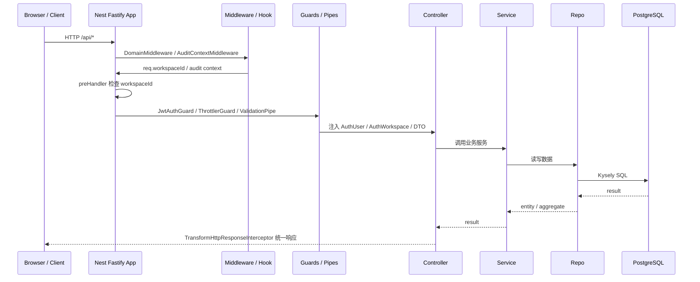

公共运行点：

| 阶段 | 关键组件 | 职责 |
|---|---|---|
| 应用初始化 | `main.ts` | 创建 NestFastifyApplication，设置全局前缀、插件、pipe、interceptor |
| Workspace 识别 | `DomainMiddleware` | 自托管取首个 Workspace；云端按 hostname/subdomain 找 Workspace |
| 审计上下文 | `AuditContextMiddleware` | 为审计日志准备请求上下文 |
| Workspace 必填检查 | Fastify `preHandler` | 大多数 `/api` 请求要求 `req.raw.workspaceId` 已存在 |
| 参数校验 | `ValidationPipe` | DTO 白名单、转换、遇首个错误停止 |
| 认证 | `JwtAuthGuard` | 解析 Cookie/JWT 并注入当前用户 |
| 响应转换 | `TransformHttpResponseInterceptor` | 统一 HTTP 响应结构 |

## 3. Workspace 识别链路

Workspace 是 Docmost 的租户边界。请求进入系统时会先识别当前 Workspace。

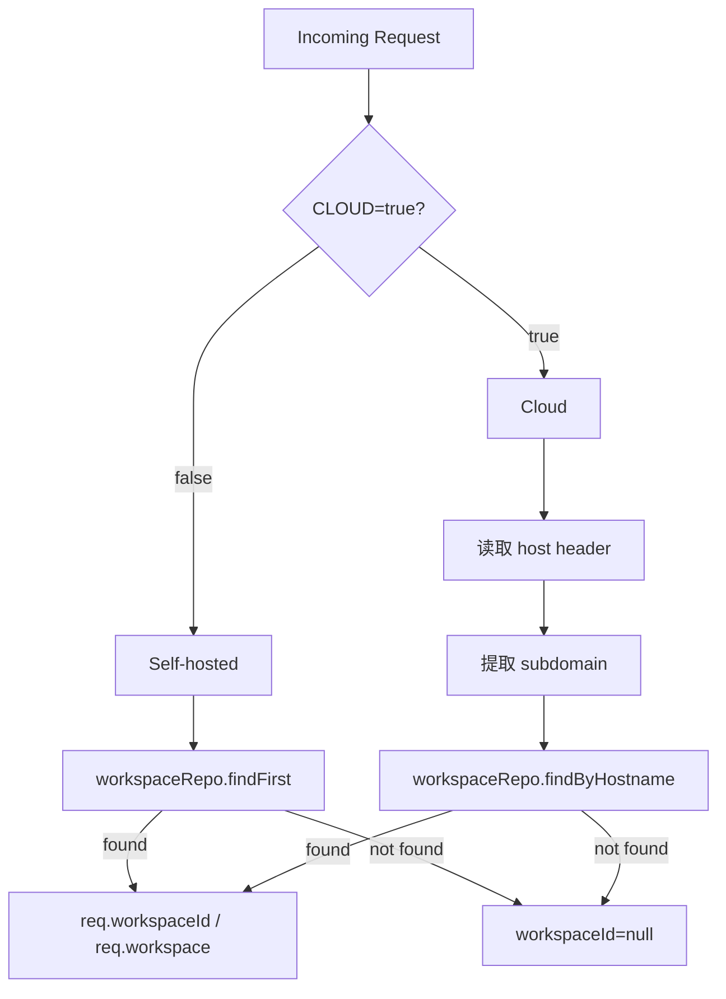

### 3.1 自托管模式

- `CLOUD=false` 或未设置时为自托管模式。
- 系统通过 `workspaceRepo.findFirst()` 获取第一个 Workspace。
- 如果尚未初始化 Workspace，则允许部分 setup 路径继续访问。

### 3.2 云端模式

- `CLOUD=true` 时启用云端模式。
- 通过 `Host` 请求头提取 subdomain。
- 使用 `workspaceRepo.findByHostname(subdomain)` 定位 Workspace。

### 3.3 Workspace 前置排除路径

`main.ts` 中的 Fastify `preHandler` 对多数 `/api` 请求要求 `workspaceId` 存在，但排除以下路径：

| 路径 | 说明 |
|---|---|
| `/api/auth/setup` | 初始化工作区 |
| `/api/health` | 健康检查 |
| `/api/billing/stripe/webhook` | Stripe webhook |
| `/api/workspace/check-hostname` | 检查 hostname |
| `/api/sso/google` | Google SSO |
| `/api/workspace/create` | 创建 Workspace |
| `/api/workspace/joined` | 已加入 Workspace |
| `/api/workspace/find-by-email` | 按邮箱查 Workspace |

## 4. 登录与会话链路

主要入口：

```text
apps/server/src/core/auth/auth.controller.ts
apps/server/src/core/auth/services/auth.service.ts
apps/server/src/core/session/session.service.ts
```

### 4.1 普通登录链路

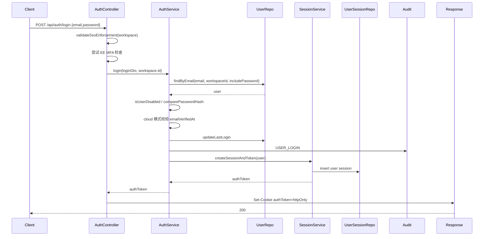

关键点：

| 环节 | 说明 |
|---|---|
| Workspace | 登录必须绑定当前 Workspace |
| SSO enforcement | 如果 Workspace 强制 SSO，密码登录会被拒绝 |
| MFA | 企业版 MFA 模块可拦截登录，要求 MFA 验证或设置 |
| 密码校验 | bcrypt hash 比对 |
| 邮箱验证 | 云端模式下未验证邮箱可能被拦截 |
| 会话 | 登录成功后创建 `userSessions` 记录并生成 JWT |
| Cookie | `authToken` 写入 httpOnly Cookie |
| 审计 | 写入 `USER_LOGIN` 审计事件 |

### 4.2 Cookie 设置

登录成功后：

```text
authToken
httpOnly=true
sameSite=lax
path=/
expires=JWT_TOKEN_EXPIRES_IN
secure=isHttps(APP_URL)
```

### 4.3 登出链路

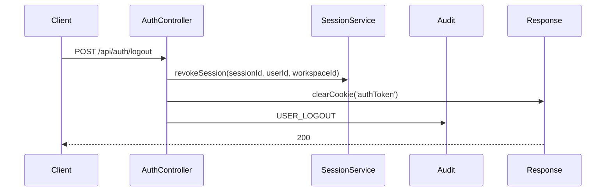

### 4.4 修改密码链路

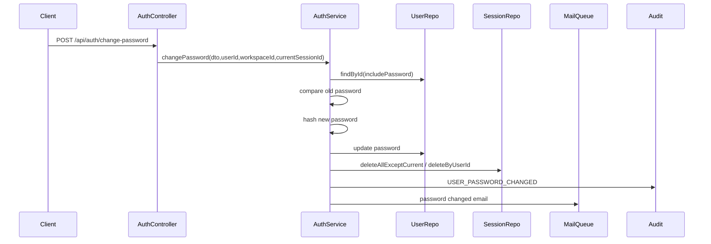

## 5. 协作 Token 链路

协作编辑使用专门的 Collab JWT，不直接复用 Access JWT。

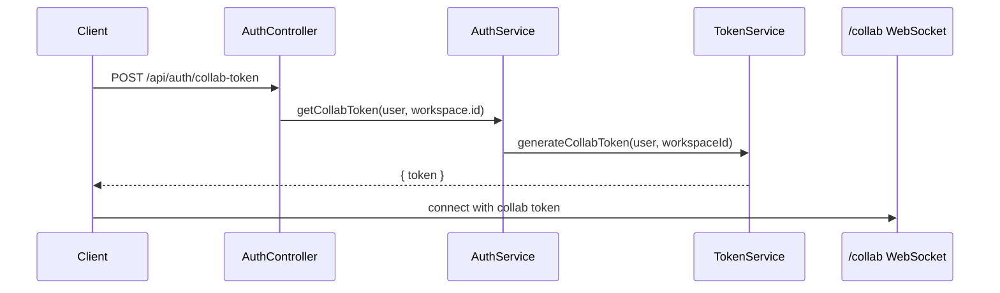

Collab token 在 `AuthenticationExtension` 中被校验，并进一步检查用户、页面、Space 权限、Page 级权限。

## 6. 页面读取链路

入口：

```text
POST /api/pages/info
PageController.getPage
```

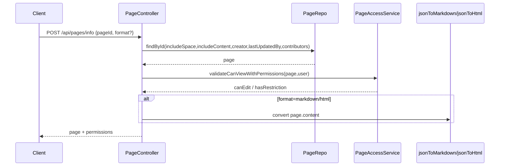

关键点：

| 环节 | 说明 |
|---|---|
| pageId | 支持 UUID 或 slugId 查询 |
| includeContent | 页面详情读取会加载 `content` |
| 权限 | 返回前必须通过 PageAccessService 校验 |
| 格式转换 | 支持 JSON、Markdown、HTML 输出 |
| 返回权限 | 响应附带 `permissions.canEdit` 和 `permissions.hasRestriction` |

## 7. 页面创建链路

入口：

```text
POST /api/pages/create
PageController.create
PageService.create
```

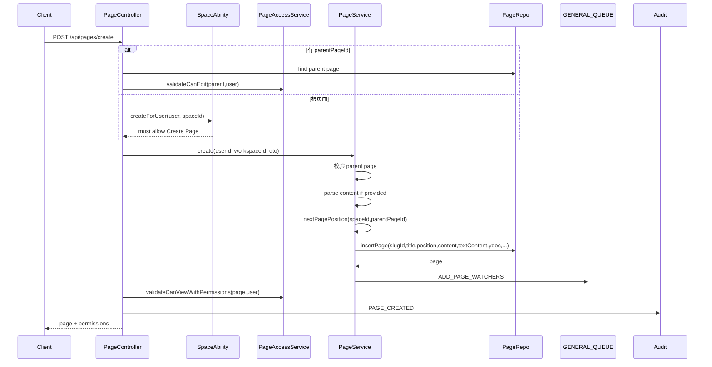

页面创建时的数据处理：

| 输入格式 | 处理方式 |
|---|---|
| `json` | 直接校验 ProseMirror JSON |
| `html` | `htmlToJson` 转换为 ProseMirror JSON |
| `markdown` | `markdownToHtml` 后再 `htmlToJson` |

创建后的内容字段：

| 字段 | 来源 |
|---|---|
| `content` | ProseMirror JSON |
| `textContent` | `jsonToText(content)` |
| `ydoc` | `createYdocFromJson(content)` |
| `slugId` | `generateSlugId()` |
| `position` | `fractional-indexing-jittered` 生成 |

## 8. 页面标题/元数据更新链路

入口：

```text
POST /api/pages/update
PageController.update
PageService.update
```

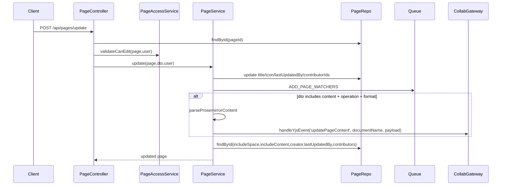

重点：

- 普通标题、图标更新直接写 `pages`。
- 内容更新不会绕过协作系统直接写 DB，而是通过 `CollaborationGateway.handleYjsEvent` 进入 Yjs 协作链路，保证在线协作者和 Ydoc 状态一致。

## 9. 实时协作编辑链路

协作入口：

```text
/collab
CollaborationModule
CollaborationGateway
AuthenticationExtension
PersistenceExtension
```

### 9.1 连接认证链路

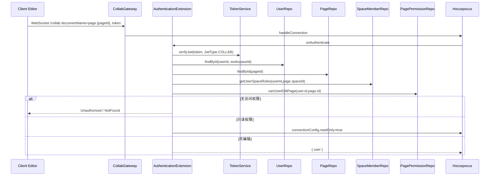

权限判断顺序：

1. Collab JWT 是否有效。
2. 用户是否存在。
3. 用户是否被禁用。
4. 页面是否存在。
5. 用户是否是 Space 成员。
6. 是否存在 Page 级限制。
7. Page 级限制下是否可访问、可编辑。
8. 若仅可读，协作连接被置为 readonly。
9. 若页面已删除，也置为 readonly。

### 9.2 文档加载链路

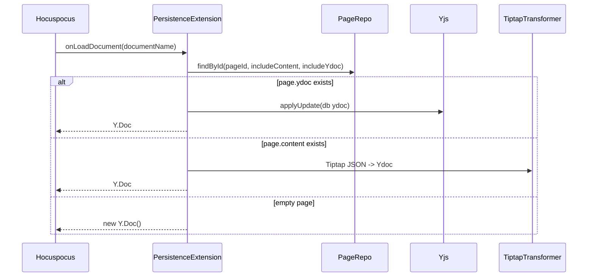

### 9.3 文档保存链路

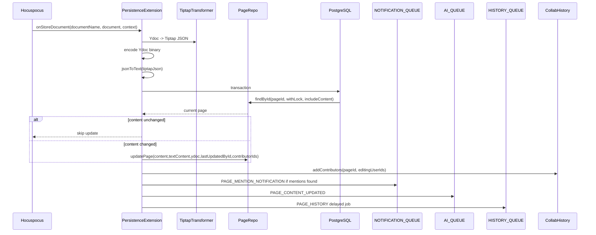

关键机制：

| 机制 | 说明 |
|---|---|
| debounce | Hocuspocus 保存 debounce 10s，最大 45s |
| DB lock | 保存时 `findById(...withLock)`，避免并发写冲突 |
| 内容去重 | 若 Tiptap JSON 与旧 content 深度相等，则跳过更新 |
| contributorIds | 合并历史贡献者、本次编辑用户、创建者 |
| mention notification | 提取新增用户提及并投递通知队列 |
| AI update | 页面内容更新后投递 AI 队列 |
| history | 投递延迟历史任务，避免过于频繁生成版本 |

## 10. 页面删除、恢复、永久删除链路

### 10.1 软删除

入口：

```text
POST /api/pages/delete { permanentlyDelete: false }
```

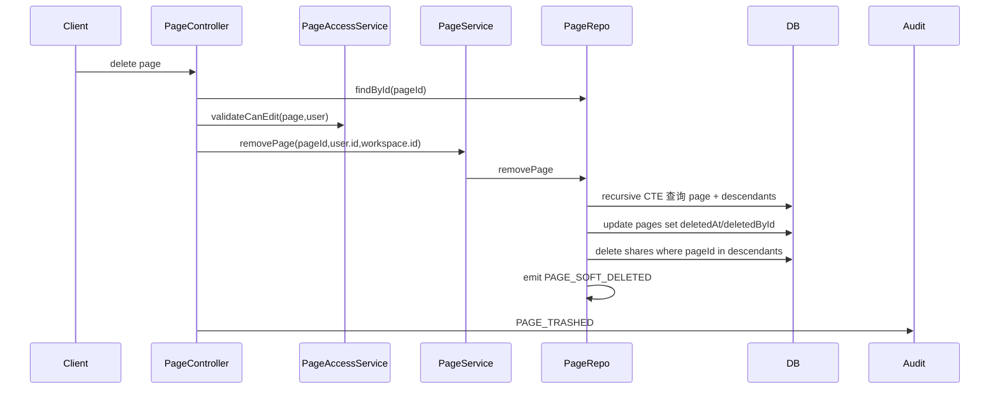

软删除规则：

- 页面及子孙页面一起标记删除。
- 相关分享记录删除。
- 页面本体仍保留，可恢复。

### 10.2 恢复

入口：

```text
POST /api/pages/restore
```

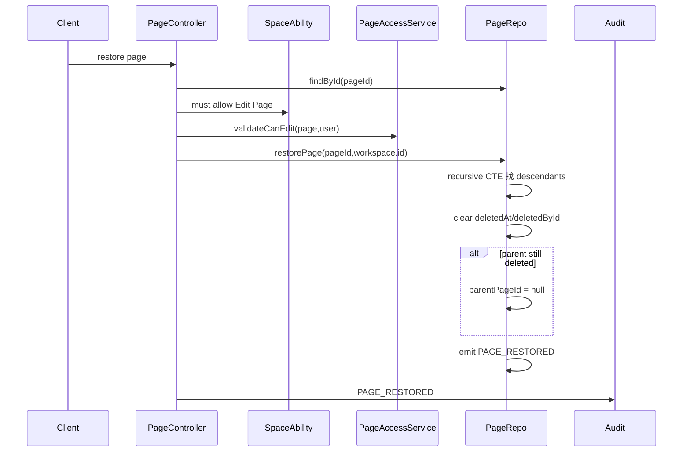

### 10.3 永久删除

入口：

```text
POST /api/pages/delete { permanentlyDelete: true }
```

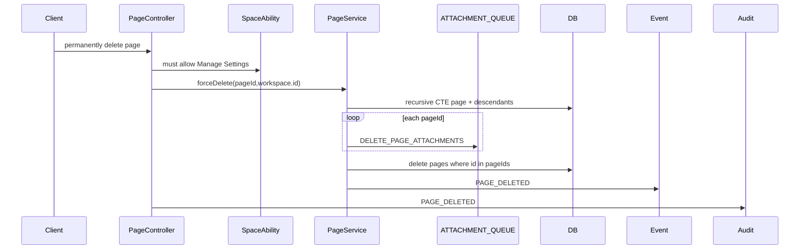

永久删除特点：

- 需要 Space Admin 级能力。
- 删除 pages 记录。
- 附件删除通过队列异步执行。

## 11. 页面移动链路

页面移动分两类：

| 操作 | 入口 | 说明 |
|---|---|---|
| 同 Space 内移动 | `POST /api/pages/move` | 调整 parentPageId / position |
| 跨 Space 移动 | `POST /api/pages/move-to-space` | 移动页面树、迁移关联数据、清理 Page 权限 |

### 11.1 同 Space 内移动

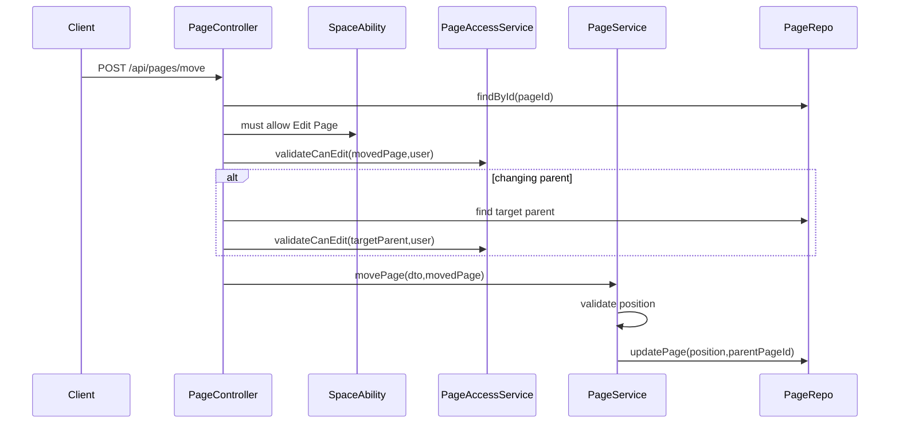

### 11.2 跨 Space 移动

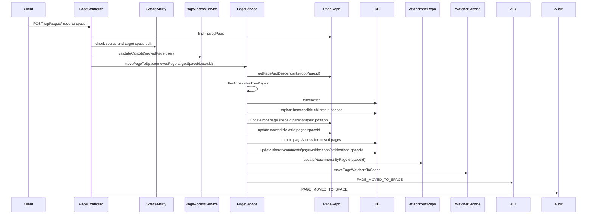

跨 Space 移动规则：

- 源 Space 和目标 Space 都需要编辑权限。
- 只移动用户可访问的页面树分支。
- 不可访问但挂在被移动分支下的子页面会留在原 Space，并被提升为根页面。
- 被移动页面的 Page 级权限会清除，让其继承目标 Space 权限。
- 相关 comments、shares、attachments、watchers、notifications 等 Space 归属要同步更新。

## 12. 页面复制链路

入口：

```text
POST /api/pages/duplicate
```

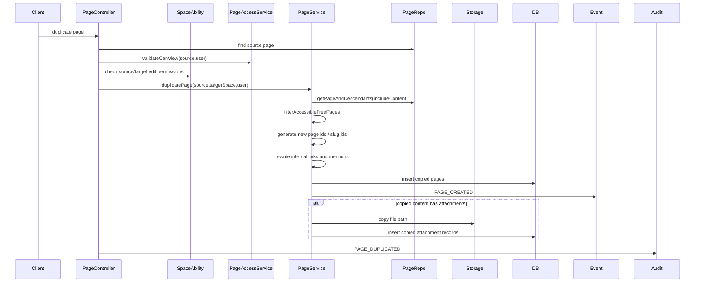

复制特点：

- 只复制可访问页面树。
- 同 Space 复制时根页面标题加 `Copy of` 前缀。
- 跨 Space 复制时根页面成为目标 Space 根页面。
- 内部页面链接和页面 mention 会重写为新页面 ID / slugId。
- 附件会复制文件并生成新 attachment 记录。
- 评论 mark 会从复制内容中移除。

## 13. 权限校验链路

### 13.1 Space 权限链路

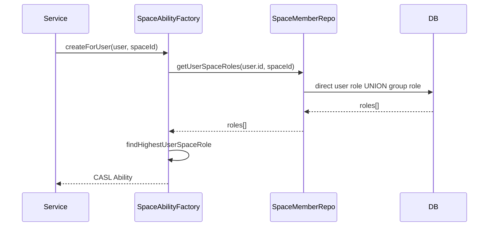

Space 角色：

| 角色 | 能力 |
|---|---|
| `admin` | 管理设置、成员、页面、分享 |
| `writer` | 读取设置/成员，管理页面/分享 |
| `reader` | 读取设置/成员/页面/分享 |

### 13.2 Page 级权限链路

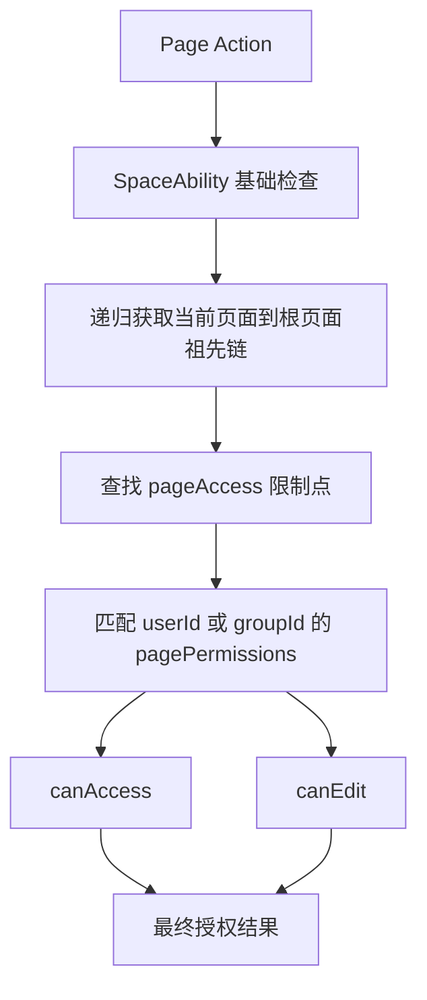

规则：

| 场景 | 结果 |
|---|---|
| 没有任何 Page 级限制 | 回退到 Space 权限 |
| 任一受限祖先无授权 | 不可访问 |
| 所有受限祖先均有授权 | 可查看 |
| 最近受限祖先为 writer | 可编辑 |
| 最近受限祖先为 reader | 只读 |

### 13.3 权限校验常见入口

| 方法 | 说明 |
|---|---|
| `PageAccessService.validateCanView` | 仅校验是否可查看 |
| `PageAccessService.validateCanViewWithPermissions` | 校验可查看，并返回 `canEdit` 和 `hasRestriction` |
| `PageAccessService.validateCanEdit` | 校验可编辑 |
| `PageAccessService.validateCanComment` | 校验评论权限 |
| `PagePermissionRepo.filterAccessiblePageIds` | 批量过滤可访问页面 |
| `PagePermissionRepo.filterAccessiblePageIdsWithPermissions` | 批量过滤并返回可编辑状态 |

## 14. 搜索链路

入口：

```text
SearchController -> SearchService.searchPage
```

```mermaid
sequenceDiagram
  participant Client
  participant SearchController
  participant SearchService
  participant DB
  participant SpaceMemberRepo
  participant PagePermissionRepo

  Client->>SearchController: search query
  SearchController->>SearchService: searchPage(dto,{userId,workspaceId})
  SearchService->>SearchService: tsquery(query + '*')
  alt authenticated normal search
    SearchService->>SpaceMemberRepo: getUserSpaceIdsQuery(userId)
    SearchService->>DB: pages where tsv @@ query and spaceId in user spaces
  else share search
    SearchService->>DB: find share
    SearchService->>PagePermissionRepo: hasRestrictedAncestor(share.pageId)
    SearchService->>DB: page / descendants excluding restricted
  end
  SearchService->>PagePermissionRepo: filterAccessiblePageIds(userId,pageIds)
  SearchService-->>Client: search results with highlight
```

搜索过滤顺序：

1. 文本查询：`tsv @@ to_tsquery(...)`。
2. Workspace / Space 范围过滤。
3. 分享范围过滤，若分享场景。
4. Page 级权限过滤。
5. 返回 highlight 摘要。

## 15. 附件上传链路

入口：

```text
POST /api/files/upload
AttachmentController.uploadFile
```

```mermaid
sequenceDiagram
  participant Client
  participant AttachmentController
  participant PageRepo
  participant PageAccessService
  participant AttachmentService
  participant Storage
  participant AttachmentRepo
  participant Audit

  Client->>AttachmentController: multipart file + pageId + attachmentId?
  AttachmentController->>AttachmentController: 检查 FILE_UPLOAD_SIZE_LIMIT
  AttachmentController->>PageRepo: findById(pageId)
  AttachmentController->>PageAccessService: validateCanEdit(page,user)
  AttachmentController->>AttachmentService: uploadFile(file,pageId,spaceId,userId,workspaceId,attachmentId)
  AttachmentService->>Storage: write stream to local/S3
  AttachmentService->>AttachmentRepo: insert/update attachment metadata
  AttachmentController->>Audit: ATTACHMENT_UPLOADED
  AttachmentController-->>Client: file metadata
```

关键校验：

| 校验 | 说明 |
|---|---|
| 文件大小 | 来自 `FILE_UPLOAD_SIZE_LIMIT`，默认 50mb |
| pageId | 必填 |
| 页面存在 | `PageRepo.findById` |
| 编辑权限 | `PageAccessService.validateCanEdit` |
| attachmentId | 若传入必须是 UUID |
| 存储异常 | 返回上传处理错误 |

## 16. 附件下载链路

### 16.1 私有附件下载

入口：

```text
GET /files/:fileId/:fileName
```

```mermaid
sequenceDiagram
  participant Client
  participant AttachmentController
  participant AttachmentRepo
  participant PageRepo
  participant PageAccessService
  participant Storage
  participant Response

  Client->>AttachmentController: GET /files/:fileId/:fileName
  AttachmentController->>AttachmentRepo: findById(fileId)
  alt AI Chat attachment
    AttachmentController->>AttachmentController: creatorId must equal current user.id
  else Page attachment
    AttachmentController->>PageRepo: findById(attachment.pageId)
    AttachmentController->>PageAccessService: validateCanView(page,user)
  end
  AttachmentController->>Storage: readStream or readRangeStream
  AttachmentController->>Response: Content-Type / Cache-Control / Range support
```

### 16.2 公开附件下载

入口：

```text
GET /files/public/:fileId/:fileName?jwt=...
```

```mermaid
sequenceDiagram
  participant Client
  participant AttachmentController
  participant TokenService
  participant AttachmentRepo
  participant Storage

  Client->>AttachmentController: GET public file with attachment JWT
  AttachmentController->>TokenService: verifyJwt(jwt, JwtType.ATTACHMENT)
  AttachmentController->>AttachmentController: fileId/pageId/workspaceId must match JWT
  AttachmentController->>AttachmentRepo: findById(fileId)
  AttachmentController->>Storage: readStream/readRangeStream
  AttachmentController-->>Client: file stream
```

文件响应安全头：

| Header | 说明 |
|---|---|
| `Accept-Ranges: bytes` | 支持 Range 请求 |
| `Content-Security-Policy` | 限制对象嵌入和默认来源 |
| `Content-Disposition` | 非 inline 类型作为附件下载 |
| `Cache-Control` | private/public scope |

## 17. 普通业务 WebSocket 链路

入口：

```text
/socket.io
WsGateway
```

```mermaid
sequenceDiagram
  participant Client
  participant WsGateway
  participant TokenService
  participant SpaceMemberRepo
  participant SocketServer

  Client->>WsGateway: Socket.IO connect with Cookie authToken
  WsGateway->>TokenService: verifyJwt(authToken, ACCESS)
  WsGateway->>SpaceMemberRepo: getUserSpaceIds(userId)
  WsGateway->>SocketServer: join user-{userId}
  WsGateway->>SocketServer: join workspace-{workspaceId}
  loop each space
    WsGateway->>SocketServer: join space room
  end
  Client->>WsGateway: message tree event
  WsGateway->>WsService: handleTreeEvent
```

用途：

- 页面树更新。
- 用户级通知。
- Workspace 级广播。
- Space 级广播。

## 18. 队列与异步副作用链路

队列入口主要来自 Service、Repo 事件监听、协作保存、控制器操作。

```mermaid
flowchart TD
  Action[用户操作 / 页面保存 / 定时任务]
  Service[Service / Extension]
  Queue[BullMQ Queue]
  Processor[Processor]
  DB[(PostgreSQL)]
  External[Mail / Storage / Search / AI]
  WS[WebSocket Event]

  Action --> Service
  Service --> Queue
  Queue --> Processor
  Processor --> DB
  Processor --> External
  Processor --> WS
```

### 18.1 页面相关异步任务

| 触发点 | 队列任务 | 用途 |
|---|---|---|
| 页面创建 | `ADD_PAGE_WATCHERS` | 自动添加 watcher |
| 页面协作保存 | `PAGE_CONTENT_UPDATED` | AI / Embedding 处理 |
| 页面协作保存 | `PAGE_HISTORY` | 生成页面历史版本 |
| 页面提及 | `PAGE_MENTION_NOTIFICATION` | 用户提及通知 |
| 页面永久删除 | `DELETE_PAGE_ATTACHMENTS` | 删除页面附件 |
| 跨 Space 移动 | `PAGE_MOVED_TO_SPACE` | AI / 派生数据更新 |
| 页面事件 | `PAGE_CREATED / PAGE_UPDATED / PAGE_DELETED` | 搜索、实时事件等监听入口 |

### 18.2 邮件相关异步任务

| 触发点 | 队列 | 用途 |
|---|---|---|
| 忘记密码 | `EMAIL_QUEUE` | 发送重置密码邮件 |
| 修改密码 | `EMAIL_QUEUE` | 发送密码变更通知 |
| 邀请 / 通知 | `EMAIL_QUEUE` | 发送业务邮件 |

### 18.3 搜索相关异步任务

| 任务 | 说明 |
|---|---|
| `SEARCH_INDEX_PAGE` | 索引单页 |
| `SEARCH_INDEX_PAGES` | 批量索引页面 |
| `SEARCH_INDEX_COMMENT` | 索引评论 |
| `SEARCH_INDEX_ATTACHMENT` | 索引附件 |
| `SEARCH_REMOVE_PAGE` | 删除页面索引 |
| `TYPESENSE_FLUSH` | 清理 Typesense 索引 |

### 18.4 AI 相关异步任务

| 任务 | 说明 |
|---|---|
| `PAGE_CONTENT_UPDATED` | 页面内容更新后处理 |
| `PAGE_CREATED` | 页面创建后处理 |
| `PAGE_UPDATED` | 页面元数据更新后处理 |
| `PAGE_SOFT_DELETED` | 页面软删除后处理 |
| `PAGE_RESTORED` | 页面恢复后处理 |
| `PAGE_DELETED` | 页面永久删除后处理 |
| `WORKSPACE_CREATE_EMBEDDINGS` | 创建 Workspace Embedding |
| `WORKSPACE_DELETE_EMBEDDINGS` | 删除 Workspace Embedding |
| `GENERATE_PAGE_EMBEDDINGS` | 生成页面 Embedding |
| `DELETE_PAGE_EMBEDDINGS` | 删除页面 Embedding |

## 19. 审计链路

审计通常由 Controller 或 Service 主动调用。

```mermaid
sequenceDiagram
  participant Controller
  participant AuditService
  participant AuditQueue
  participant AuditTable as audit table

  Controller->>AuditService: log({event,resourceType,resourceId,changes,metadata})
  AuditService->>AuditService: 补充 actor/workspace/request context
  AuditService->>AuditQueue: AUDIT_LOG or direct insert
  AuditQueue->>AuditTable: insert audit record
```

常见审计事件：

| 操作 | 事件 |
|---|---|
| 登录 | `USER_LOGIN` |
| 登出 | `USER_LOGOUT` |
| 改密 | `USER_PASSWORD_CHANGED` |
| 密码重置 | `USER_PASSWORD_RESET` |
| 页面创建 | `PAGE_CREATED` |
| 页面软删除 | `PAGE_TRASHED` |
| 页面永久删除 | `PAGE_DELETED` |
| 页面恢复 | `PAGE_RESTORED` |
| 页面跨 Space 移动 | `PAGE_MOVED_TO_SPACE` |
| 页面复制 | `PAGE_DUPLICATED` |
| 附件上传 | `ATTACHMENT_UPLOADED` |

## 20. 页面侧边栏树链路

入口：

```text
POST /api/pages/sidebar-pages
```

```mermaid
sequenceDiagram
  participant Client
  participant PageController
  participant PageRepo
  participant SpaceAbility
  participant PageService
  participant PagePermissionRepo
  participant DB

  Client->>PageController: sidebar-pages {spaceId or pageId}
  alt pageId provided
    PageController->>PageRepo: findById(pageId)
    PageController->>PageController: derive spaceId
  end
  PageController->>SpaceAbility: createForUser(user,spaceId)
  PageController->>PageService: getSidebarPages(spaceId,pagination,pageId,userId,spaceCanEdit)
  PageService->>DB: query direct children + hasChildren
  PageService->>PagePermissionRepo: hasRestrictedPagesInSpace(spaceId)
  alt no restrictions
    PageService-->>Client: children + canEdit from space ability
  else has restrictions
    PageService->>PagePermissionRepo: filterAccessiblePageIdsWithPermissions
    PageService->>PagePermissionRepo: getParentIdsWithAccessibleChildren
    PageService-->>Client: filtered children + effective canEdit + hasChildren
  end
```

关键点：

- 侧边栏不是一次取全树，而是按父节点分页取子节点。
- `hasChildren` 需要在 Page 级权限过滤后重新判断。
- 如果 Space 内没有任何受限页面，则跳过重权限过滤，提高性能。

## 21. 运行链路排障入口

### 21.1 登录问题

| 问题 | 优先查看 |
|---|---|
| 登录失败 | `AuthController.login`, `AuthService.login` |
| Cookie 未写入 | `AuthController.setAuthCookie`, `APP_URL`, HTTPS 配置 |
| SSO 强制导致密码登录失败 | `validateSsoEnforcement` |
| MFA 拦截 | `apps/server/src/ee/mfa` |
| Session 失效 | `SessionService`, `UserSessionRepo` |

### 21.2 Workspace 问题

| 问题 | 优先查看 |
|---|---|
| API 返回 Workspace not found | `DomainMiddleware`, `main.ts` preHandler |
| 自托管未初始化 | `/api/auth/setup`, `SetupGuard` |
| 云端子域名错误 | `workspaceRepo.findByHostname`, `SUBDOMAIN_HOST`, host header |

### 21.3 页面访问问题

| 问题 | 优先查看 |
|---|---|
| 页面 404 | `PageRepo.findById`, `slugId`, `deletedAt` |
| 页面 403 | `SpaceAbilityFactory`, `PageAccessService`, `PagePermissionRepo` |
| 子页面不可见 | Page 级限制祖先链、`filterAccessiblePageIds` |
| 侧边栏 hasChildren 不准确 | `getParentIdsWithAccessibleChildren` |

### 21.4 协作编辑问题

| 问题 | 优先查看 |
|---|---|
| 无法连接 `/collab` | WebSocket 代理、`CollaborationModule`, `CollabWsAdapter` |
| 协作认证失败 | `AuthenticationExtension`, Collab JWT |
| 只读但应可编辑 | `canUserEditPage`, Space role, Page restriction |
| 内容未保存 | `PersistenceExtension.onStoreDocument`, DB lock, queue errors |
| 多实例协作异常 | Redis、`RedisSyncExtension`, `COLLAB_DISABLE_REDIS` |

### 21.5 附件问题

| 问题 | 优先查看 |
|---|---|
| 上传失败 | `AttachmentController.uploadFile`, `FILE_UPLOAD_SIZE_LIMIT` |
| 下载 404 | `AttachmentRepo.findById`, workspaceId, page access |
| 文件不存在 | `StorageService`, local/S3 driver, filePath |
| Range 播放异常 | `sendFileResponse`, `readRangeStream` |

### 21.6 队列问题

| 问题 | 优先查看 |
|---|---|
| 邮件未发送 | `EMAIL_QUEUE`, `MailService`, mail driver |
| 搜索不更新 | `SEARCH_QUEUE`, page events, tsv/Typesense |
| 历史版本缺失 | `HISTORY_QUEUE`, `PAGE_HISTORY` job |
| AI 数据不更新 | `AI_QUEUE`, AI provider config |
| 附件未清理 | `ATTACHMENT_QUEUE`, `DELETE_PAGE_ATTACHMENTS` |

## 22. 关键链路与源码对照表

| 运行链路 | Controller / Gateway | Service / Extension | Repo / Infra |
|---|---|---|---|
| 登录 | `AuthController` | `AuthService`, `SessionService` | `UserRepo`, `UserSessionRepo` |
| Workspace 识别 | `DomainMiddleware` | `EnvironmentService` | `WorkspaceRepo` |
| 页面详情 | `PageController.getPage` | `PageAccessService` | `PageRepo`, `PagePermissionRepo` |
| 页面创建 | `PageController.create` | `PageService.create` | `PageRepo`, `GENERAL_QUEUE` |
| 页面内容更新 | `PageController.update` | `PageService.updatePageContent`, `CollaborationGateway` | `PersistenceExtension`, `PageRepo` |
| 协作连接 | `CollaborationGateway` | `AuthenticationExtension` | `UserRepo`, `PageRepo`, `SpaceMemberRepo`, `PagePermissionRepo` |
| 协作保存 | `PersistenceExtension` | `CollabHistoryService` | `PageRepo`, `AI_QUEUE`, `HISTORY_QUEUE`, `NOTIFICATION_QUEUE` |
| 页面移动 | `PageController.move/move-to-space` | `PageService.movePage/movePageToSpace` | `PageRepo`, `AttachmentRepo`, `WatcherService` |
| 搜索 | `SearchController` | `SearchService` | `PageRepo`, `ShareRepo`, `PagePermissionRepo` |
| 附件上传 | `AttachmentController.uploadFile` | `AttachmentService` | `StorageService`, `AttachmentRepo` |
| 附件下载 | `AttachmentController.getFile` | `StorageService` | `AttachmentRepo`, `PageRepo`, `PageAccessService` |
| 业务 WS | `WsGateway` | `WsService`, `WsTreeService` | `SpaceMemberRepo`, Redis Adapter |

## 23. 小结

Docmost 的运行链路可以概括为：

1. 每个请求先经过 Workspace 识别和审计上下文建立。
2. 登录通过用户密码校验、会话创建和 httpOnly Cookie 完成。
3. 页面普通元数据更新走 HTTP API，页面正文更新优先进入协作系统。
4. 协作编辑通过 Collab JWT、Space 权限和 Page 级权限共同授权。
5. 页面内容持久化会同时更新 `content`、`ydoc`、`textContent`，并投递历史、AI、通知等队列任务。
6. Page 权限沿祖先链继承，搜索、侧边栏、分享、协作都需要过滤。
7. 附件元数据在数据库，文件本体在 local/S3，访问前必须校验页面或聊天权限。
8. 搜索、AI、历史、通知、附件清理等大多是最终一致异步链路。
