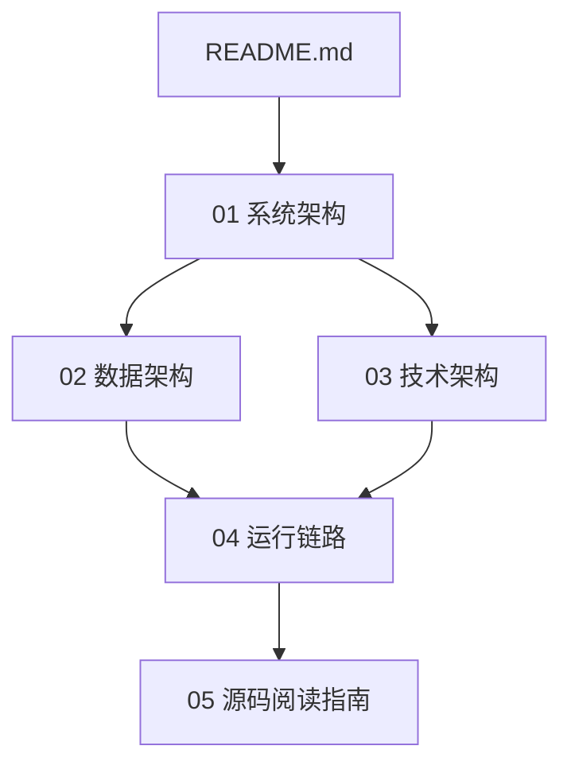

# Docmost 源码理解文档

本文档集由源码反向分析生成，目标是帮助新成员、二次开发者、架构师快速理解 Docmost 的系统结构、核心数据模型、技术栈、运行链路与阅读顺序。

> 分析基线：`main` 分支，参考提交 `c9fa6e20b32689c3639d691840834b15df171f5f`。
>
> 说明：文档基于当前仓库源码与配置文件推导，不替代正式产品文档、部署手册或安全审计报告。

## 文档清单

| 文档 | 说明 | 适用对象 |
|---|---|---|
| [01-system-architecture.md](./01-system-architecture.md) | 系统架构、模块分层、核心业务域、运行时组件关系 | 架构师、后端/全栈开发 |
| [02-data-architecture.md](./02-data-architecture.md) | 数据库表域划分、核心实体关系、内容与协作数据模型 | 后端开发、数据/平台工程师 |
| [03-technology-architecture.md](./03-technology-architecture.md) | 前后端技术栈、构建体系、基础设施依赖、部署形态 | 系统工程师、DevOps、架构师 |
| [04-runtime-flows.md](./04-runtime-flows.md) | 登录、Workspace 识别、页面编辑、权限校验、搜索、异步任务等运行链路 | 研发、测试、排障人员 |
| [05-source-reading-guide.md](./05-source-reading-guide.md) | 源码阅读路线、关键目录、二次开发切入点、变更风险点 | 新成员、二次开发者 |

## 快速判断

Docmost 是一个类似飞书文档 / Confluence / Notion 的协作文档系统，当前源码呈现以下架构特征：

1. **Monorepo 工程**：根目录使用 `pnpm workspace` 与 `Nx` 管理 `apps/*` 和 `packages/*`。
2. **前后端分离但统一构建**：`apps/client` 是 React/Vite 前端；`apps/server` 是 NestJS/Fastify 后端。
3. **实时协作独立成域**：编辑协作由 Hocuspocus + Yjs + WebSocket 实现，可内嵌在主服务，也可运行独立协作服务。
4. **主数据库是 PostgreSQL**：通过 Kysely 访问，类型由 `kysely-codegen` 生成。
5. **Redis 是关键基础设施**：用于缓存、BullMQ 队列、WebSocket 横向扩展、协作同步。
6. **权限模型分层**：Workspace 级、Space 级、Page 级权限叠加；Space 权限用 CASL 表达，Page 权限在业务服务中补充校验。
7. **扩展形态清晰**：存储、邮件、搜索、AI、审计、计费、SSO/MFA 等能力通过 integrations / ee 目录分层。

## 建议阅读顺序

## 主要源码入口

| 领域 | 关键文件 / 目录 |
|---|---|
| 根工程与构建 | `package.json`, `nx.json`, `Dockerfile`, `docker-compose.yml` |
| 后端入口 | `apps/server/src/main.ts`, `apps/server/src/app.module.ts` |
| 核心业务模块 | `apps/server/src/core/*` |
| 数据访问层 | `apps/server/src/database/*` |
| 实时协作 | `apps/server/src/collaboration/*` |
| 集成能力 | `apps/server/src/integrations/*` |
| 前端入口 | `apps/client/src/main.tsx`, `apps/client/src/App.tsx` |
| 前端页面与功能 | `apps/client/src/pages/*`, `apps/client/src/features/*` |
| 编辑器扩展 | `packages/editor-ext/*` |
| 企业版扩展 | `apps/server/src/ee`, `apps/client/src/ee`, `packages/ee` |

## 使用建议

- 新人入门：先读 `01-system-architecture.md` 和 `05-source-reading-guide.md`。
- 数据库改造：先读 `02-data-architecture.md`，再定位对应 repo 与 service。
- 协作编辑问题：重点读 `04-runtime-flows.md` 中的页面编辑链路和 `apps/server/src/collaboration/*`。
- 部署与运行问题：重点读 `03-technology-architecture.md` 和 `Dockerfile` / `docker-compose.yml`。
- 权限问题：结合 `SpaceAbilityFactory`、`PageAccessService`、`PagePermissionRepo` 与控制器调用点排查。
