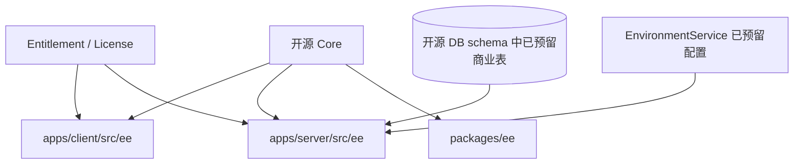
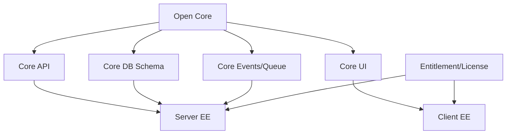

# 商业版 EE 功能与服务端缺失源码分析

> 本文档基于当前 `main` 分支源码反向分析生成，用于说明 Docmost 商业版能力的功能范围、前端 EE 与开源核心的关系、服务端 EE 缺失源码范围，以及如果要补齐服务端能力需要实现哪些模块。
>
> 分析基线：`main` 分支，参考提交 `c9fa6e20b32689c3639d691840834b15df171f5f`。
>
> 重要边界：当前可访问仓库中，`apps/client/src/ee` 可读取；`apps/server/src/ee` 的关键实现文件不可读取或未包含。因此本文把结论分为：
>
> - **源码已确认**：由前端 EE、开源服务端接缝、数据库类型、配置、队列常量直接确认。
> - **服务端缺失推断**：由前端 API 调用、数据表、配置项和开源接缝反推出服务端应存在但当前不可读的实现。

## 1. 结论摘要

Docmost 商业版不是一个完全独立系统，而是通过 **开源核心 + EE 扩展模块** 的方式叠加能力。

整体关系：



商业版能力大致分为 12 类：

| 类别 | 商业功能 | 前端是否可见 | 服务端源码状态 |
|---|---|---:|---|
| 授权与权益 | License、Entitlements、Feature Gate | 是 | 缺失核心实现 |
| 云端 SaaS | Workspace 创建/选择、邮箱验证、已加入 Workspace | 是 | 部分开源端点 + 缺失云端增强逻辑 |
| 计费 | Billing、Plans、Checkout、Portal、Stripe webhook | 是 | 缺失核心 Controller/Service |
| 安全设置 | SSO、MFA、允许域名、强制 SSO/MFA、禁用公开分享、Trash retention | 是 | 部分字段/校验开源，核心实现缺失 |
| SSO | Google、Custom SSO、SAML/OIDC/LDAP 配置 | 是 | 缺失 Provider 管理和认证回调核心 |
| SCIM | SCIM Token、启用 SCIM、用户/组同步 | 是 | 缺失 SCIM API 和 Token 管理实现 |
| API Key | 用户级/Workspace 级 API Key | 是 | DB 类型存在，接口实现缺失 |
| 审计 | Audit Logs、Retention | 是 | NoopAudit 开源，真实 Audit 实现缺失 |
| AI | AI 设置、AI 生成、AI Chat、Embedding、MCP | 是 | DB/队列/配置存在，核心 EE 服务缺失 |
| 页面治理 | Page Verification、审批、过期、Obsolete | 是 | DB 类型/通知任务存在，Controller/Service 缺失 |
| 模板 | Templates 列表、编辑、使用 | 是 | DB 类型存在，Controller/Service 缺失 |
| PDF Export | PDF 渲染页、Gotenberg 等导出链路 | 是 | 渲染页存在，服务端导出接口缺失 |

## 2. License 与代码边界

README 明确说明：

- Docmost core 使用 AGPL 3.0。
- Enterprise features 使用 Enterprise license。
- 以下目录属于 Enterprise Edition：
  - `apps/server/src/ee`
  - `apps/client/src/ee`
  - `packages/ee`

这说明仓库设计上允许前后端同时存在 EE 代码，但商业功能的服务端关键实现可以不随开源核心公开。

## 3. 服务端 EE 加载机制

开源后端入口 `AppModule` 中已经预留动态加载企业模块：

```ts
const enterpriseModules = [];
try {
  if (require('./ee/ee.module')?.EeModule) {
    enterpriseModules.push(require('./ee/ee.module')?.EeModule);
  }
} catch (err) {
  if (process.env.CLOUD === 'true') {
    console.warn('Failed to load enterprise modules. Exiting program.\n', err);
    process.exit(1);
  }
}
```

架构含义：

| 场景 | 行为 |
|---|---|
| 自托管且无 EE 模块 | 启动继续，商业功能不可用或返回缺失 |
| Cloud 模式且 EE 模块加载失败 | 进程退出 |
| 有 EE 模块 | `EeModule` 被追加到 Nest imports 中，注册商业 Controller/Service/Processor |

这说明：

1. 开源核心不直接依赖 EE 编译通过。
2. EE 后端通过 Nest Module 扩展方式挂载。
3. Cloud 版本强依赖 EE 模块。
4. 自托管可运行开源核心，但商业路由会缺失。

## 4. 前端 EE 总入口分析

`apps/client/src/App.tsx` 直接引入大量 EE 页面和组件。

### 4.1 商业版路由入口

| 路由 | 前端组件 | 功能类别 |
|---|---|---|
| `/login/mfa` | `MfaChallengePage` | MFA 登录挑战 |
| `/login/mfa/setup` | `MfaSetupRequiredPage` | 强制 MFA 设置 |
| `/create` | `CreateWorkspace` | Cloud Workspace 创建 |
| `/select` | `CloudLogin` | Cloud Workspace 选择 |
| `/verify-email` | `VerifyEmail` | Cloud 邮箱验证 |
| `/pdf-render/:pageId` | `PdfRenderPage` | PDF 导出渲染页 |
| `/ai` | `AiChat` | AI Chat |
| `/ai/chat/:chatId` | `AiChat` | AI Chat 会话 |
| `/templates` | `TemplateList` | 模板列表 |
| `/templates/:templateId` | `TemplateEditor` | 模板编辑 |
| `/settings/account/api-keys` | `UserApiKeys` | 用户 API Key |
| `/settings/api-keys` | `WorkspaceApiKeys` | Workspace API Key |
| `/settings/security` | `Security` | 安全中心 |
| `/settings/ai` | `AiSettings` | AI 设置 |
| `/settings/ai/mcp` | `AiSettings` | MCP 设置 |
| `/settings/audit` | `AuditLogs` | 审计日志 |
| `/settings/verifications` | `VerifiedPages` | 页面验证/审批 |
| `/settings/license` | `License` | 自托管 License |
| `/settings/billing` | `Billing` | Cloud Billing |

### 4.2 功能开关模型

前端 EE 定义了 Feature 常量：

| Feature | 功能 |
|---|---|
| `sso:custom` | 自定义 SSO |
| `sso:google` | Google SSO |
| `mfa` | 多因素认证 |
| `api:keys` | API Key |
| `comment:resolution` | 评论解决 |
| `page:permissions` | 页面权限 |
| `ai` | AI |
| `import:confluence` | Confluence 导入 |
| `import:docx` | DOCX 导入 |
| `import:pdf` | PDF 导入 |
| `attachment:indexing` | 附件内容索引 |
| `security:settings` | 安全设置 |
| `mcp` | MCP |
| `scim` | SCIM |
| `page:verification` | 页面验证 |
| `audit:logs` | 审计日志 |
| `retention` | 保留策略 |
| `sharing:controls` | 公开分享控制 |
| `templates` | 模板 |
| `comment:viewer` | 读者评论 |

前端的 `useHasFeature(feature)` 从 `entitlementAtom` 读取 `entitlements.features` 判断是否可用。`Entitlements` 包含：

| 字段 | 说明 |
|---|---|
| `cloud` | 是否云端版本 |
| `tier` | `free` / `standard` / `business` / `enterprise` |
| `features` | 当前授权可用功能列表 |

因此商业版能力不是靠前端路径是否存在判断，而是靠 **entitlement / feature gate** 控制。

## 5. 商业功能清单与开源关系

### 5.1 License / Entitlement

#### 已确认前端功能

| 能力 | API |
|---|---|
| 查询 License | `POST /license/info` |
| 激活 License | `POST /license/activate` |
| 移除 License | `POST /license/remove` |
| 前端权益缓存 | `entitlementAtom` local storage |
| Feature 判断 | `useHasFeature(feature)` |

#### 与开源关系

- 开源核心可运行，但 EE 功能需要 License/Entitlement 开关。
- Feature gate 控制前端显示和操作入口。
- 服务端也必须做同样的 feature gate，否则只靠前端禁用不安全。

#### 服务端缺失源码

需要补齐：

| 模块 | 必要职责 |
|---|---|
| `LicenseModule` | License 激活、校验、移除、缓存 |
| `EntitlementService` | 根据 License / Cloud plan 返回 feature 列表 |
| `FeatureGuard` / `EntitlementGuard` | 服务端路由级功能拦截 |
| License 存储 | 本地 license 文件、DB 字段或远端 license server 绑定 |
| License 定时校验 | 过期、吊销、离线宽限期 |

### 5.2 Cloud SaaS Workspace 能力

#### 已确认前端功能

| 能力 | API |
|---|---|
| 创建 Workspace | `POST /workspace/create` |
| 检查 hostname | `POST /workspace/check-hostname` |
| 已加入 Workspace | `POST /workspace/joined` |
| 按邮箱查 Workspace | `POST /workspace/find-by-email` |
| 邮箱验证 | `POST /workspace/verify-email` |
| 重发验证邮件 | `POST /workspace/resend-verification` |

#### 与开源关系

开源核心已有 Workspace 概念；Cloud SaaS 在其上增加：

- 多 Workspace 选择页。
- 子域名 hostname 登录。
- 按邮箱找 Workspace。
- 邮箱验证。
- 创建 Workspace 返回 `exchangeToken` 或 `requiresEmailVerification`。
- Cloud 模式下 EE 模块加载失败直接退出。

#### 服务端缺失源码

需要补齐：

| 模块 | 必要职责 |
|---|---|
| Cloud Workspace Controller | `/workspace/create`, `/workspace/joined`, `/workspace/find-by-email`, `/workspace/verify-email`, `/workspace/resend-verification` |
| Email verification service | 生成 token/signature、邮件发送、验证落库 |
| Workspace hostname service | hostname 唯一性、保留词、subdomain 规则 |
| Exchange token service | Cloud create 后跳转/自动登录令牌 |
| Cloud workspace selection | 当前账号加入的 workspace 列表 |

### 5.3 Billing / Stripe 计费

#### 已确认前端功能

| 能力 | API |
|---|---|
| 查询 Billing | `POST /billing/info` |
| 查询 Plans | `POST /billing/plans` |
| Checkout 链接 | `POST /billing/checkout` |
| Billing Portal | `POST /billing/portal` |

前端 Billing 页面只允许 admin 访问，展示 trial、billing details、plans、manage billing。

#### 已确认后端数据/队列

开源数据库类型中存在 `Billing` 类型；队列常量中存在：

| 队列任务 | 说明 |
|---|---|
| `STRIPE_SEATS_SYNC` | 同步 Stripe seats |
| `TRIAL_ENDED` | 试用结束 |
| `WELCOME_EMAIL` | 欢迎邮件 |
| `FIRST_PAYMENT_EMAIL` | 首次付款邮件 |

#### 与开源关系

- 开源 Workspace/User 成员体系是 Billing seat 计算基础。
- Cloud plan / tier 会反向决定 entitlements.features。
- Billing 仅 Cloud 模式展示，自托管展示 License 页面。

#### 服务端缺失源码

需要补齐：

| 模块 | 必要职责 |
|---|---|
| `BillingModule` | 注册 billing controller/service/processor |
| Billing Controller | `/billing/info`, `/billing/plans`, `/billing/checkout`, `/billing/portal`, `/billing/stripe/webhook` |
| Stripe Service | customer/subscription/checkout/portal/webhook 处理 |
| Plan Catalog | plan、priceId、feature mapping |
| Seats Sync Processor | Workspace 成员变化同步 seats |
| Trial Processor | 试用到期处理 |
| Billing Entitlement Adapter | plan -> tier/features |

### 5.4 Security Settings

#### 已确认前端功能

Security 页面聚合了：

| 能力 | 控制字段/API |
|---|---|
| 强制 MFA | `updateWorkspace({ enforceMfa })` |
| 禁用公开分享 | `updateWorkspace({ disablePublicSharing })` |
| Trash retention | `updateWorkspace({ trashRetentionDays })` |
| 强制 SSO | `updateWorkspace({ enforceSso })` |
| 允许邮箱域名 | Security 页面组件 |
| SSO Provider 管理 | `/sso/*` |
| SCIM provisioning | `/scim-tokens/*` |

#### 已确认开源服务端接缝

开源认证工具中已有：

| 函数 | 作用 |
|---|---|
| `validateSsoEnforcement(workspace)` | 如果 workspace.enforceSso=true，则禁止密码登录 |
| `validateAllowedEmail(userEmail, workspace)` | 如果配置了 emailDomains，则限制邮箱域名 |
| `throwIfEmailNotVerified` | Cloud 模式下强制邮箱验证 |

#### 与开源关系

- Workspace 是安全策略承载对象。
- Security EE 页面只是操作 Workspace 字段和 EE 子资源。
- 部分校验逻辑已下沉到开源核心，说明安全策略本身会影响开源认证流程。

#### 服务端缺失源码

需要补齐或检查：

| 能力 | 缺失服务端实现 |
|---|---|
| 强制 MFA | 更新 workspace.enforceMfa 的 feature gate、登录拦截、setup required 流程 |
| 禁用公开分享 | 更新 workspace.settings.sharing.disabled，并删除/禁止 shares |
| Trash retention | 定时清理超过 retention 的软删除 pages |
| 允许域名 | Workspace emailDomains 更新接口、邀请/注册/SSO 登录校验 |
| Security feature gate | 非授权版本不允许改商业字段 |

### 5.5 SSO

#### 已确认前端功能/API

| 能力 | API |
|---|---|
| 查询 SSO Providers | `POST /sso/providers` |
| 查询单个 Provider | `POST /sso/info` |
| 创建 Provider | `POST /sso/create` |
| 更新 Provider | `POST /sso/update` |
| 删除 Provider | `POST /sso/delete` |

前端 Security 中展示 Google 和 Custom SSO，Provider 包含 enabled、allowSignup、type 等字段。

#### 已确认后端基础

- 数据库类型中存在 `AuthProvider` 和 `AuthAccount`。
- 后端依赖包含 Google OAuth、OIDC、SAML、LDAP、SCIM 相关库。
- `auth.util` 已有 SSO enforcement 和 allowed email 校验。

#### 与开源关系

- 开源用户体系、Workspace、Session 是 SSO 登录后的承载层。
- SSO Provider 是商业扩展，但登录成功后仍复用开源会话、用户、Workspace 成员模型。

#### 服务端缺失源码

需要补齐：

| 模块 | 必要职责 |
|---|---|
| `SsoModule` | Provider 管理和登录回调 |
| Provider Controller | `/sso/providers`, `/sso/create`, `/sso/update`, `/sso/delete`, `/sso/info` |
| Google OAuth Controller | `/sso/google` 等回调 |
| OIDC Service | discovery、callback、account mapping |
| SAML Service | metadata、ACS callback、certificate 处理 |
| LDAP Service | bind/search/group sync |
| AuthAccount Service | provider user -> local user 绑定 |
| SSO Group Sync | 外部组同步到 groups/groupUsers |

### 5.6 MFA

#### 已确认前端功能/API

| 能力 | API |
|---|---|
| 查询 MFA 状态 | `POST /mfa/status` |
| 设置 MFA | `POST /mfa/setup` |
| 启用 MFA | `POST /mfa/enable` |
| 禁用 MFA | `POST /mfa/disable` |
| 生成备份码 | `POST /mfa/generate-backup-codes` |
| 登录验证 | `POST /mfa/verify` |
| 校验访问 | `POST /mfa/validate-access` |

#### 已确认服务端接缝

`AuthController.login` 中动态加载：

```ts
require('./../../ee/mfa/services/mfa.service')
```

并调用：

```ts
mfaService.checkMfaRequirements(loginInput, workspace, res)
```

#### 已确认数据基础

数据库类型中存在 `UserMFA`，依赖中存在 `otpauth`。

#### 与开源关系

- MFA 是登录链路增强，不替代开源 AuthService。
- MFA 模块如果返回 authToken，仍由开源 `setAuthCookie` 写 Cookie。
- 如果用户已有 MFA 或 workspace 强制 MFA，登录返回挑战状态，不直接登录。

#### 服务端缺失源码

需要补齐：

| 模块 | 必要职责 |
|---|---|
| `MfaModule` | 注册 MFA Controller/Service |
| `MfaService.checkMfaRequirements` | 登录前判断用户 MFA / Workspace enforceMfa |
| TOTP setup | 生成 secret、QR URI、临时状态 |
| enable/disable | 校验 code/密码，写 `userMfa` |
| backup codes | hash 存储、一次性消耗 |
| verify login | challenge token -> authToken |
| validate access | 敏感设置操作前二次校验 |

### 5.7 SCIM

#### 已确认前端功能/API

| 能力 | API |
|---|---|
| 查询 SCIM Tokens | `POST /scim-tokens` |
| 创建 SCIM Token | `POST /scim-tokens/create` |
| 更新 SCIM Token | `POST /scim-tokens/update` |
| 撤销 SCIM Token | `POST /scim-tokens/revoke` |
| 启用/禁用 SCIM | `updateWorkspace({ isScimEnabled })` |

#### 已确认数据基础

数据库类型中存在 `ScimToken`，依赖中存在 `scimmy`。

#### 与开源关系

- SCIM 最终写入开源 users、groups、groupUsers、spaceMembers 等组织数据。
- Security 页面提示：SCIM enabled 后优先于 SSO group sync。

#### 服务端缺失源码

需要补齐：

| 模块 | 必要职责 |
|---|---|
| `ScimModule` | SCIM Token 和 SCIM API |
| Token Controller | `/scim-tokens`, `/create`, `/update`, `/revoke` |
| SCIM Auth Guard | Bearer token hash 校验、lastUsedAt 更新 |
| SCIM Users API | `/scim/v2/Users` CRUD / patch |
| SCIM Groups API | `/scim/v2/Groups` CRUD / patch |
| Mapping Service | SCIM schema -> Docmost users/groups |
| Precedence Rule | SCIM enabled 时禁用或覆盖 SSO group sync |

### 5.8 API Keys

#### 已确认前端功能/API

| 能力 | API |
|---|---|
| 查询 API Keys | `POST /api-keys` |
| 创建 API Key | `POST /api-keys/create` |
| 更新 API Key | `POST /api-keys/update` |
| 撤销 API Key | `POST /api-keys/revoke` |

前端存在用户级 API Key 和 Workspace 级 API Key 页面。

#### 已确认数据基础

数据库类型中存在 `ApiKey`，Workspace 类型中存在 `restrictApiToAdmins` / `settings.api.restrictToAdmins`。

#### 与开源关系

- API Key 应接入开源 AuthGuard 或新增 ApiKeyAuthGuard。
- API 权限最终仍要映射到用户/Workspace/role。

#### 服务端缺失源码

需要补齐：

| 模块 | 必要职责 |
|---|---|
| `ApiKeyModule` | API Key CRUD |
| API Key Auth Guard | Header token -> apiKeys token hash |
| Scope/Role Mapping | user key/workspace key 权限边界 |
| Admin Restriction | `restrictApiToAdmins` 生效 |
| Token Generation | 只展示一次、hash 存储、lastUsedAt |

### 5.9 Audit Logs

#### 已确认前端功能/API

| 能力 | API |
|---|---|
| 查询审计日志 | `POST /audit` |
| 查询审计保留期 | `POST /audit/retention` |
| 更新审计保留期 | `POST /audit/retention/update` |

#### 已确认开源服务端接缝

- `AppModule` 默认注册 `NoopAuditModule`。
- 业务 Controller 中大量调用 `auditService.log(...)`。
- 数据库类型中存在 `Audit`。
- 队列常量中存在 `AUDIT_LOG`、`AUDIT_CLEANUP`。

#### 与开源关系

- 开源核心已经埋点，但默认 Noop 实现不落库或不完整展示。
- 商业版应替换 `AUDIT_SERVICE` provider，实现真实审计写入、查询、清理。

#### 服务端缺失源码

需要补齐：

| 模块 | 必要职责 |
|---|---|
| `AuditModule` | 替换 NoopAuditModule |
| Audit Controller | `/audit`, `/audit/retention`, `/audit/retention/update` |
| Audit Service | 写入 audit 表，补充 actor/context/resource |
| Audit Processor | `AUDIT_LOG`, `AUDIT_CLEANUP` |
| Retention Service | 按保留天数清理 |
| Filter/Search | 事件、actor、resource、时间范围过滤 |

### 5.10 AI / AI Chat / MCP

#### 已确认前端功能/API

AI 生成：

| 能力 | API |
|---|---|
| AI 内容生成 | `POST /ai/generate` |
| AI 流式生成 | `POST /ai/generate/stream` |

AI Chat：

| 能力 | API |
|---|---|
| 创建 Chat | `POST /ai/chats/create` |
| 列出 Chats | `POST /ai/chats` |
| Chat 详情 | `POST /ai/chats/info` |
| 删除 Chat | `POST /ai/chats/delete` |
| 更新标题 | `POST /ai/chats/update` |
| 搜索 Chat | `POST /ai/chats/search` |
| 上传 Chat 文件 | `POST /ai/chats/upload` |
| 发送消息流 | `POST /ai/chats/send` |

#### 已确认服务端基础

- 数据库类型中存在 `AiChats`、`AiChatMessages`、`PageEmbeddings`。
- EnvironmentService 中有 AI provider 配置：OpenAI、Gemini、OpenAI compatible、Ollama、Embedding dimension 等。
- 队列常量中存在 `AI_QUEUE`、`PAGE_CONTENT_UPDATED`、`GENERATE_PAGE_EMBEDDINGS`、`DELETE_PAGE_EMBEDDINGS`、Workspace Embedding 任务。
- 附件表支持 `aiChatId`。

#### 与开源关系

- AI 依赖开源页面内容、附件、搜索、权限体系。
- AI Chat 的附件下载权限已在开源附件控制器里出现：Chat-owned attachment 只能 creator 读取。
- AI Embedding 是页面内容变更后的派生数据。

#### 服务端缺失源码

需要补齐：

| 模块 | 必要职责 |
|---|---|
| `AiModule` | AI generate、settings、provider adapter |
| `AiChatModule` | Chat CRUD、消息流式响应、附件处理 |
| Provider Adapters | OpenAI/Gemini/Ollama/OpenAI-compatible |
| Embedding Service | 页面 embedding 生成/删除/检索 |
| AI Queue Processor | 处理 `PAGE_CONTENT_UPDATED`、Embedding 任务 |
| MCP Module | MCP server/tool 暴露、权限控制 |
| AI Settings Controller | Workspace AI search/generative/mcp/chat 开关 |
| AI Permission Layer | Feature gate、Workspace setting、Page 权限过滤 |

### 5.11 Page Verification / Approval

#### 已确认前端功能/API

| 能力 | API |
|---|---|
| 验证信息 | `POST /pages/verification-info` |
| 创建验证规则 | `POST /pages/create-verification` |
| 更新验证规则 | `POST /pages/update-verification` |
| 删除验证规则 | `POST /pages/delete-verification` |
| 验证页面 | `POST /pages/verify` |
| 提交审批 | `POST /pages/submit-for-approval` |
| 拒绝审批 | `POST /pages/reject-approval` |
| 标记过期/废弃 | `POST /pages/mark-obsolete` |
| 验证列表 | `POST /pages/verifications` |

#### 已确认数据/队列基础

- 数据库类型中存在 `PageVerifications`、`PageVerifiers`。
- 通知队列接口中存在 verification 相关任务：expiring、expired、verified、approval requested、approval rejected 等。
- Page 跨 Space 移动时开源 `PageService.movePageToSpace` 会更新 `pageVerifications.spaceId`，说明该表已纳入核心页面生命周期。

#### 与开源关系

- Verification 是 Page 生命周期治理能力。
- 开源页面移动、删除、通知已经预留关联。
- 商业版应在 Page 操作后维护验证状态，例如内容变更后置为 obsolete 或 pending。

#### 服务端缺失源码

需要补齐：

| 模块 | 必要职责 |
|---|---|
| `PageVerificationModule` | Controller/Service/Processor |
| Verification Controller | 上述 `/pages/*verification*` 和审批接口 |
| Verification Service | 创建规则、指定 verifier、verify、reject、obsolete |
| Scheduler/Processor | 过期检查、到期通知、状态 reconciliation |
| Notification Integration | PAGE_VERIFICATION_* 通知任务 |
| Permission Rules | 谁可配置、谁可验证、谁可审批 |

### 5.12 Templates

#### 已确认前端功能/API

| 能力 | API |
|---|---|
| 查询模板 | `POST /templates` |
| 模板详情 | `POST /templates/info` |
| 创建模板 | `POST /templates/create` |
| 更新模板 | `POST /templates/update` |
| 删除模板 | `POST /templates/delete` |
| 使用模板 | `POST /templates/use` |

#### 已确认数据基础

数据库类型中存在 `Templates`，Favorite 支持 `templateId`。

#### 与开源关系

- 模板复用开源 Page 内容模型：`content`、`ydoc`、Space、creator、workspace。
- 使用模板应最终调用页面创建链路，生成新的 Page。

#### 服务端缺失源码

需要补齐：

| 模块 | 必要职责 |
|---|---|
| `TemplateModule` | 模板 CRUD 和 use |
| Template Controller | `/templates/*` |
| Template Service | 模板内容保存、复制为 Page |
| Permission | Space admin / member template setting |
| Favorite Integration | 模板收藏 |
| Feature Gate | `Feature.TEMPLATES`、`allowMemberTemplates` |

### 5.13 PDF Export

#### 已确认前端功能/API

| 能力 | API |
|---|---|
| PDF 渲染数据 | `POST /pdf-export/render` |
| 前端渲染页 | `/pdf-render/:pageId?token=...` |

前端 `PdfRenderPage` 读取 token 和 pageId，调用 `/api/pdf-export/render` 获取 `{ pageId, title, content }`，然后用 `ReadonlyPageEditor` 渲染页面。

#### 已确认服务端基础

EnvironmentService 中存在 `GOTENBERG_URL`；队列常量中存在 `PDF_EXPORT_TASK`、`PDF_EXPORT_CLEANUP`。

#### 与开源关系

- PDF 导出复用开源页面内容和只读编辑器渲染。
- 服务端需要生成一次性 render token，调用 Gotenberg 或浏览器渲染生成 PDF。

#### 服务端缺失源码

需要补齐：

| 模块 | 必要职责 |
|---|---|
| `PdfExportModule` | PDF 导出 API 和 Processor |
| Render Controller | `/pdf-export/render` token 校验与页面内容返回 |
| Export Controller | 发起导出任务、下载导出结果 |
| Token Service | 一次性/短期 render token |
| Gotenberg Client | 调用 HTML/PDF 渲染服务 |
| Cleanup Processor | 清理临时导出文件 |

### 5.14 Import：Confluence / DOCX / PDF / Attachment Indexing

#### 已确认前端 Feature

Feature 列表中存在：

| Feature | 说明 |
|---|---|
| `import:confluence` | Confluence 导入 |
| `import:docx` | DOCX 导入 |
| `import:pdf` | PDF 导入 |
| `attachment:indexing` | 附件内容索引 |

#### 已确认服务端基础

后端依赖包含 `mammoth`、PDF inspector、ZIP 处理、HTML/Markdown 转换；队列常量中存在 `IMPORT_TASK`、`ATTACHMENT_INDEX_CONTENT`、`ATTACHMENT_INDEXING`。

#### 与开源关系

- 导入最终生成开源 Page、Attachment、FileTask。
- 附件索引最终写入 `attachments.textContent` / `tsv` 或外部搜索索引。

#### 服务端缺失源码

需要补齐：

| 模块 | 必要职责 |
|---|---|
| Confluence Importer | ZIP/XML/HTML 解析、页面树重建、附件映射 |
| DOCX Importer | mammoth 转 HTML/Markdown，再转 ProseMirror JSON |
| PDF Importer | PDF 内容提取或转附件索引 |
| Attachment Indexer | 文件文本抽取、tsv/搜索索引更新 |
| Import Processor | `IMPORT_TASK` |
| FileTask Controller | 导入任务状态查询 |

### 5.15 Comments：Resolution / Viewer Comments

#### 已确认 Feature

Feature 列表中存在：

| Feature | 说明 |
|---|---|
| `comment:resolution` | 评论解决 |
| `comment:viewer` | Reader 评论 |

#### 已确认开源基础

- `comments` 表有 `resolvedAt`、`resolvedById` 字段。
- CommentRepo 支持 include `resolvedBy`。
- 开源 CommentController 支持 create/list/info/update/delete，但未看到单独 resolve/unresolve API。
- `PageAccessService.validateCanComment` 已包含读者是否可评论的策略入口。

#### 与开源关系

- 评论基础能力是开源的。
- 评论解决和 reader comment 属于商业 feature gate 或 Workspace/Space setting 控制。

#### 服务端缺失源码

需要补齐：

| 模块/接口 | 必要职责 |
|---|---|
| Comment resolve/unresolve API | 更新 `resolvedAt/resolvedById` |
| Feature Gate | `comment:resolution` |
| Viewer Comment Policy | `comment:viewer` 与 Space setting 联动 |
| Notification | COMMENT_RESOLVED_NOTIFICATION |

## 6. 商业功能与开源核心的关系模型

### 6.1 扩展方式



### 6.2 数据层关系

商业版不是另起一套数据库，而是在开源 schema 中已经预留大量商业表/字段：

| 已预留对象 | 对应商业功能 |
|---|---|
| `billing` | Cloud Billing |
| `authProviders`, `authAccounts` | SSO/OIDC/SAML/LDAP/Google |
| `userMfa` | MFA |
| `apiKeys` | API Key |
| `scimTokens` | SCIM |
| `audit` | Audit Logs |
| `aiChats`, `aiChatMessages`, `pageEmbeddings` | AI / AI Chat / Embedding |
| `pageVerifications`, `pageVerifiers` | Page Verification / Approval |
| `templates` | Templates |
| `fileTasks` | Import / Export |
| `attachments.textContent/tsv` | Attachment Indexing |

### 6.3 运行层关系

商业版能力主要通过以下方式嵌入开源运行链路：

| 接入点 | 示例 |
|---|---|
| Nest Module 动态加载 | `require('./ee/ee.module')` |
| 动态 Service 加载 | MFA、Typesense |
| 开源字段控制 | `workspace.enforceSso`, `emailDomains`, `settings` |
| 开源事件监听 | Page events -> AI/Search/Audit/PageVerification |
| 队列 Processor | AI、Audit、Billing、PDF、Search、Import |
| Feature Gate | 前端 `useHasFeature`，服务端应有 Guard |
| 开源 Repo 复用 | Page/User/Workspace/Space/Attachment 等 Repo |

## 7. 服务端缺失源码补齐总表

如果要补齐 `apps/server/src/ee`，至少应包含以下模块。

| 优先级 | 模块 | 关键 Controller/API | 关键 Service/Processor | 依赖数据表/配置 |
|---:|---|---|---|---|
| P0 | Entitlement/License | `/license/*`, `/entitlements` | LicenseService, EntitlementService, FeatureGuard | License storage, workspace.plan |
| P0 | MFA | `/mfa/*` | MfaService, challenge token, backup codes | `userMfa`, `workspace.enforceMfa` |
| P0 | SSO | `/sso/*`, OAuth/SAML/OIDC callbacks | ProviderService, AuthAccountService | `authProviders`, `authAccounts`, `workspace.enforceSso` |
| P0 | Audit | `/audit/*` | AuditService, AuditProcessor | `audit`, `AUDIT_QUEUE` |
| P0 | API Keys | `/api-keys/*` | ApiKeyService, ApiKeyAuthGuard | `apiKeys`, workspace settings |
| P1 | Billing | `/billing/*`, Stripe webhook | StripeService, BillingProcessor | `billing`, Stripe env, billing queue |
| P1 | AI / AI Chat | `/ai/*` | Provider adapters, ChatService, EmbeddingProcessor | `aiChats`, `aiChatMessages`, `pageEmbeddings`, AI env |
| P1 | Page Verification | `/pages/*verification*`, approval APIs | VerificationService, Notification jobs | `pageVerifications`, `pageVerifiers` |
| P1 | Templates | `/templates/*` | TemplateService | `templates`, `favorites` |
| P1 | SCIM | `/scim-tokens/*`, `/scim/v2/*` | ScimService, token guard | `scimTokens`, users/groups |
| P1 | Typesense Search | dynamic `PageSearchService`, search processor | Typesense client, reindex processor | Typesense env, `SEARCH_QUEUE` |
| P2 | PDF Export | `/pdf-export/*` | Gotenberg client, PDF processor | `fileTasks`, storage, `GOTENBERG_URL` |
| P2 | Importers | import APIs | Confluence/DOCX/PDF processors | `fileTasks`, storage, import queue |
| P2 | Comment Resolution | `/comments/resolve`, `/comments/unresolve` | Comment resolution service | `comments.resolvedAt/resolvedById` |
| P2 | Retention | workspace/audit/page cleanup APIs | Retention scheduled jobs | `trashRetentionDays`, audit retention |

## 8. 建议服务端 EE 目录结构

建议补齐后的目录结构：

```text
apps/server/src/ee/
  ee.module.ts
  entitlement/
    entitlement.module.ts
    entitlement.service.ts
    feature.guard.ts
  license/
    license.module.ts
    license.controller.ts
    license.service.ts
  billing/
    billing.module.ts
    billing.controller.ts
    billing.service.ts
    stripe-webhook.controller.ts
    processors/billing.processor.ts
  mfa/
    mfa.module.ts
    mfa.controller.ts
    services/mfa.service.ts
  sso/
    sso.module.ts
    sso.controller.ts
    google.controller.ts
    saml.controller.ts
    oidc.controller.ts
    ldap.service.ts
    auth-provider.service.ts
  scim/
    scim.module.ts
    scim-token.controller.ts
    scim.controller.ts
    scim.service.ts
    scim-token.guard.ts
  api-key/
    api-key.module.ts
    api-key.controller.ts
    api-key.service.ts
    api-key.guard.ts
  audit/
    audit.module.ts
    audit.controller.ts
    audit.service.ts
    processors/audit.processor.ts
  ai/
    ai.module.ts
    ai.controller.ts
    ai-settings.controller.ts
    ai-provider.service.ts
    embedding.service.ts
    processors/ai.processor.ts
  ai-chat/
    ai-chat.module.ts
    ai-chat.controller.ts
    ai-chat.service.ts
  mcp/
    mcp.module.ts
    mcp.controller.ts
    mcp.service.ts
  page-verification/
    page-verification.module.ts
    page-verification.controller.ts
    page-verification.service.ts
    processors/page-verification.processor.ts
  template/
    template.module.ts
    template.controller.ts
    template.service.ts
  typesense/
    typesense.module.ts
    services/page-search.service.ts
    processors/search.processor.ts
    schemas/page.schema.ts
  pdf-export/
    pdf-export.module.ts
    pdf-export.controller.ts
    pdf-export.service.ts
    processors/pdf-export.processor.ts
  importers/
    confluence-importer.service.ts
    docx-importer.service.ts
    pdf-importer.service.ts
```

## 9. 补齐顺序建议

如果目标是让前端 EE 能跑通，不建议一口气补全所有模块，建议按依赖链分阶段。

### 阶段一：商业功能基础门禁

| 顺序 | 模块 | 原因 |
|---:|---|---|
| 1 | Entitlement/License | 所有商业功能都需要 feature gate |
| 2 | FeatureGuard | 防止前端绕过禁用商业接口 |
| 3 | Workspace EE 字段更新校验 | 安全设置、AI 设置、Template 设置都依赖 |

### 阶段二：安全与合规基础

| 顺序 | 模块 | 原因 |
|---:|---|---|
| 4 | MFA | 登录链路已有动态接缝，优先补齐 |
| 5 | SSO | 企业客户核心需求，影响登录和成员体系 |
| 6 | Audit | 现有业务已埋点，真实实现可快速产生价值 |
| 7 | API Keys | 外部集成基础能力 |
| 8 | SCIM | 企业用户/组自动化 provisioning |

### 阶段三：内容治理与效率能力

| 顺序 | 模块 | 原因 |
|---:|---|---|
| 9 | Page Verification | 页面治理能力，与通知/页面生命周期相关 |
| 10 | Templates | 独立度较高，复用 Page 创建逻辑 |
| 11 | Comment Resolution | 表字段已存在，实现边界较小 |
| 12 | Retention | 清理任务需谨慎，放在治理能力稳定后 |

### 阶段四：AI、搜索、导入导出

| 顺序 | 模块 | 原因 |
|---:|---|---|
| 13 | AI Settings + Generate | 先跑通最小 AI 能力 |
| 14 | AI Chat | 涉及消息流、附件、权限、上下文 |
| 15 | Embedding/MCP | 涉及异步任务和检索能力 |
| 16 | Typesense | 外部索引一致性和权限过滤复杂 |
| 17 | PDF Export | 依赖 Gotenberg/文件任务/临时 token |
| 18 | Importers | 文件解析、页面树构建、附件映射复杂 |

## 10. 风险与注意事项

| 风险 | 说明 | 建议 |
|---|---|---|
| 只补前端不补服务端 | 前端 EE 页面已存在，但 API 会 404 或 feature 越权 | 服务端必须有对应 Controller 和 Guard |
| 只做前端 feature gate | 用户可直接调 API 绕过 | 服务端必须做 feature/role 校验 |
| 商业字段开源 update 可直接改 | 如 enforceMfa、disablePublicSharing、trashRetentionDays | Workspace update 服务端必须校验 entitlement |
| SSO/MFA 与登录链路耦合 | 容易导致用户无法登录 | 必须保留 fallback 和恢复策略 |
| Audit 默认 Noop | 看似调用了 log，但可能不落库 | 商业版需替换 Provider |
| AI/Typesense 权限泄漏 | 外部索引/LLM 上下文可能包含无权页面 | 必须复用 PagePermissionRepo 过滤 |
| SCIM 覆盖人工用户组 | SCIM 优先级高于 SSO group sync | 需要明确 source-of-truth 字段 |
| Retention/PDF/Import 是破坏性或重任务 | 删除、导出、解析都可能占用大量资源 | 必须走队列、限流、可观测 |

## 11. 最小可补齐闭环

如果目标不是完整商业化，而是让当前代码可运行并验证 EE 页面，最小闭环可以是：

| 能力 | 最小实现 |
|---|---|
| Entitlement | 返回固定 features，用于本地开发 |
| License | `/license/info` 返回 mock license，activate/remove 可空实现 |
| MFA | 保持禁用，`/mfa/status` 返回 disabled |
| Billing | 返回 mock plans/info，checkout/portal 返回占位 URL |
| Audit | 真实写 `audit` 表，支持分页查询 |
| API Key | 实现 CRUD 和 hash token，不一定接入所有 API |
| Templates | 实现 CRUD + use template 创建 Page |
| Page Verification | 先实现基本 verify/obsolete，不做复杂审批 |
| AI | 先实现 `/ai/generate` 同步生成，不做 Embedding/MCP |

但生产可用版本必须按第 7 节完整补齐权限、安全、审计、队列和回归测试。

## 12. 小结

Docmost 当前代码呈现出非常清晰的 Open Core 架构：

1. 开源核心负责协作文档、页面树、Space、Workspace、权限、评论、附件、搜索、协作编辑等基础能力。
2. 前端 `apps/client/src/ee` 已经暴露商业版完整产品入口。
3. 服务端开源部分只保留 EE 扩展接缝、配置、数据类型、队列常量和部分运行校验。
4. 真正缺失的是 `apps/server/src/ee` 下的商业 Controller、Service、Processor、Guard、Provider。
5. 商业版能力主要围绕企业安全、合规审计、计费授权、AI、内容治理、导入导出、外部搜索和云端 SaaS 运营展开。
6. 如果要补齐服务端源码，必须优先实现 Entitlement/License 和服务端 FeatureGuard，否则所有商业功能都缺少统一门禁。
