# 搜索与索引链路详细说明

> 本文档基于源码反向分析生成，用于解释 Docmost 的页面搜索、搜索建议、分享搜索、PostgreSQL 全文检索、Typesense 扩展索引、权限过滤与排障入口。
>
> 分析基线：`main` 分支，参考提交 `c9fa6e20b32689c3639d691840834b15df171f5f`。

## 1. 总览

Docmost 的搜索能力分为两条路线：

| 路线 | 启用条件 | 查询入口 | 索引来源 | 适用场景 |
|---|---|---|---|---|
| PostgreSQL 全文检索 | `SEARCH_DRIVER=database` 或默认值 | `SearchService.searchPage` | `pages.tsv` / `pages.textContent` 等数据库字段 | 开源默认模式、小中规模部署 |
| Typesense 搜索 | `SEARCH_DRIVER=typesense` | `SearchController.searchTypesense` 动态加载 EE Typesense service | Page 事件触发 `SEARCH_QUEUE`，由企业版 Typesense 模块处理 | 大规模搜索、外部搜索引擎能力 |

运行时链路可以概括为：

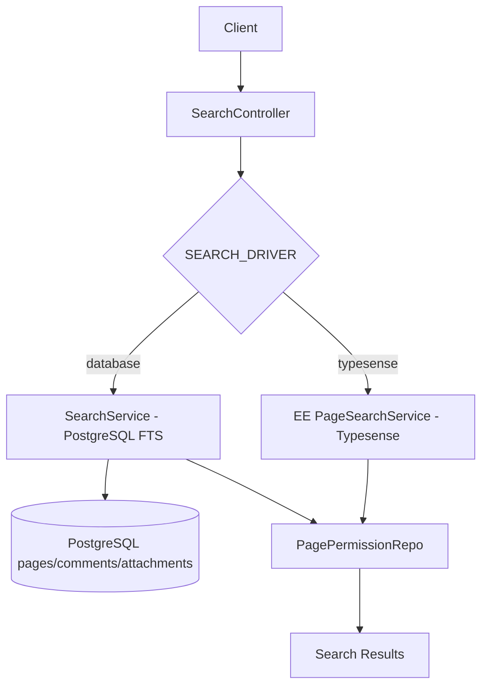

## 2. 相关源码入口

| 文件 | 职责 |
|---|---|
| `apps/server/src/core/search/search.controller.ts` | 搜索 HTTP API 入口，按 `SEARCH_DRIVER` 分流 database/typesense |
| `apps/server/src/core/search/search.service.ts` | PostgreSQL 全文检索实现，包含页面搜索、分享搜索、搜索建议 |
| `apps/server/src/core/search/dto/search.dto.ts` | 搜索请求 DTO |
| `apps/server/src/core/search/dto/search-response.dto.ts` | 搜索结果 DTO |
| `apps/server/src/database/listeners/page.listener.ts` | 监听页面创建/更新/删除/恢复事件，投递搜索/AI 队列 |
| `apps/server/src/integrations/queue/constants/queue.constants.ts` | 搜索相关队列名和任务名 |
| `apps/server/src/database/repos/page/page-permission.repo.ts` | 搜索结果 Page 级权限过滤 |
| `apps/server/src/database/repos/space/space-member.repo.ts` | 用户可搜索 Space 范围查询 |
| `apps/server/src/database/repos/share/share.repo.ts` | 分享搜索时校验分享范围 |
| `apps/server/src/integrations/queue/tasks/backlinks.task.ts` | 页面内容提及/内部链接派生 backlink，不是搜索索引，但同属内容派生链路 |

## 3. 搜索 API 入口

### 3.1 登录用户页面搜索

入口：

```text
POST /api/search
SearchController.pageSearch
```

请求 DTO：

| 字段 | 必填 | 说明 |
|---|---:|---|
| `query` | 是 | 搜索关键词 |
| `spaceId` | 否 | 限定某个 Space |
| `creatorId` | 否 | 限定创建者 |
| `limit` | 否 | 返回条数，默认由服务侧使用 25 |
| `offset` | 否 | 偏移量 |
| `shareId` | 登录搜索会被删除 | 登录搜索入口不允许客户端传入分享搜索范围 |

Controller 处理逻辑：

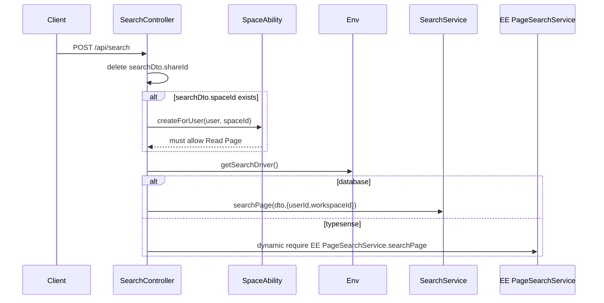

关键点：

- 登录搜索必须经过 `JwtAuthGuard`。
- 如果请求限定 `spaceId`，会先用 Space CASL 能力检查 `Read Page`。
- Controller 会删除 `shareId`，防止登录搜索入口被混用为分享搜索。
- `SEARCH_DRIVER=typesense` 时，Controller 会动态加载 `apps/server/src/ee/typesense/services/page-search.service`。
- 如果配置为 `typesense` 但企业版模块未打包，会抛出 `Enterprise Typesense search module missing`。

### 3.2 搜索建议

入口：

```text
POST /api/search/suggest
SearchController.searchSuggestions
```

请求 DTO：

| 字段 | 说明 |
|---|---|
| `query` | 搜索词 |
| `includeUsers` | 是否搜索用户 |
| `includeGroups` | 是否搜索组 |
| `includePages` | 是否搜索页面 |
| `spaceId` | 当前 Space，用于页面建议排序优先级 |
| `limit` | 每类建议数量，默认 10 |

搜索建议固定走 `SearchService.searchSuggestions`，不通过 Typesense 分流。

### 3.3 分享搜索

入口：

```text
POST /api/search/share-search
SearchController.searchShare
```

特点：

| 项目 | 说明 |
|---|---|
| 认证 | `@Public()`，无需登录 |
| 必填 | `shareId` 必填 |
| Space 限定 | Controller 会删除 `spaceId`，避免客户端自行扩大范围 |
| Workspace | 仍依赖 `AuthWorkspace` 从当前域名/Workspace 上下文注入 |
| Driver | 同样按 `SEARCH_DRIVER` 分流 database/typesense |

## 4. PostgreSQL 页面搜索链路

实现入口：

```text
SearchService.searchPage(searchParams, opts)
```

### 4.1 主查询链路

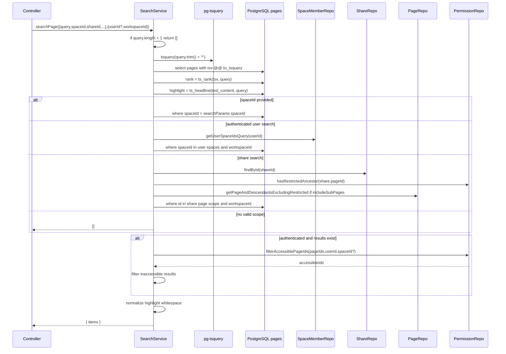

### 4.2 SQL 查询要点

数据库搜索针对 `pages` 表：

| 字段 / 表达式 | 作用 |
|---|---|
| `pages.tsv` | PostgreSQL tsvector 全文索引字段 |
| `pages.textContent` | 生成摘要与高亮 |
| `to_tsquery('english', f_unaccent(searchQuery))` | 生成全文检索查询 |
| `ts_rank(tsv, query)` | 相关性排序 |
| `ts_headline('english', text_content, query, ...)` | 生成命中摘要 |
| `deletedAt is null` | 排除软删除页面 |
| `limit / offset` | 分页 |
| `creatorId` | 可选创建者过滤 |

伪 SQL 结构：

```sql
SELECT
  id,
  slug_id,
  title,
  icon,
  parent_page_id,
  creator_id,
  created_at,
  updated_at,
  ts_rank(tsv, to_tsquery('english', f_unaccent(:query))) AS rank,
  ts_headline('english', text_content, to_tsquery('english', f_unaccent(:query)), ...) AS highlight
FROM pages
WHERE tsv @@ to_tsquery('english', f_unaccent(:query))
  AND deleted_at IS NULL
  AND <scope filter>
ORDER BY rank DESC
LIMIT :limit
OFFSET :offset;
```

### 4.3 返回字段

`SearchResponseDto` 主要字段：

| 字段 | 说明 |
|---|---|
| `id` | Page ID |
| `title` | 页面标题 |
| `icon` | 页面图标 |
| `parentPageId` | 父页面 |
| `creatorId` | 创建者 |
| `rank` | PostgreSQL 相关性分数 |
| `highlight` | 命中高亮摘要 |
| `createdAt` | 创建时间 |
| `updatedAt` | 更新时间 |
| `space` | 所属 Space 简要信息，非分享搜索时返回 |

## 5. 搜索范围与权限过滤

搜索的难点不在全文匹配，而在“不能泄漏无权页面”。

### 5.1 登录搜索范围

如果指定 `spaceId`：

1. Controller 先校验当前用户对该 Space 有 `Read Page` 权限。
2. SearchService 查询时限定 `pages.spaceId = spaceId`。
3. 结果再经过 Page 级权限过滤。

如果未指定 `spaceId`：

1. `SpaceMemberRepo.getUserSpaceIdsQuery(userId)` 获取用户可访问 Space。
2. 查询限定 `pages.spaceId in userSpaceIds`。
3. 查询限定 `pages.workspaceId = workspaceId`。
4. 结果再经过 Page 级权限过滤。

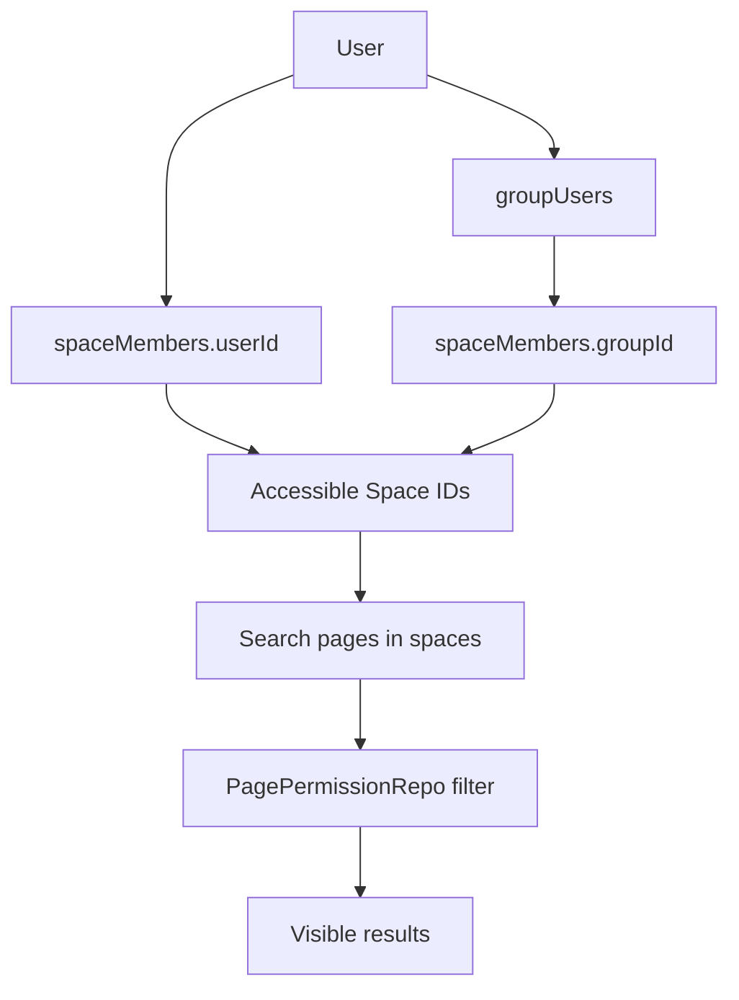

### 5.2 Page 级权限过滤

搜索初步结果出来后，若是登录用户搜索，会调用：

```text
PagePermissionRepo.filterAccessiblePageIds({ pageIds, userId, spaceId? })
```

过滤规则：

| 情况 | 结果 |
|---|---|
| 页面及祖先没有 Page 级限制 | 可访问，前提是 Space 权限已通过 |
| 页面或任一祖先有限制，且用户/所属组没有授权 | 过滤掉 |
| 页面或祖先有限制，用户/所属组有授权 | 保留 |

内部使用 recursive CTE 构建每个结果页面的祖先链，并检查 `pageAccess + pagePermissions`。

### 5.3 分享搜索范围

分享搜索没有登录用户，所以权限策略不同：

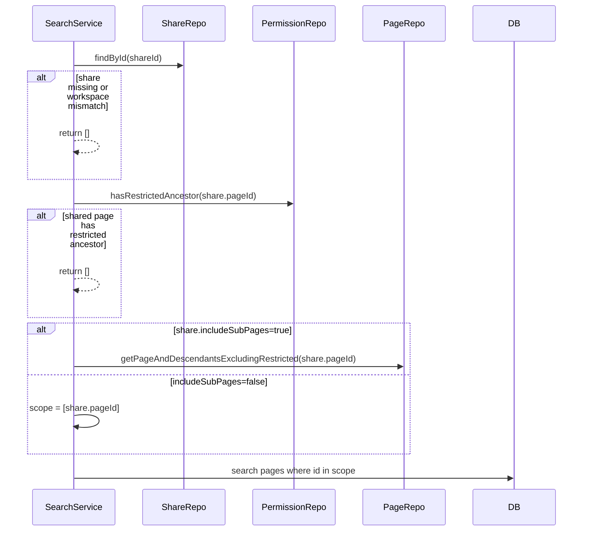

分享搜索设计要点：

| 规则 | 说明 |
|---|---|
| share 必须存在 | 否则返回空 |
| share.workspaceId 必须等于当前 workspaceId | 防止跨租户泄漏 |
| 如果分享页有受限祖先 | 直接返回空 |
| includeSubPages=false | 只搜索分享页本身 |
| includeSubPages=true | 搜索分享页及子孙，但排除受限子树 |
| 无登录用户 | 不调用用户维度 Page 权限过滤 |

## 6. 搜索建议链路

实现入口：

```text
SearchService.searchSuggestions(dto, userId, workspaceId)
```

搜索建议支持三类对象：

| 类型 | 表 | 匹配字段 | 权限过滤 |
|---|---|---|---|
| 用户 | `users` | `name`, `email` | workspaceId + deletedAt 过滤 |
| 用户组 | `groups` | `name` | workspaceId 过滤 |
| 页面 | `pages` | `title` | 用户可访问 Space + Page 级权限过滤 |

### 6.1 用户建议

查询逻辑：

- `users.workspaceId = workspaceId`
- `users.deletedAt is null`
- `LOWER(f_unaccent(users.name)) like query` 或 `users.email ilike query`
- `limit` 默认 10

### 6.2 组建议

查询逻辑：

- `groups.workspaceId = workspaceId`
- `LOWER(f_unaccent(groups.name)) like query`
- `limit` 默认 10

### 6.3 页面建议

查询逻辑：

1. `pages.workspaceId = workspaceId`
2. `pages.deletedAt is null`
3. `LOWER(f_unaccent(pages.title)) like query`
4. `spaceId in userSpaceIds`
5. 如果传入当前 `spaceId`，当前 Space 的页面优先排序。
6. 再调用 `PagePermissionRepo.filterAccessiblePageIds` 过滤 Page 级限制。

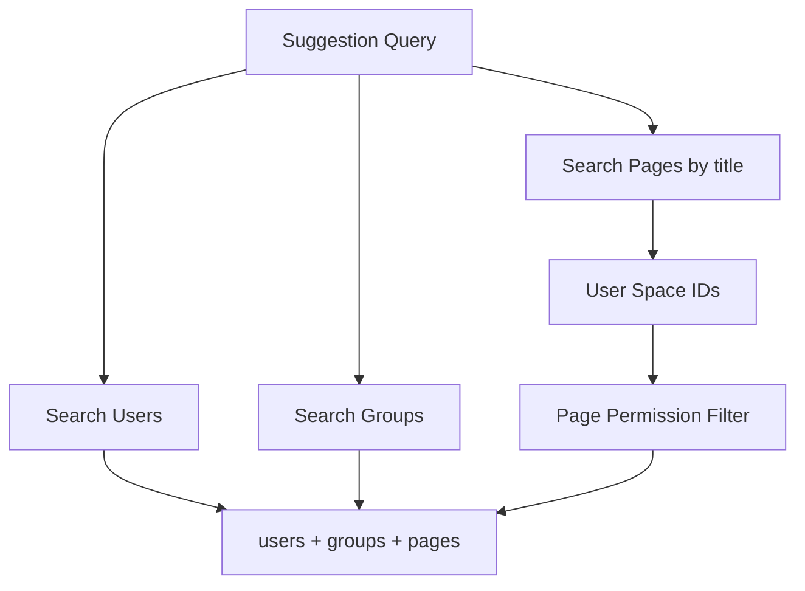

## 7. 页面索引数据来源

数据库搜索的核心字段来自 `pages` 表：

| 字段 | 来源 | 用途 |
|---|---|---|
| `content` | Tiptap / ProseMirror JSON | 页面结构化正文 |
| `textContent` | `jsonToText(content)` | 搜索摘要、AI、全文检索源文本 |
| `tsv` | PostgreSQL tsvector | 全文检索索引 |
| `title` | 页面标题 | 标题展示、建议搜索 |
| `deletedAt` | 软删除标记 | 排除已删除页面 |

### 7.1 创建页面时的数据生成

`PageService.create` 在创建页面时，如果带有内容：

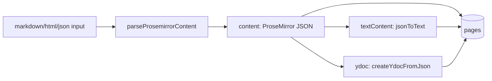

### 7.2 协作保存时的数据生成

`PersistenceExtension.onStoreDocument` 在协作保存时：

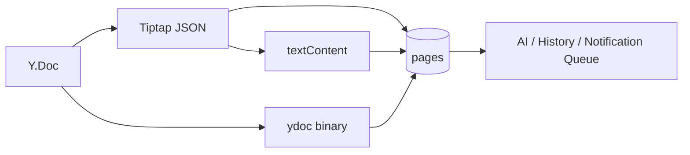

协作保存会更新：

- `pages.content`
- `pages.textContent`
- `pages.ydoc`
- `pages.lastUpdatedById`
- `pages.contributorIds`

`tsv` 字段通常由数据库侧触发器或 migration 中的生成逻辑维护；当前源码的搜索服务直接消费 `pages.tsv`，不会在 `SearchService` 内手工生成 tsvector。

## 8. Page 事件与索引触发

页面 Repo 和 Service 会发出页面事件，`PageListener` 监听这些事件并投递队列。

### 8.1 事件来源

| 操作 | 事件 | 触发点 |
|---|---|---|
| 插入页面 | `PAGE_CREATED` | `PageRepo.insertPage` |
| 更新页面 | `PAGE_UPDATED` | `PageRepo.updatePages` |
| 永久删除页面 | `PAGE_DELETED` | `PageService.forceDelete` |
| 软删除页面 | `PAGE_SOFT_DELETED` | `PageRepo.removePage` |
| 恢复页面 | `PAGE_RESTORED` | `PageRepo.restorePage` |

### 8.2 PageListener 处理逻辑

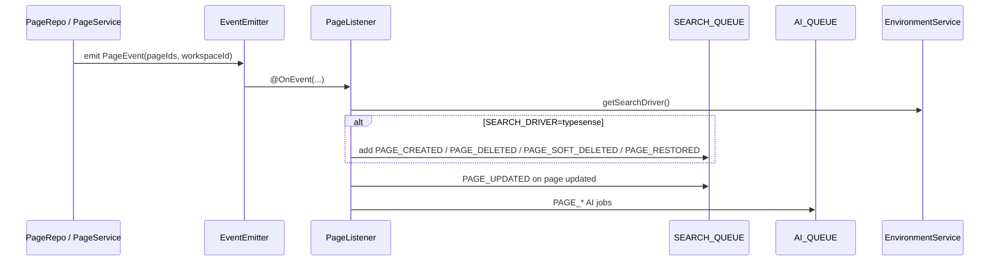

源码中 `PageListener` 的搜索队列投递策略：

| 事件 | SearchQueue 行为 | AIQueue 行为 |
|---|---|---|
| `PAGE_CREATED` | Typesense 模式下投递 `PAGE_CREATED` | 投递 `PAGE_CREATED` |
| `PAGE_UPDATED` | 总是投递 `PAGE_UPDATED` | 当前 listener 未投递 AI update；协作保存会投递 `PAGE_CONTENT_UPDATED` |
| `PAGE_DELETED` | Typesense 模式下投递 `PAGE_DELETED` | 投递 `PAGE_DELETED` |
| `PAGE_SOFT_DELETED` | Typesense 模式下投递 `PAGE_SOFT_DELETED` | 投递 `PAGE_SOFT_DELETED` |
| `PAGE_RESTORED` | Typesense 模式下投递 `PAGE_RESTORED` | 投递 `PAGE_RESTORED` |

说明：

- PostgreSQL database 搜索模式下，搜索查询直接读 `pages.tsv`，因此创建/删除/恢复通常不需要外部索引任务。
- Typesense 模式下，需要把 Page 变更同步到外部索引。
- `PAGE_UPDATED` 当前无条件投递到 `SEARCH_QUEUE`，但具体处理取决于搜索队列 Processor / 企业版模块是否存在。

## 9. 搜索队列任务清单

`QueueName.SEARCH_QUEUE` 与搜索相关任务包括：

| 任务 | 作用 |
|---|---|
| `SEARCH_INDEX_PAGE` | 索引单个页面 |
| `SEARCH_INDEX_PAGES` | 批量索引页面 |
| `SEARCH_INDEX_COMMENT` | 索引单条评论 |
| `SEARCH_INDEX_COMMENTS` | 批量索引评论 |
| `SEARCH_INDEX_ATTACHMENT` | 索引单个附件 |
| `SEARCH_INDEX_ATTACHMENTS` | 批量索引附件 |
| `SEARCH_REMOVE_PAGE` | 从搜索索引移除页面 |
| `SEARCH_REMOVE_ASSET` | 从搜索索引移除附件 |
| `SEARCH_REMOVE_FACE` | 从搜索索引移除评论；命名中 `FACE` 可能是历史命名或笔误，但常量值为 `search-remove-comment` |
| `TYPESENSE_FLUSH` | 清空 / 刷新 Typesense 索引 |
| `PAGE_CREATED` | 页面创建事件同步 |
| `PAGE_UPDATED` | 页面更新事件同步 |
| `PAGE_SOFT_DELETED` | 页面软删除事件同步 |
| `PAGE_RESTORED` | 页面恢复事件同步 |
| `PAGE_DELETED` | 页面永久删除事件同步 |

注意：当前已读取的开源路径中没有定位到完整 SearchQueue Processor 实现；Typesense 查询服务通过 EE 动态加载。因此本节对搜索队列任务的用途来自队列常量和事件投递链路，具体外部索引实现应继续查看 `apps/server/src/ee/typesense/*` 或企业版构建产物。

## 10. Typesense 搜索链路

当配置：

```text
SEARCH_DRIVER=typesense
```

Controller 会走：

```text
SearchController.searchTypesense
```

流程：

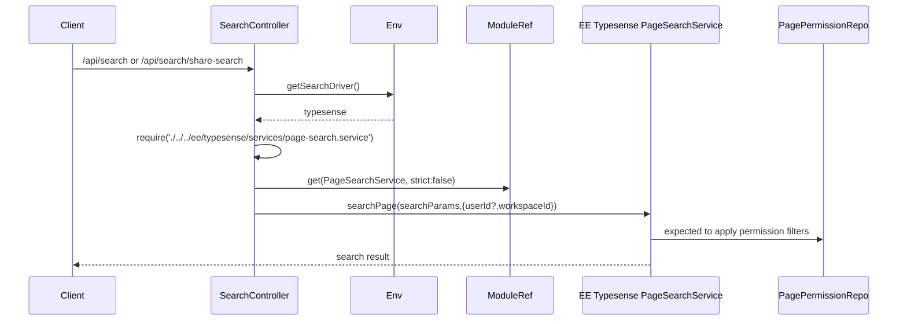

风险点：

| 风险 | 表现 | 处理建议 |
|---|---|---|
| 配置了 typesense 但未打包 EE 模块 | API 返回 `Enterprise Typesense search module missing` | 检查企业版模块构建与部署产物 |
| Typesense 索引未同步 | 搜索结果缺失或过期 | 检查 `SEARCH_QUEUE`、PageListener、Typesense Processor |
| 权限过滤不一致 | 搜索结果泄漏或缺失 | 对比 database 搜索和 Typesense 搜索的 Page 权限过滤逻辑 |
| share-search 范围不一致 | 分享页搜索结果异常 | 检查 `shareId`、`includeSubPages`、受限子树过滤 |

## 11. 评论、附件与搜索索引

虽然当前 `SearchService.searchPage` 只展示页面搜索实现，但队列常量中存在评论和附件索引任务：

| 对象 | 数据表 | 相关字段 | 队列任务 |
|---|---|---|---|
| Page | `pages` | `title`, `textContent`, `tsv`, `spaceId`, `workspaceId` | `SEARCH_INDEX_PAGE`, `SEARCH_REMOVE_PAGE` |
| Comment | `comments` | `content`, `pageId`, `spaceId`, `workspaceId` | `SEARCH_INDEX_COMMENT`, `SEARCH_REMOVE_FACE` |
| Attachment | `attachments` | `fileName`, `textContent`, `tsv`, `pageId`, `spaceId`, `workspaceId` | `SEARCH_INDEX_ATTACHMENT`, `SEARCH_REMOVE_ASSET` |

设计判断：

- 页面搜索是当前开源核心链路的主实现。
- 评论/附件索引任务说明系统架构上考虑了更广义的搜索索引对象。
- 附件文本搜索依赖文件内容提取，即 `attachments.textContent`。
- 外部搜索引擎模式需要维护 Page / Comment / Attachment 多类索引一致性。

## 12. Backlink 与搜索的关系

Backlink 不是全文搜索索引，但它和页面内容解析存在相邻关系。

链路：

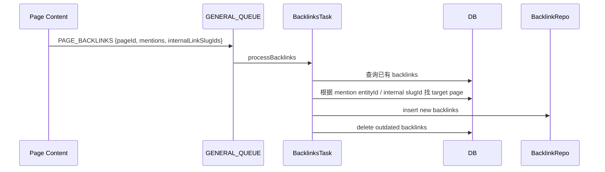

为什么放在本专题：

- 它同样来自页面内容解析。
- 它同样属于页面内容变更后的派生数据。
- 它不影响全文搜索排名，但影响页面关系发现、反向链接展示、知识图谱类能力。

## 13. 权限安全边界

搜索必须遵守以下安全边界：

| 边界 | 控制点 |
|---|---|
| Workspace 隔离 | `workspaceId` 查询条件，`AuthWorkspace`，分享搜索校验 `share.workspaceId` |
| Space 权限 | `SpaceAbilityFactory`，`SpaceMemberRepo.getUserSpaceIdsQuery` |
| Page 限制 | `PagePermissionRepo.filterAccessiblePageIds` |
| 分享范围 | `ShareRepo.findById`，`includeSubPages`，`getPageAndDescendantsExcludingRestricted` |
| 软删除 | `pages.deletedAt is null` |
| 企业版搜索一致性 | Typesense service 必须复刻上述过滤规则 |

建议任何改造搜索逻辑时必须补充以下测试：

1. 用户只能搜索自己所在 Space 的页面。
2. 用户不能搜索被 Page 级限制挡住的页面。
3. 用户可以搜索被授权的受限页面。
4. 受限父页面下的子页面不能通过搜索泄漏。
5. 分享搜索不能越过分享页范围。
6. 分享搜索开启子页面时不能搜索受限子树。
7. 删除页面不能出现在搜索结果中。
8. Typesense 与 database 搜索结果在权限边界上保持一致。

## 14. 搜索链路排障手册

### 14.1 搜不到页面

| 检查项 | 说明 |
|---|---|
| `pages.deletedAt` | 页面是否已软删除 |
| `pages.textContent` | 页面正文是否已正确抽取纯文本 |
| `pages.tsv` | PostgreSQL tsvector 是否有内容 |
| `query.length` | 空查询直接返回空 |
| `spaceId` | 是否限定了错误 Space |
| Space 成员 | 用户是否属于页面所在 Space |
| Page 权限 | 是否被 `pageAccess/pagePermissions` 过滤掉 |
| Typesense 模式 | 索引是否同步，EE 模块是否加载 |

### 14.2 搜索结果太多或泄漏

| 检查项 | 说明 |
|---|---|
| Workspace 条件 | 是否缺少 `workspaceId` 过滤 |
| Space 条件 | 未指定 spaceId 时是否使用用户可访问 Space 查询 |
| Page 权限过滤 | 是否调用 `filterAccessiblePageIds` |
| 分享搜索 | 是否错误允许传入 `spaceId` 或绕过 `shareId` |
| 受限祖先 | 是否检查 `hasRestrictedAncestor` 和 ancestor chain |

### 14.3 搜索摘要异常

| 检查项 | 说明 |
|---|---|
| `textContent` | 是否为空或未更新 |
| HTML/Markdown 转换 | 内容转换是否丢文本 |
| `jsonToText` | 新编辑器节点是否支持文本抽取 |
| `ts_headline` | 高亮参数是否符合预期 |
| 换行压缩 | SearchService 会将摘要换行和多空格压缩 |

### 14.4 Typesense 模式异常

| 检查项 | 说明 |
|---|---|
| `SEARCH_DRIVER` | 是否为 `typesense` |
| EE 模块 | `apps/server/src/ee/typesense/services/page-search.service` 是否随构建产物存在 |
| `TYPESENSE_URL` | 服务地址是否可达 |
| `TYPESENSE_API_KEY` | API Key 是否正确 |
| `SEARCH_QUEUE` | 页面事件是否投递索引任务 |
| Processor | 搜索队列 worker 是否运行 |
| 权限一致性 | 外部索引查询后是否进行权限过滤 |

### 14.5 页面更新后搜索不更新

| 场景 | 检查项 |
|---|---|
| 数据库搜索模式 | `PersistenceExtension` 是否更新 `textContent`；数据库是否维护 `tsv` |
| Typesense 模式 | `PageListener` 是否收到事件；`SEARCH_QUEUE` 是否积压；Typesense processor 是否失败 |
| 页面标题更新 | `PageRepo.updatePage` 是否 emit `PAGE_UPDATED` |
| 协作正文更新 | `PersistenceExtension.onStoreDocument` 是否成功保存内容 |
| 页面恢复/删除 | `PAGE_RESTORED` / `PAGE_SOFT_DELETED` / `PAGE_DELETED` 是否触发 |

## 15. 研发改造建议

### 15.1 新增可搜索字段

若要让 Page 搜索支持新字段：

1. 修改数据库 schema / migration。
2. 确保写入链路更新该字段。
3. 更新 `tsv` 生成逻辑或触发器。
4. 修改 `SearchService.searchPage` select / where / highlight。
5. 修改 Typesense schema 与索引处理器。
6. 补充 database/typesense 双模式测试。

### 15.2 新增可搜索对象

若要新增搜索对象，例如模板、附件全文、评论：

| 步骤 | 说明 |
|---|---|
| 1 | 定义搜索 DTO 是否需要区分类型 |
| 2 | 定义索引字段和权限过滤规则 |
| 3 | 数据库搜索模式下增加 SQL 查询 |
| 4 | Typesense 模式下增加 collection/schema |
| 5 | 增加对象变更事件和搜索队列任务 |
| 6 | 统一 SearchResponse 或新增响应类型 |
| 7 | 前端展示分组结果 |

### 15.3 优化搜索性能

优先顺序：

1. 确认 `pages.tsv` 有合适 GIN 索引。
2. 确认 `pages.workspaceId`, `pages.spaceId`, `pages.deletedAt` 有合适索引。
3. 控制 `limit`，避免大 offset 深分页。
4. 对大规模租户启用 Typesense。
5. 对 Page 权限过滤做批量优化，避免逐条权限查询。
6. 对 share-search 的递归子树范围做缓存或限制。

## 16. 当前实现边界

基于已读取源码，可以明确：

1. 开源默认页面搜索由 `SearchService` 使用 PostgreSQL 全文检索实现。
2. 搜索入口由 `SearchController` 按 `SEARCH_DRIVER` 分流。
3. Typesense 查询服务通过企业版模块动态加载。
4. 搜索建议固定走数据库查询。
5. 登录搜索会做 Space 权限和 Page 级权限过滤。
6. 分享搜索会限制在 share 范围内，并排除受限祖先/受限子树。
7. 页面事件由 `PageListener` 投递搜索队列和 AI 队列。
8. 完整 Typesense 索引 processor 未在已读取开源路径中确认，需查看 EE typesense 目录。

## 17. 小结

Docmost 搜索链路的核心设计是：

- **查询层分流**：database 走 PostgreSQL FTS；typesense 走企业版外部搜索服务。
- **索引层分层**：database 模式依赖 `pages.tsv`；typesense 模式依赖 Page 事件和 `SEARCH_QUEUE`。
- **权限层强约束**：搜索结果必须经过 Workspace、Space、Page 限制过滤。
- **分享层特殊处理**：分享搜索不依赖登录用户，但严格限制在 share 范围内。
- **内容派生最终一致**：页面内容变更后，搜索字段、AI、历史、通知、backlink 等派生能力各自通过保存逻辑、事件或队列更新。
