# 搜索异步队列处理链路图与排障指南汇总

> 本文档基于源码反向分析生成，用于把 Docmost 的数据库搜索、Typesense 搜索、页面事件、搜索队列、索引重建、权限过滤与排障操作统一到一份可执行指南中。
>
> 分析基线：`main` 分支，参考提交 `c9fa6e20b32689c3639d691840834b15df171f5f`。
>
> 相关文档：
>
> - `docs/topic-search-indexing.md`
> - `docs/topic-typesense-search.md`
> - `docs/04-runtime-flows.md`

## 1. 总体结论

Docmost 搜索链路分为两类模式：

| 模式 | 配置 | 查询来源 | 索引维护方式 | 核心风险 |
|---|---|---|---|---|
| 数据库搜索模式 | `SEARCH_DRIVER=database` 或默认值 | PostgreSQL `pages.tsv` / `pages.textContent` | 页面写库时维护字段，查询直接读 DB | `textContent` / `tsv` 未更新、权限过滤遗漏 |
| Typesense 搜索模式 | `SEARCH_DRIVER=typesense` | Typesense collection | Page 事件 → `SEARCH_QUEUE` → Processor → Typesense | 队列积压、Processor 未运行、EE 模块缺失、索引与 DB 不一致 |

搜索排障时先判断当前搜索模式：

```text
EnvironmentService.getSearchDriver()
SEARCH_DRIVER=database | typesense
```

## 2. 全链路总图

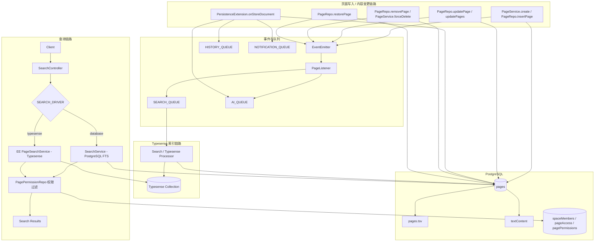

## 3. 查询链路汇总

### 3.1 数据库搜索模式

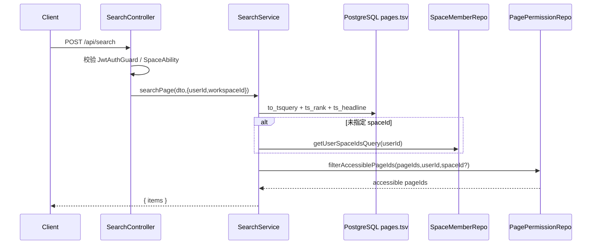

关键判断：

| 判断点 | 源码入口 | 失败表现 |
|---|---|---|
| `query` 是否为空 | `SearchService.searchPage` | 空结果 |
| `pages.tsv` 是否可命中 | PostgreSQL FTS | 搜不到正文 |
| `spaceId` 是否正确 | `SearchController.pageSearch` | 搜索范围过窄或 Forbidden |
| 用户是否属于 Space | `SpaceMemberRepo.getUserSpaceIdsQuery` | 结果缺失 |
| Page 级权限是否过滤 | `PagePermissionRepo.filterAccessiblePageIds` | 结果缺失或权限泄漏 |

### 3.2 Typesense 搜索模式

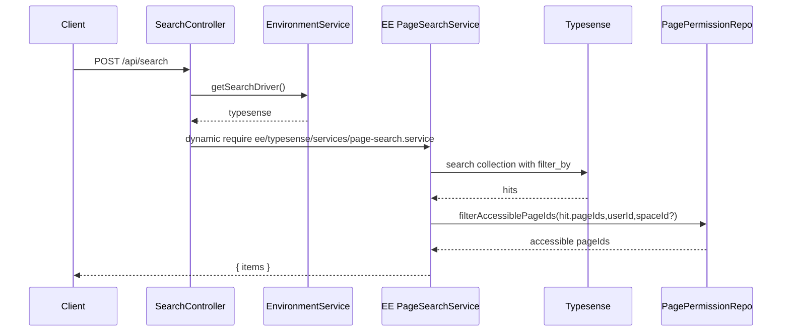

关键判断：

| 判断点 | 失败表现 | 优先检查 |
|---|---|---|
| EE 模块是否存在 | `Enterprise Typesense search module missing` | 构建产物是否包含 `ee/typesense` |
| Typesense 是否可达 | 查询接口报错或超时 | `TYPESENSE_URL`, 网络, API Key |
| collection 是否存在 | 查询失败或空结果 | Typesense collection/schema |
| 索引是否同步 | DB 有页面但搜索不到 | `SEARCH_QUEUE`, Processor, failed jobs |
| 权限过滤是否一致 | 泄漏或缺失 | PageSearchService 是否调用 PagePermissionRepo |

### 3.3 分享搜索链路

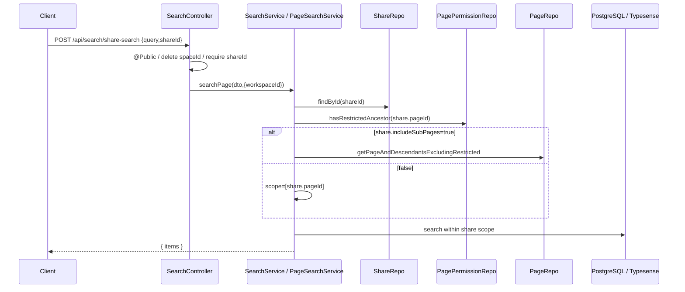

分享搜索排障重点：

| 问题 | 检查项 |
|---|---|
| 分享搜索无结果 | `shareId` 是否存在，`workspaceId` 是否匹配 |
| 子页面搜不到 | `includeSubPages` 是否开启，子页面是否受限 |
| 分享页自身搜不到 | 分享页是否有受限祖先 |
| 搜索越权 | 是否删除了客户端传入的 `spaceId`，是否限定 share scope |

## 4. 写入与索引触发链路

### 4.1 页面创建

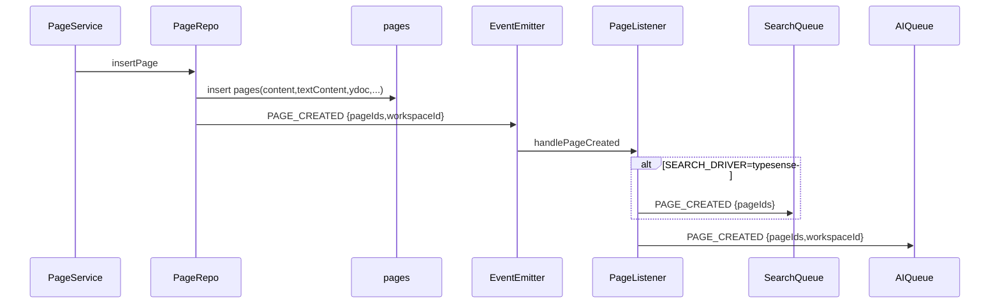

排障点：

| 检查项 | 说明 |
|---|---|
| `pages.content` | 创建时是否写入正文 JSON |
| `pages.textContent` | 是否由 `jsonToText` 生成 |
| `pages.tsv` | 数据库全文索引是否维护 |
| `PAGE_CREATED` | 是否触发 PageListener |
| `SEARCH_QUEUE` | Typesense 模式是否投递创建任务 |

### 4.2 页面协作保存

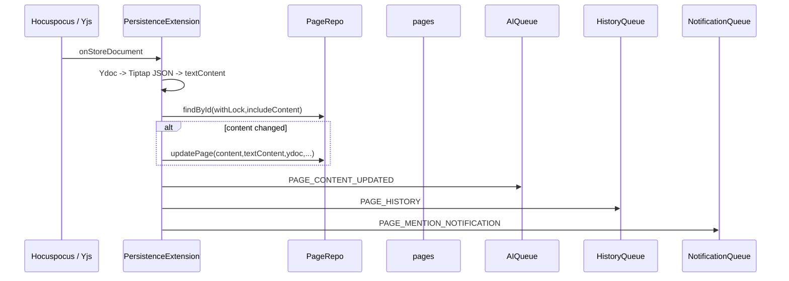

排障点：

| 问题 | 检查项 |
|---|---|
| 数据库搜索搜不到新正文 | `PersistenceExtension` 是否更新 `textContent`，`tsv` 是否更新 |
| Typesense 搜索搜不到新正文 | 是否有页面更新事件或搜索队列任务触发；Processor 是否重建索引 |
| 历史版本缺失 | `HISTORY_QUEUE` 是否积压或失败 |
| AI 结果过期 | `AI_QUEUE` 是否处理 `PAGE_CONTENT_UPDATED` |

### 4.3 页面更新 / 删除 / 恢复

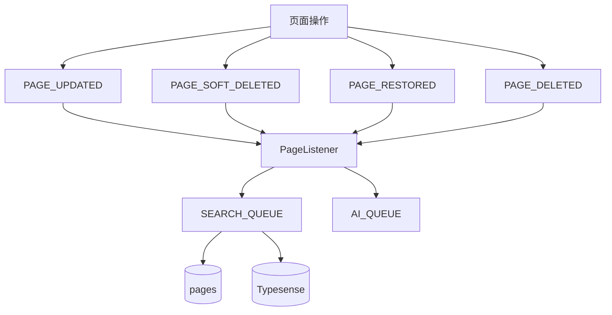

事件到搜索队列映射：

| 页面事件 | SearchQueue 投递 | 条件 | 预期索引行为 |
|---|---|---|---|
| `PAGE_CREATED` | `PAGE_CREATED` | `SEARCH_DRIVER=typesense` | upsert 新页面 |
| `PAGE_UPDATED` | `PAGE_UPDATED` | 当前代码无条件投递 | upsert 页面 |
| `PAGE_SOFT_DELETED` | `PAGE_SOFT_DELETED` | `SEARCH_DRIVER=typesense` | 删除或标记删除 |
| `PAGE_RESTORED` | `PAGE_RESTORED` | `SEARCH_DRIVER=typesense` | 重新 upsert |
| `PAGE_DELETED` | `PAGE_DELETED` | `SEARCH_DRIVER=typesense` | 删除索引文档 |

## 5. 搜索队列处理链路

### 5.1 推荐 Processor 行为

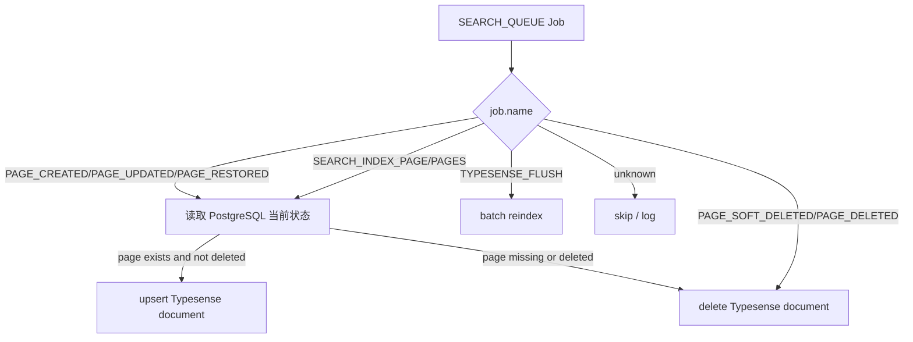

Processor 处理原则：

| 原则 | 说明 |
|---|---|
| 以 DB 为准 | job payload 只带 ID，实际内容重新读 PostgreSQL |
| 幂等 | 重复 upsert/delete 不应产生错误结果 |
| 可重试 | BullMQ 失败后可安全重试 |
| 不越权 | 索引可以含粗过滤字段，但最终搜索仍要服务端权限过滤 |
| 记录上下文 | 日志至少包含 job.name、pageIds、workspaceId、失败原因 |

### 5.2 任务分类

| 分类 | 任务 | 处理动作 |
|---|---|---|
| 页面索引 | `PAGE_CREATED`, `PAGE_UPDATED`, `PAGE_RESTORED`, `SEARCH_INDEX_PAGE`, `SEARCH_INDEX_PAGES` | 读取 pages，upsert Typesense |
| 页面删除 | `PAGE_SOFT_DELETED`, `PAGE_DELETED`, `SEARCH_REMOVE_PAGE` | 删除 Typesense 页面文档 |
| 评论索引 | `SEARCH_INDEX_COMMENT`, `SEARCH_INDEX_COMMENTS`, `SEARCH_REMOVE_FACE` | 写入/删除评论索引 |
| 附件索引 | `SEARCH_INDEX_ATTACHMENT`, `SEARCH_INDEX_ATTACHMENTS`, `SEARCH_REMOVE_ASSET` | 写入/删除附件索引 |
| 全量维护 | `TYPESENSE_FLUSH` | 重建 collection 或按 workspace 重建 |

## 6. 排障决策树

### 6.1 用户反馈“搜不到页面”

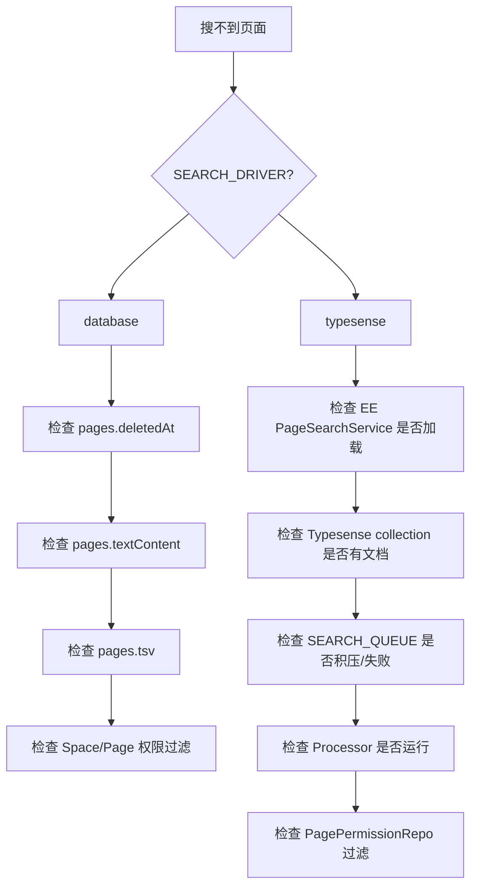

### 6.2 用户反馈“搜索结果有不该看的页面”

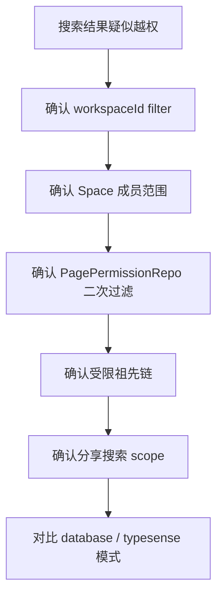

### 6.3 用户反馈“页面更新后搜索还是旧内容”

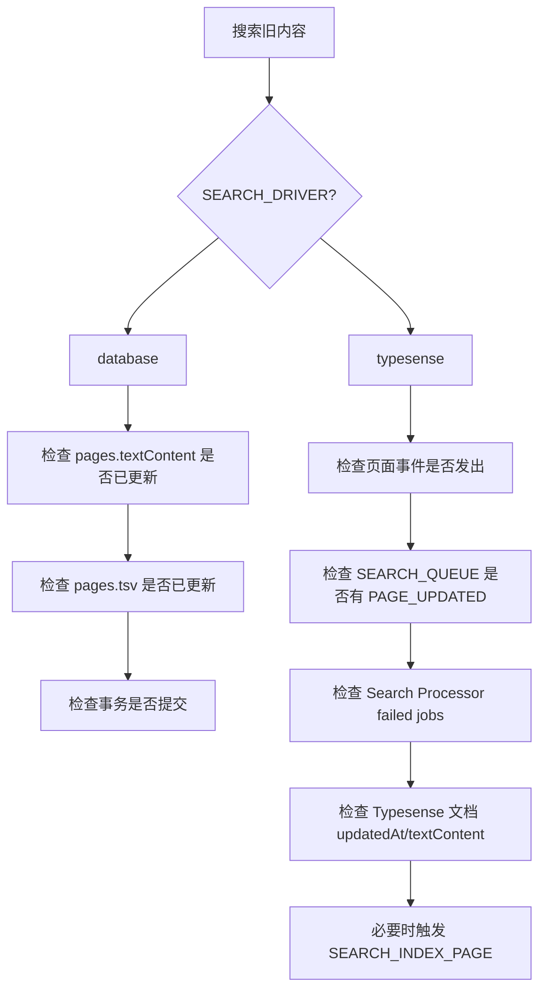

## 7. 分模式排障清单

### 7.1 数据库搜索模式排障清单

| 步骤 | 检查项 | 目标 |
|---:|---|---|
| 1 | `SEARCH_DRIVER` 是否为 `database` 或未配置 | 确认走 DB 搜索 |
| 2 | 页面 `deletedAt` 是否为空 | 排除软删除 |
| 3 | `pages.textContent` 是否包含关键词 | 确认内容抽取正常 |
| 4 | `pages.tsv` 是否非空且可命中 | 确认 FTS 索引正常 |
| 5 | 当前用户是否属于页面 Space | 确认 Space 范围 |
| 6 | 页面或祖先是否存在 Page 限制 | 确认 Page 级权限 |
| 7 | `SearchService.searchPage` 是否过滤掉结果 | 定位查询或权限过滤 |
| 8 | 是否传入错误 `spaceId` / `creatorId` | 排除前端参数问题 |

### 7.2 Typesense 搜索模式排障清单

| 步骤 | 检查项 | 目标 |
|---:|---|---|
| 1 | `SEARCH_DRIVER=typesense` | 确认走 Typesense 查询 |
| 2 | EE 模块是否包含 `ee/typesense/services/page-search.service` | 确认查询服务存在 |
| 3 | `TYPESENSE_URL` 是否可达 | 确认服务连接 |
| 4 | `TYPESENSE_API_KEY` 是否有效 | 确认鉴权 |
| 5 | collection 是否存在 | 确认 schema 初始化 |
| 6 | collection 中是否有该页面文档 | 确认索引存在 |
| 7 | `SEARCH_QUEUE` 是否有积压 | 判断索引延迟 |
| 8 | failed jobs 是否有错误 | 判断 Processor 失败 |
| 9 | PageSearchService 是否调用权限过滤 | 排除越权风险 |
| 10 | 必要时投递 `SEARCH_INDEX_PAGE` 或 `TYPESENSE_FLUSH` | 修复索引 |

## 8. 典型问题定位表

| 现象 | 最可能原因 | 验证方式 | 修复动作 |
|---|---|---|---|
| DB 模式搜不到新正文 | `textContent` 未更新 | 查 `pages.textContent` | 检查协作保存链路 |
| DB 模式标题可搜、正文不可搜 | `tsv` 未覆盖正文 | 查 `pages.tsv` / FTS 查询 | 检查 migration/trigger |
| Typesense 模式接口直接报错 | EE PageSearchService 缺失 | 看 API 错误 | 补 EE 模块或改回 database |
| Typesense 模式结果为空 | collection 无文档 | 查 Typesense document count | 触发 reindex |
| 更新后旧结果仍存在 | Search Processor 未消费 | 查 BullMQ queue depth | 启动 worker / 修 failed job |
| 删除页面仍可搜 | 删除事件未同步索引 | 查 `PAGE_SOFT_DELETED/PAGE_DELETED` job | 手动 remove/reindex |
| 搜索结果越权 | 权限过滤缺失 | 用无权限用户复现 | 强制调用 PagePermissionRepo |
| 分享搜索返回太多 | share scope 未限制 | 查 share-search filter | 限定 share pageIds |
| 分享搜索返回为空 | 受限祖先或 includeSubPages 未开 | 查 share、pageAccess | 修分享设置或权限 |
| 某用户搜不到别人能搜到的页面 | Space 或 Page 权限不同 | 查 spaceMembers/pagePermissions | 修授权关系 |

## 9. 搜索队列观测指标

建议生产环境至少监控：

| 指标 | 含义 | 告警建议 |
|---|---|---|
| `SEARCH_QUEUE waiting count` | 等待处理任务数 | 持续增长告警 |
| `SEARCH_QUEUE failed count` | 失败任务数 | 大于 0 需要检查 |
| `SEARCH_QUEUE active count` | 正在处理任务数 | 长时间为 0 且 waiting 增长说明 worker 异常 |
| `PAGE_UPDATED job latency` | 页面更新到索引处理的延迟 | 超过业务容忍阈值告警 |
| `Typesense search latency` | 查询耗时 | 延迟升高告警 |
| `Typesense document count` | 索引文档数 | 与 DB 页面数差异异常告警 |
| `PostgreSQL FTS query latency` | DB 搜索耗时 | 慢查询告警 |
| `permission filter latency` | Page 权限过滤耗时 | 大空间/深树下重点关注 |

## 10. 手工修复操作建议

### 10.1 单页面索引修复

适用：某个页面 DB 正常，但 Typesense 搜不到。

推荐动作：

```text
投递 SEARCH_INDEX_PAGE { pageId }
```

Processor 应读取 DB 当前页面状态：

| DB 状态 | 动作 |
|---|---|
| 页面存在且未删除 | upsert Typesense |
| 页面软删除 | delete Typesense |
| 页面不存在 | delete Typesense |

### 10.2 批量页面索引修复

适用：某个 Space 或 Workspace 部分页面缺索引。

推荐动作：

```text
投递 SEARCH_INDEX_PAGES { pageIds }
```

或按批次从 DB 读取页面后分批 upsert。

### 10.3 全量重建

适用：schema 变更、严重索引不一致、Typesense 数据损坏。

推荐动作：

```text
投递 TYPESENSE_FLUSH { workspaceId? }
```

执行策略：

| 步骤 | 动作 |
|---:|---|
| 1 | 暂停或限流高频写入，降低重建期间漂移 |
| 2 | 清理目标 collection 或目标 workspace 文档 |
| 3 | 从 PostgreSQL 分批读取未删除页面 |
| 4 | 批量 import/upsert Typesense |
| 5 | 抽样对比 DB 与 Typesense 文档数 |
| 6 | 执行权限回归测试 |

## 11. 测试模板

### 11.1 database 与 typesense 一致性测试

| 编号 | 场景 | database 预期 | typesense 预期 |
|---|---|---|---|
| S01 | 普通页面标题搜索 | 返回 | 返回 |
| S02 | 普通页面正文搜索 | 返回 | 返回 |
| S03 | 页面软删除 | 不返回 | 不返回 |
| S04 | 页面恢复 | 返回 | 返回 |
| S05 | 页面永久删除 | 不返回 | 不返回 |
| S06 | Space 非成员搜索 | 不返回 | 不返回 |
| S07 | Page 级限制未授权 | 不返回 | 不返回 |
| S08 | Page 级限制授权 reader | 返回 | 返回 |
| S09 | 父页面限制，子页面命中 | 无授权不返回 | 无授权不返回 |
| S10 | 分享页搜索 | 仅 share scope | 仅 share scope |

### 11.2 队列处理测试

| 编号 | 触发动作 | 期望队列任务 | 期望索引动作 |
|---|---|---|---|
| Q01 | 创建页面 | `PAGE_CREATED` | upsert page |
| Q02 | 更新标题 | `PAGE_UPDATED` | upsert page |
| Q03 | 协作更新正文 | 视实现触发 `PAGE_UPDATED` 或专用索引任务 | upsert page text |
| Q04 | 软删除页面 | `PAGE_SOFT_DELETED` | remove or mark deleted |
| Q05 | 恢复页面 | `PAGE_RESTORED` | upsert page |
| Q06 | 永久删除页面 | `PAGE_DELETED` | remove page |
| Q07 | 手工修复单页 | `SEARCH_INDEX_PAGE` | upsert page |
| Q08 | 全量重建 | `TYPESENSE_FLUSH` | rebuild collection |

## 12. 研发修改搜索链路的检查清单

任何修改搜索相关代码，必须检查：

| 检查项 | 说明 |
|---|---|
| 查询入口 | `SearchController` database/typesense 分流是否正确 |
| DTO | 新字段是否同时支持 database 与 typesense |
| 权限过滤 | 是否调用 `PagePermissionRepo` |
| Workspace 隔离 | 是否强制 `workspaceId` |
| Space 范围 | 是否使用用户可访问 Space |
| 分享范围 | share-search 是否禁止客户端扩大范围 |
| 软删除 | 是否过滤 `deletedAt` |
| 索引字段 | `content/textContent/tsv/Typesense document` 是否一致 |
| 队列任务 | 页面事件是否能触发索引更新 |
| 重建脚本 | schema 变化后是否有 reindex 方案 |
| 回归测试 | database/typesense 两模式是否都覆盖 |

## 13. 建议后续补充

如果继续完善工程化运维文档，建议补三份：

| 文档 | 内容 |
|---|---|
| `topic-search-test-cases.md` | 搜索权限、分享搜索、更新同步的测试用例明细 |
| `topic-typesense-reindex-runbook.md` | Typesense flush/reindex 的运维 SOP |
| `topic-search-observability.md` | BullMQ、Typesense、PostgreSQL 搜索监控指标和告警规则 |

## 14. 小结

搜索链路排障的核心顺序是：

1. 先确认 `SEARCH_DRIVER`。
2. database 模式优先检查 `pages.textContent`、`pages.tsv`、Space/Page 权限过滤。
3. typesense 模式优先检查 EE 模块、Typesense 连接、collection 文档、`SEARCH_QUEUE` 和 Processor。
4. 所有模式都必须验证 Workspace、Space、Page 权限边界。
5. 对外分享搜索必须单独验证 share scope 和受限子树过滤。
6. 索引异常优先用单页 reindex 修复，再考虑批量或全量 flush。
