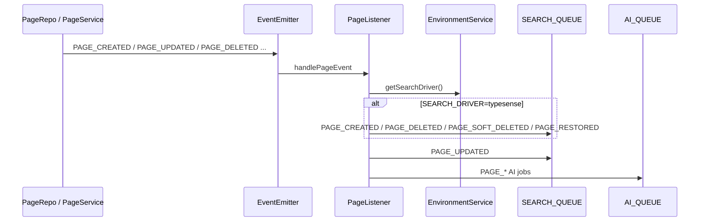
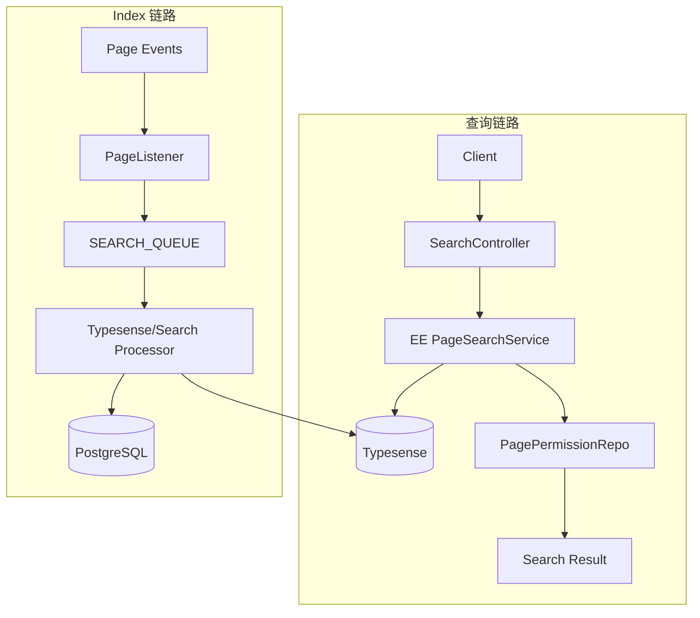
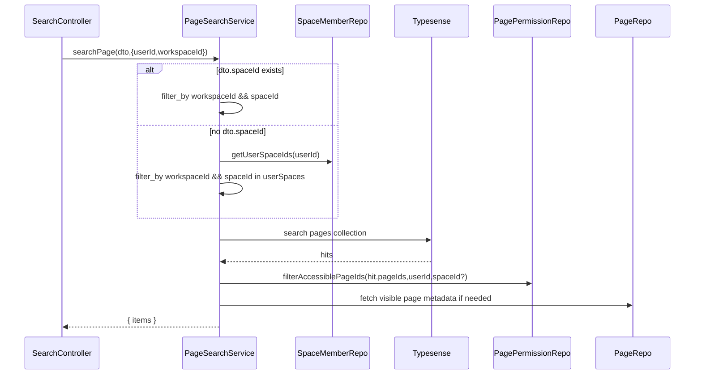
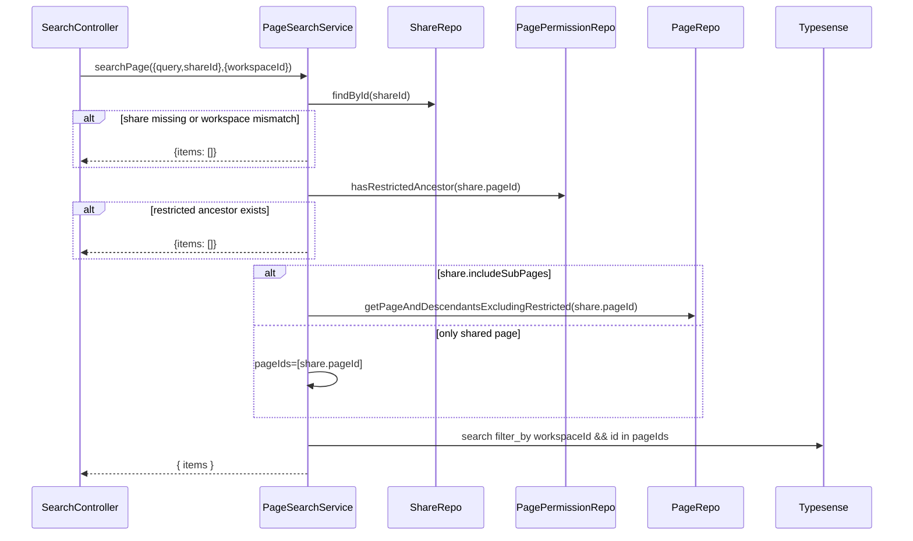
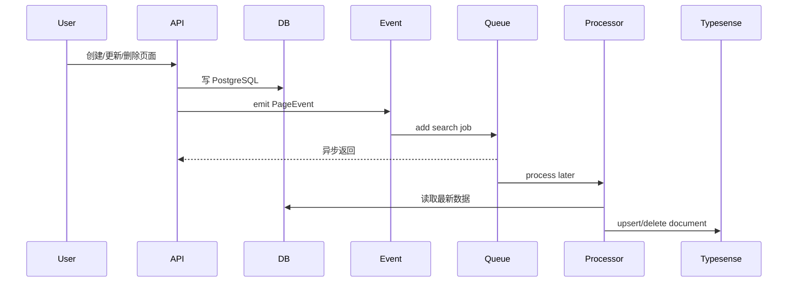
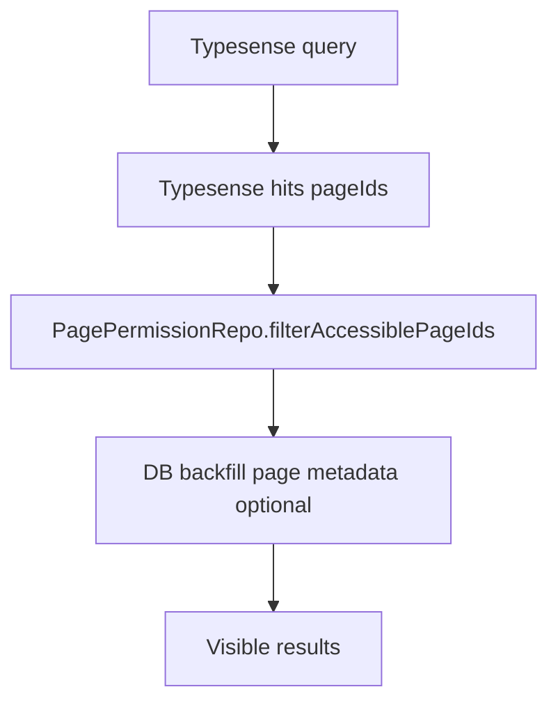
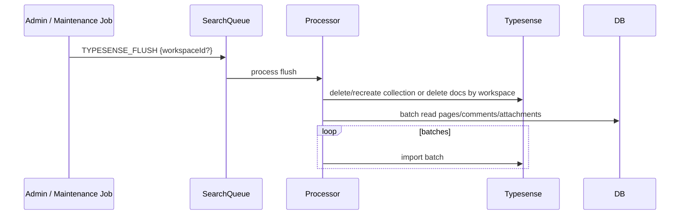

# Typesense Processor / PageSearchService 设计契约说明

> 本文档基于源码反向分析生成，用于补充说明 Docmost 在 `SEARCH_DRIVER=typesense` 模式下的查询入口、动态模块加载、队列 Processor 预期职责、索引数据契约、权限过滤要求与排障检查点。
>
> 分析基线：`main` 分支，参考提交 `c9fa6e20b32689c3639d691840834b15df171f5f`。
>
> 重要说明：当前可读取的仓库路径中，未找到 `apps/server/src/ee/typesense/services/page-search.service.ts` 与完整 Typesense Processor 源码；但 `SearchController` 明确动态加载该路径，`EnvironmentService`、`server/package.json` 与 `QueueJob` 常量也明确保留了 Typesense 依赖、配置和队列任务。因此本文档以“已确认入口 + 运行契约 + 应实现行为 + 排障清单”的方式描述，不伪造未读取到的企业版实现细节。

## 1. 已确认事实

### 1.1 后端已依赖 Typesense SDK

`apps/server/package.json` 中包含：

```json
"typesense": "^3.0.5"
```

说明后端构建依赖中已预留 Typesense 客户端能力。

### 1.2 环境配置已支持 Typesense

`EnvironmentService` 中已定义：

| 方法 | 环境变量 | 默认值 | 说明 |
|---|---|---|---|
| `getSearchDriver()` | `SEARCH_DRIVER` | `database` | 搜索驱动，返回小写 |
| `getTypesenseUrl()` | `TYPESENSE_URL` | `http://localhost:8108` | Typesense 服务地址 |
| `getTypesenseApiKey()` | `TYPESENSE_API_KEY` | 无 | Typesense API Key |
| `getTypesenseLocale()` | `TYPESENSE_LOCALE` | `en` | Typesense locale |

### 1.3 SearchController 已动态加载企业版 PageSearchService

当 `SEARCH_DRIVER=typesense` 时，`SearchController` 会调用：

```ts
require('./../../ee/typesense/services/page-search.service')
```

并通过 `ModuleRef.get(PageSearchService, { strict: false })` 取得服务实例，然后调用：

```ts
PageSearchService.searchPage(searchParams, {
  userId,
  workspaceId,
});
```

若企业版模块未打包，会抛出：

```text
Enterprise Typesense search module missing
```

### 1.4 搜索队列已定义 Typesense / Search 任务

`QueueJob` 中已定义以下搜索相关任务：

| 任务 | 常量值 | 说明 |
|---|---|---|
| `SEARCH_INDEX_PAGE` | `search-index-page` | 索引单页 |
| `SEARCH_INDEX_PAGES` | `search-index-pages` | 批量索引页面 |
| `SEARCH_INDEX_COMMENT` | `search-index-comment` | 索引单条评论 |
| `SEARCH_INDEX_COMMENTS` | `search-index-comments` | 批量索引评论 |
| `SEARCH_INDEX_ATTACHMENT` | `search-index-attachment` | 索引单个附件 |
| `SEARCH_INDEX_ATTACHMENTS` | `search-index-attachments` | 批量索引附件 |
| `SEARCH_REMOVE_PAGE` | `search-remove-page` | 删除页面索引 |
| `SEARCH_REMOVE_ASSET` | `search-remove-attachment` | 删除附件索引 |
| `SEARCH_REMOVE_FACE` | `search-remove-comment` | 删除评论索引；命名可能是历史遗留 |
| `TYPESENSE_FLUSH` | `typesense-flush` | 清空 / 重建 Typesense 索引 |
| `PAGE_CREATED` | `page-created` | 页面创建事件 |
| `PAGE_UPDATED` | `page-updated` | 页面更新事件 |
| `PAGE_SOFT_DELETED` | `page-soft-deleted` | 页面软删除事件 |
| `PAGE_RESTORED` | `page-restored` | 页面恢复事件 |
| `PAGE_DELETED` | `page-deleted` | 页面永久删除事件 |

### 1.5 PageListener 已投递搜索队列

`PageListener` 监听页面事件，并在 `SEARCH_DRIVER=typesense` 时投递页面创建、删除、软删除、恢复等搜索同步任务；页面更新事件会投递 `PAGE_UPDATED`。



## 2. Typesense 搜索运行边界

Typesense 模式至少包含两类组件：

| 组件 | 源码入口 / 契约 | 职责 |
|---|---|---|
| 查询服务 | `apps/server/src/ee/typesense/services/page-search.service.ts` | 接收搜索请求，查询 Typesense，返回页面搜索结果 |
| 队列 Processor | 搜索队列 Processor，路径未在当前可读源码中确认 | 监听页面/评论/附件索引任务，同步 Typesense collection |

整体运行链路：



## 3. PageSearchService 查询契约

`SearchController` 对 PageSearchService 的调用契约如下：

```ts
PageSearchService.searchPage(
  searchParams: SearchDTO,
  opts: {
    userId?: string;
    workspaceId: string;
  },
)
```

### 3.1 输入参数

`SearchDTO` 字段：

| 字段 | 来源 | 说明 |
|---|---|---|
| `query` | 用户输入 | 搜索关键词，必填 |
| `spaceId` | 登录搜索可传 | 限定某个 Space；分享搜索入口会删除该字段 |
| `shareId` | 分享搜索必填 | 登录搜索入口会删除该字段 |
| `creatorId` | 可选 | 限定创建者 |
| `limit` | 可选 | 返回条数 |
| `offset` | 可选 | 偏移量 |

`opts` 字段：

| 字段 | 说明 |
|---|---|
| `userId` | 登录用户搜索时存在；分享搜索时为空 |
| `workspaceId` | 当前 Workspace，必填 |

### 3.2 输出契约

应与数据库搜索保持兼容：

```ts
{
  items: SearchResponseDto[]
}
```

`SearchResponseDto` 字段：

| 字段 | 说明 |
|---|---|
| `id` | Page ID |
| `title` | 页面标题 |
| `icon` | 页面图标 |
| `parentPageId` | 父页面 ID |
| `creatorId` | 创建者 |
| `rank` | 搜索相关性分数，Typesense 可映射 `_text_match` 或自定义分数 |
| `highlight` | 命中摘要 |
| `createdAt` | 创建时间 |
| `updatedAt` | 更新时间 |
| `space` | 所属 Space 简要信息；分享搜索可按现有接口约定决定是否返回 |

### 3.3 查询行为契约

PageSearchService 必须满足以下行为：

| 行为 | 要求 |
|---|---|
| Workspace 隔离 | 查询必须强制过滤 `workspaceId` |
| Space 范围 | 登录搜索未传 `spaceId` 时，只允许当前用户可访问 Space；传入 `spaceId` 时必须限定该 Space |
| Creator 过滤 | 若传入 `creatorId`，结果必须限定该创建者 |
| 软删除过滤 | 不返回 `deletedAt` 非空页面 |
| Page 权限过滤 | 对登录用户必须执行 Page 级权限过滤 |
| 分享范围 | 对分享搜索必须限制在 `shareId` 对应页面范围内 |
| 受限子树 | 分享搜索包含子页面时必须排除受限子树 |
| 返回兼容 | 返回结构必须兼容 `SearchResponseDto` |

## 4. PageSearchService 推荐实现链路

### 4.1 登录搜索链路



### 4.2 分享搜索链路



## 5. Typesense Collection 设计契约

未读取到企业版 schema 源码，因此下面是基于现有 SearchResponse 和数据库搜索字段的推荐 collection 契约。

### 5.1 pages collection 推荐字段

| 字段 | 类型 | 是否 facet/filter | 用途 |
|---|---|---:|---|
| `id` | string | 是 | Page ID，结果回填、权限过滤 |
| `workspaceId` | string | 是 | 租户隔离 |
| `spaceId` | string | 是 | Space 范围过滤 |
| `parentPageId` | string / optional | 是 | 页面树辅助信息 |
| `slugId` | string | 可选 | URL / 跳转 |
| `title` | string | 否 | 标题搜索与展示 |
| `textContent` | string | 否 | 正文搜索 |
| `creatorId` | string | 是 | 创建者过滤 |
| `deletedAt` | int64 / optional 或 boolean | 是 | 删除状态过滤；也可不索引已删除页面 |
| `createdAt` | int64 | 可排序 | 创建时间 |
| `updatedAt` | int64 | 可排序 | 更新时间 |
| `icon` | string / optional | 否 | 结果展示 |
| `spaceName` | string / optional | 否 | 展示冗余字段 |
| `spaceSlug` | string / optional | 否 | 跳转辅助 |

### 5.2 搜索字段建议

| 查询字段 | 权重建议 | 说明 |
|---|---:|---|
| `title` | 高 | 标题命中优先 |
| `textContent` | 中 | 正文搜索 |
| `spaceName` | 低 / 可选 | 若支持空间名辅助搜索 |

### 5.3 filter_by 建议

登录搜索：

```text
workspaceId:={workspaceId} && deletedAt:=0 && spaceId:=[spaceIds]
```

限定 Space：

```text
workspaceId:={workspaceId} && deletedAt:=0 && spaceId:={spaceId}
```

限定创建者：

```text
workspaceId:={workspaceId} && deletedAt:=0 && creatorId:={creatorId}
```

分享搜索：

```text
workspaceId:={workspaceId} && deletedAt:=0 && id:=[sharePageIds]
```

注意：Typesense filter 只负责粗过滤；Page 级权限仍建议在服务端用 `PagePermissionRepo` 二次过滤，避免权限模型在外部索引中重复实现导致不一致。

## 6. Typesense Processor 职责契约

搜索 Processor 应处理两类任务：

1. 对象级索引任务：Page / Comment / Attachment。
2. 事件级同步任务：Page created/updated/deleted/restored 等。

### 6.1 Processor 基本结构建议

```ts
@Processor(QueueName.SEARCH_QUEUE)
export class SearchQueueProcessor extends WorkerHost {
  async process(job: Job): Promise<void> {
    switch (job.name) {
      case QueueJob.PAGE_CREATED:
      case QueueJob.PAGE_UPDATED:
      case QueueJob.PAGE_RESTORED:
        return this.indexPages(job.data.pageIds);

      case QueueJob.PAGE_SOFT_DELETED:
      case QueueJob.PAGE_DELETED:
        return this.removePages(job.data.pageIds);

      case QueueJob.SEARCH_INDEX_PAGE:
        return this.indexPage(job.data.pageId);

      case QueueJob.SEARCH_INDEX_PAGES:
        return this.indexPages(job.data.pageIds);

      case QueueJob.TYPESENSE_FLUSH:
        return this.flushAndReindex(job.data);
    }
  }
}
```

### 6.2 页面索引任务行为

| 任务 | 行为 |
|---|---|
| `PAGE_CREATED` | 从 PostgreSQL 读取页面，写入 Typesense |
| `PAGE_UPDATED` | 重新读取页面并 upsert 到 Typesense |
| `PAGE_RESTORED` | 重新写入 Typesense |
| `PAGE_SOFT_DELETED` | 从 Typesense 删除或标记删除 |
| `PAGE_DELETED` | 从 Typesense 删除 |
| `SEARCH_INDEX_PAGE` | 手工/批处理索引单页 |
| `SEARCH_INDEX_PAGES` | 手工/批处理索引多页 |
| `TYPESENSE_FLUSH` | 重建 collection 或清空后全量重建 |

### 6.3 评论索引任务行为

| 任务 | 行为 |
|---|---|
| `SEARCH_INDEX_COMMENT` | 读取评论、页面、空间上下文，写入评论 collection |
| `SEARCH_INDEX_COMMENTS` | 批量写入评论 collection |
| `SEARCH_REMOVE_FACE` | 删除评论索引；常量名可能遗留，但值是 `search-remove-comment` |

建议评论索引至少包含：

| 字段 | 说明 |
|---|---|
| `id` | Comment ID |
| `pageId` | 所属页面 |
| `spaceId` | 所属 Space |
| `workspaceId` | Workspace |
| `contentText` | 评论纯文本 |
| `creatorId` | 创建者 |
| `createdAt` / `updatedAt` | 时间 |
| `deletedAt` | 删除状态 |

### 6.4 附件索引任务行为

| 任务 | 行为 |
|---|---|
| `SEARCH_INDEX_ATTACHMENT` | 读取附件元数据和 `textContent`，写入附件 collection |
| `SEARCH_INDEX_ATTACHMENTS` | 批量写入附件 collection |
| `SEARCH_REMOVE_ASSET` | 删除附件索引 |

建议附件索引至少包含：

| 字段 | 说明 |
|---|---|
| `id` | Attachment ID |
| `pageId` | 所属页面 |
| `aiChatId` | AI Chat 附件场景 |
| `spaceId` | 所属 Space |
| `workspaceId` | Workspace |
| `fileName` | 文件名 |
| `mimeType` | MIME |
| `textContent` | 文本抽取结果 |
| `creatorId` | 上传者 |
| `deletedAt` | 删除状态 |

## 7. 索引写入数据源

Typesense Processor 不应依赖队列 payload 中携带完整页面内容，而应以数据库为准。


理由：

| 原因 | 说明 |
|---|---|
| 防止 payload 过大 | 页面正文、附件文本可能很大 |
| 保证最终状态 | 队列延迟执行时，数据库才是最新状态 |
| 便于重试 | job 重试可重复读取当前 DB 状态 |
| 避免权限泄漏 | workspaceId、spaceId、deletedAt 以 DB 为准 |

## 8. 索引一致性策略

### 8.1 最终一致

Typesense 索引天然是最终一致：



用户刚刚更新页面后，短时间内 Typesense 搜索结果可能滞后。数据库搜索模式则更多依赖 PostgreSQL 字段即时更新。

### 8.2 幂等要求

Processor 必须幂等：

| 操作 | 幂等策略 |
|---|---|
| upsert page | 使用 Typesense import/upsert 或 delete+create，重复执行结果一致 |
| delete page | 删除不存在文档不应导致 job 失败 |
| bulk index | 单条失败应记录并允许重试 |
| flush | 明确是否清 collection；不要误删其他 workspace |

### 8.3 顺序问题

队列可能出现事件顺序交错：

```text
PAGE_UPDATED -> PAGE_SOFT_DELETED -> PAGE_RESTORED
```

建议 Processor 每次处理时都读取 DB 当前状态：

| 当前 DB 状态 | Processor 行为 |
|---|---|
| 页面存在且未删除 | upsert |
| 页面软删除 | delete or mark deleted |
| 页面不存在 | delete |
| workspace 不匹配 | skip and log |

## 9. 权限过滤策略

Typesense 不应成为权限判断来源。推荐策略是：

1. 用 Typesense 做全文搜索和粗过滤。
2. 从结果中提取 Page IDs。
3. 用 `PagePermissionRepo.filterAccessiblePageIds` 做 Page 级权限过滤。
4. 必要时从 DB 回填最新页面元数据。
5. 返回可见结果。



### 9.1 为什么不把 Page 权限完全冗余进 Typesense

| 原因 | 说明 |
|---|---|
| 权限沿祖先链继承 | Page 权限不是单页字段能完整表达 |
| 用户组动态变化 | groupUsers 变化会影响权限，不一定触发页面重建索引 |
| Space 权限动态变化 | spaceMembers 变化也会影响搜索可见性 |
| 降低泄漏风险 | 服务端 DB 权限判断是最终安全边界 |
| 与 database 搜索保持一致 | 两种搜索模式必须共享同一权限算法 |

### 9.2 分页注意事项

Typesense 先返回一页 hits，然后服务端再过滤权限，可能导致过滤后数量少于 limit。

可选策略：

| 策略 | 说明 | 代价 |
|---|---|---|
| 简单策略 | 返回过滤后的结果，数量可能不足 | 实现简单 |
| 补页策略 | Typesense 多取几页，过滤后凑够 limit | 查询更多、实现复杂 |
| 预过滤 Space | 先用 Space 范围尽量减少无权结果 | 不能解决 Page 级限制 |

推荐：先做 Space 粗过滤 + Page 二次过滤；对用户体验要求高时再做补页策略。

## 10. 分享搜索策略

分享搜索没有登录用户，必须谨慎处理。

### 10.1 分享搜索约束

| 约束 | 说明 |
|---|---|
| share 必须存在 | `ShareRepo.findById(shareId)` |
| workspace 必须匹配 | `share.workspaceId === opts.workspaceId` |
| 受限祖先必须检查 | `PagePermissionRepo.hasRestrictedAncestor(share.pageId)` |
| includeSubPages=false | 仅允许 `share.pageId` |
| includeSubPages=true | 使用 `PageRepo.getPageAndDescendantsExcludingRestricted` 获取范围 |
| 不允许客户端指定 spaceId | `SearchController.searchShare` 会删除 `spaceId` |

### 10.2 Typesense 分享搜索 filter

```text
workspaceId:={workspaceId} && id:=[allowedPageIds] && deletedAt:=0
```

如果 `allowedPageIds` 很大，需要注意 Typesense filter 长度限制。可选方案：

| 方案 | 说明 |
|---|---|
| pageIds filter | 简单直接，适合中小子树 |
| shareScopeId 字段 | 索引时冗余 share scope，不推荐，share 动态变化会复杂 |
| DB 先筛 + Typesense 后搜 | 实现复杂，可能丢失相关性排序 |
| 限制分享搜索子树规模 | 产品侧约束 |

## 11. Reindex / Flush 设计

`TYPESENSE_FLUSH` 表示存在清空或重建索引的设计入口。

### 11.1 推荐重建链路



### 11.2 Flush 范围建议

| 范围 | 适用场景 | 风险 |
|---|---|---|
| 全局 collection 重建 | schema 变更、全量修复 | 影响所有 workspace |
| 按 workspace 删除重建 | 单租户问题修复 | filter/delete 操作需要谨慎 |
| 按对象类型重建 | 只修页面/评论/附件 | 需要拆 collection 或 type 字段 |

### 11.3 批处理建议

| 项 | 建议 |
|---|---|
| batch size | 100 - 1000，根据文档大小和 Typesense import 性能调整 |
| retry | BullMQ attempts + exponential backoff |
| logging | 记录 workspaceId、batch offset、成功/失败条数 |
| checkpoint | 大规模重建建议支持断点或幂等重复执行 |
| memory | 不要一次加载所有页面正文 |

## 12. 配置与部署检查

Typesense 模式至少需要：

```text
SEARCH_DRIVER=typesense
TYPESENSE_URL=http://typesense:8108
TYPESENSE_API_KEY=<secret>
TYPESENSE_LOCALE=en
```

### 12.1 服务依赖

| 组件 | 必须 | 说明 |
|---|---:|---|
| PostgreSQL | 是 | 主数据源 |
| Redis | 是 | `SEARCH_QUEUE` 依赖 BullMQ |
| Typesense | 是 | 外部搜索服务 |
| EE Typesense module | 是 | 查询服务和 Processor 实现 |
| App / Worker process | 是 | 必须运行包含 search processor 的进程 |

### 12.2 Docker / K8s 注意事项

| 项 | 建议 |
|---|---|
| Typesense API Key | 使用 secret 管理 |
| Typesense data volume | 持久化数据目录 |
| App 网络 | App 容器必须能访问 `TYPESENSE_URL` |
| Redis | 队列不能使用易淘汰配置，推荐 noeviction |
| Worker | 如果队列 processor 与 App 分离部署，需要确认 worker 镜像包含 EE 模块 |
| 健康检查 | 增加 Typesense `/health` 或 client health check |

## 13. 测试用例模板

### 13.1 功能一致性测试

| 用例 | 步骤 | 预期 |
|---|---|---|
| 标题搜索 | 创建标题包含关键词的页面，搜索关键词 | 返回该页面 |
| 正文搜索 | 正文包含关键词，标题不包含 | 返回该页面并有摘要 |
| 创建后搜索 | 创建页面后立即搜索 | database 模式应较快可见；typesense 允许短暂延迟 |
| 更新后搜索 | 修改页面正文关键词 | 旧关键词消失，新关键词可搜 |
| 软删除 | 删除页面后搜索 | 不返回 |
| 恢复 | 恢复页面后搜索 | 重新返回 |
| 永久删除 | 永久删除页面后搜索 | 不返回 |

### 13.2 权限测试

| 用例 | 步骤 | 预期 |
|---|---|---|
| 非 Space 成员 | 用户不在 Space，搜索该 Space 页面关键词 | 不返回 |
| Space Reader | 用户是 reader，搜索普通页面 | 返回 |
| Page 限制无授权 | 页面加限制，不授权用户 | 不返回 |
| Page 限制 reader | 授权 reader | 返回但不可编辑状态由页面 API 判断 |
| 祖先限制 | 父页面限制，子页面包含关键词 | 无授权不返回子页面 |
| 组授权 | 用户通过组获得 Page 权限 | 返回 |

### 13.3 分享搜索测试

| 用例 | 步骤 | 预期 |
|---|---|---|
| 分享页自身 | share includeSubPages=false | 只返回分享页自身 |
| 包含子页 | share includeSubPages=true | 返回分享页和可公开子页 |
| 受限子树 | 子页面开启 Page 限制 | 分享搜索不返回受限子树 |
| 受限祖先 | 分享页存在受限祖先 | 分享搜索返回空 |
| 跨 workspace shareId | 使用其他 workspace shareId | 返回空 |

### 13.4 Reindex 测试

| 用例 | 步骤 | 预期 |
|---|---|---|
| flush 后重建 | 执行 `TYPESENSE_FLUSH` | 全量页面可重新搜索 |
| 单页重建 | 删除 Typesense 中单页文档后投递 `SEARCH_INDEX_PAGE` | 该页面恢复可搜 |
| 批量重建 | 投递 `SEARCH_INDEX_PAGES` | 指定页面批量恢复 |
| 删除索引 | 投递 `SEARCH_REMOVE_PAGE` | 对应页面不再返回 |

## 14. 排障清单

### 14.1 配置了 typesense 但搜索接口报错

| 检查项 | 判断 |
|---|---|
| `SEARCH_DRIVER` | 是否确认为 `typesense`，大小写无关 |
| EE 文件 | 构建产物是否包含 `ee/typesense/services/page-search.service` |
| Nest Provider | `PageSearchService` 是否注册到模块容器 |
| 错误信息 | 是否为 `Enterprise Typesense search module missing` |

### 14.2 搜索结果为空

| 检查项 | 判断 |
|---|---|
| Typesense 服务 | `TYPESENSE_URL` 是否可达 |
| API Key | `TYPESENSE_API_KEY` 是否正确 |
| Collection | pages collection 是否存在 |
| 文档数量 | collection 中是否有对应 workspace/page 文档 |
| filter_by | workspaceId、spaceId、deletedAt 条件是否过严 |
| 权限过滤 | 是否被 `PagePermissionRepo` 过滤掉 |
| 队列 | `SEARCH_QUEUE` 是否积压或失败 |

### 14.3 结果过期

| 检查项 | 判断 |
|---|---|
| PageListener | 页面事件是否投递搜索队列 |
| Processor | Search Processor 是否运行 |
| Job failed | BullMQ failed jobs 中是否有错误 |
| DB 状态 | 页面是否已更新 `textContent` / `updatedAt` |
| Upsert | Processor 是否真的 upsert 到 Typesense |
| Delete | 软删除/永久删除是否从 Typesense 移除 |

### 14.4 权限泄漏

| 检查项 | 判断 |
|---|---|
| Workspace filter | Typesense 查询是否强制 `workspaceId` |
| Space filter | 登录搜索是否限定用户可访问 Space |
| Page filter | 是否调用 `filterAccessiblePageIds` |
| Share filter | 分享搜索是否使用 share scope pageIds |
| Ancestor restriction | 是否检查受限祖先和受限子树 |

## 15. 建议补充源码文档的位置

如果后续可以读取或补全企业版源码，建议为以下文件补充注释或文档：

| 建议文件 | 应说明内容 |
|---|---|
| `apps/server/src/ee/typesense/typesense.module.ts` | Typesense provider、collection 初始化、Processor 注册 |
| `apps/server/src/ee/typesense/services/page-search.service.ts` | 查询参数转换、filter_by、权限过滤、返回映射 |
| `apps/server/src/ee/typesense/processors/search.processor.ts` | 队列任务处理、upsert/delete/reindex 行为 |
| `apps/server/src/ee/typesense/services/typesense-client.service.ts` | Client 初始化、健康检查、错误处理 |
| `apps/server/src/ee/typesense/schemas/*.ts` | Collection schema、字段权重、facet/filter 字段 |
| `apps/server/src/ee/typesense/tasks/*.ts` | 批量重建和 flush 行为 |

## 16. 小结

Typesense 能力在当前代码中的确认边界是：

1. 后端依赖已包含 `typesense` SDK。
2. 环境配置已包含 `SEARCH_DRIVER`、`TYPESENSE_URL`、`TYPESENSE_API_KEY`、`TYPESENSE_LOCALE`。
3. `SearchController` 在 `SEARCH_DRIVER=typesense` 时动态加载企业版 `PageSearchService`。
4. 搜索队列定义了 Page / Comment / Attachment 索引与删除任务。
5. `PageListener` 会按页面事件投递搜索队列。
6. 当前可读源码未确认完整 EE Typesense Processor 实现，因此二次开发时应优先补齐或审查企业版 `ee/typesense` 目录。
7. 安全边界必须以服务端 DB 权限过滤为准，Typesense 只承担全文检索与粗过滤。
